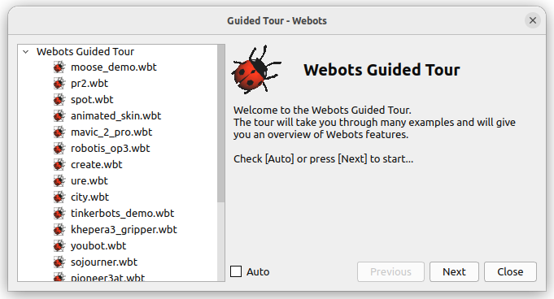

# Einführung Robotik & Robotersimulatoren

## Einführung [45 min]

Die Automobilindustrie ist seit Langem ein Vorreiter in der Anwendung von Robotertechnologie. Von der Montage über die Lackierung bis hin zur Qualitätskontrolle werden Roboter eingesetzt, um Effizienz, Präzision und Sicherheit in der Produktion zu steigern.

Robotersimulatoren spielen in diesem Kontext eine entscheidende Rolle, indem sie es ermöglichen, Robotersysteme zu entwerfen, zu testen und zu optimieren, bevor diese in der realen Produktionsumgebung eingesetzt werden.

## Bedeutung von Robotern in der Automobilproduktion

In der Automobilfertigung werden Roboter für eine Vielzahl von Aufgaben eingesetzt, darunter:

- Schweißen: Roboter führen präzises Punktschweißen und Nahtschweißen aus, um Fahrzeugteile zusammenzufügen.
- Lackierung: Roboterarme sorgen für gleichmäßige und effiziente Lackierung von Fahrzeugkarosserien.
- Montage: Roboter werden für die Montage von Kleinteilen verwendet, was die Effizienz steigert und menschliche Fehler reduziert.
- Qualitätskontrolle: Automatisierte Systeme führen genaue Inspektionen durch, um die Qualität der Fahrzeuge sicherzustellen.

## Die Rolle von Robotersimulatoren

Robotersimulatoren sind in der Automobilindustrie aus folgenden Gründen unerlässlich:

- Design und Planung: Simulatoren ermöglichen es Ingenieuren, komplexe Robotersysteme zu entwerfen und zu planen, ohne physische Prototypen zu benötigen.
- Testen von Szenarien: Verschiedene Produktionsbedingungen und -szenarien können in einer simulierten Umgebung getestet werden, was Zeit und Ressourcen spart.
- Optimierung der Produktionslinien: Durch Simulation können Produktionsabläufe effizient gestaltet und potenzielle Engpässe identifiziert werden.
- Schulung des Bedienpersonals: Simulatoren bieten eine risikofreie Umgebung für die Schulung von Bedienpersonal.

## Anwendungsbeispiele in der Automobilindustrie

Robotersimulatoren kann man in vielen Bereich der Fahrzeugherstellung und -entwicklung einsetzen.

### Optimierung der Montagelinien

Robotersimulatoren ermöglichen die virtuelle Gestaltung und Optimierung von Montagelinien. Zum Beispiel kann die Positionierung der Roboterarme simuliert werden, um den effizientesten Workflow zu ermitteln.

### Virtuelles Prototyping

Bei der Entwicklung neuer Fahrzeugmodelle können Simulatoren verwendet werden, um Montageprozesse virtuell zu testen und anzupassen, bevor die tatsächliche Produktion beginnt. Dies spart Zeit und Kosten bei der Entwicklung neuer Modelle.

### Schulung und Sicherheit

Simulatoren bieten eine sichere Umgebung, um Bedienpersonal in der Handhabung von Robotersystemen zu schulen, ohne das Risiko von Unfällen oder Schäden an der Ausrüstung.

### Testen von Software-Updates

Bevor Software-Updates auf Roboter in der Produktion angewendet werden, können diese in einer simulierten Umgebung getestet werden, um sicherzustellen, dass sie korrekt funktionieren und keine unerwünschten Auswirkungen auf den Produktionsprozess haben.

## Die Bedeutung von Robotersimulatoren

Robotersimulatoren sind ein unverzichtbares Werkzeug in der Automobilindustrie. Sie ermöglichen es, die komplexen Anforderungen moderner Automobilproduktion effizient zu meistern, von der Planung und Entwicklung neuer Modelle bis hin zur Optimierung bestehender Produktionslinien. Durch ihren Einsatz können Automobilhersteller nicht nur die Produktionskosten senken und die Effizienz steigern, sondern auch die Sicherheit am Arbeitsplatz erhöhen und die Qualität ihrer Produkte sicherstellen.

## Auswahl eines Robotersimulators

Auf dem Markt gibt es mehrere Robotersimulatoren unter denen man auswählen kann. Wichtige Kriterien sind hierbei zum Beispiel:

| Kriterium                          | Beschreibung |
|------------------------------------|--------------|
| Realitätsnahe Simulation           | Der Simulator sollte eine realistische Nachbildung der realen Welt bieten, einschließlich genauer Physik-Engines und visueller Darstellungen. |
| Benutzerfreundlichkeit             | Eine intuitive und leicht bedienbare Benutzeroberfläche mit klarer Navigation und umfassender Dokumentation. |
| Flexibilität und Anpassbarkeit     | Unterstützung verschiedener Robotermodelle, Sensoren und Umgebungen sowie die Möglichkeit, spezifische Szenarien zu modellieren. |
| Programmier- und Skriptunterstützung | Unterstützung für gängige Programmiersprachen und Skripting-Tools für die Automatisierung und Integration in bestehende Workflows. |
| Schnittstellen und Integration     | Kompatibilität mit Industriestandards und Schnittstellen für eine nahtlose Integration in bestehende Systeme. |
| Hardware-Kompatibilität und -Integration | Fähigkeit zur Interaktion mit realer Hardware, insbesondere für Hardware-in-the-Loop-Tests. |
| Unterstützung für Sensoren und Aktoren | Unterstützung einer breiten Palette von Sensoren und Aktoren zur Simulation verschiedener Automatisierungs- und Robotik-Anwendungen. |
| Performance und Skalierbarkeit     | Effiziente Handhabung komplexer Szenarien und Skalierbarkeit für verschiedene Projektgrößen. |
| Community und Support             | Eine aktive Nutzergemeinschaft und Zugang zu professionellem Support. |
| Kosten und Lizenzmodell           | Transparente Kosten und ein passendes Lizenzmodell für das Budget und die Anforderungen des Projekts. |
| Updates und Wartung                | Regelmäßige Updates und zuverlässige Wartung zur Aktualisierung des Simulators und Integration neuer Funktionen. |
| Sicherheitsmerkmale                | Unterstützung spezieller Sicherheitsfunktionen und -protokolle für bestimmte Anwendungen. |
| Erweiterbarkeit                    | Möglichkeit zur Erweiterung des Simulators, um zukünftige Anforderungen und Technologien zu integrieren. |

## Aufgaben [200 min]

### A1: Internetrecherche zu Robotersimulatoren (90min) 🌶️🌶️

Die Auswahl eines Robotersimulators auf den man setzen möchte, ist ein entscheindender Schritt! Daher sollte die Auwahl wohlüberlegt erfolgen.

Wir wollen einen aktuellen und State-of-the-Art Robotersimulator im Folgenden verwenden und die Roboter im Simulator in Python programmieren.

Führe Sie eine Internetrecherche hierzu durch!

Welche der drei bekannten Robotersimulatoren

- CoppeliaSim
- Gazebo
- Webots
  
wären geeignet, so dass folgende Anforderungen erfüllt sind?

1. der Robotersimulator lässt sich leicht unter Windows und Linux installieren
2. der Robotersimulator bietet eine große Breite an verschiedenen Robotern
3. die Roboter können in Python programmiert werden
4. der Robotersimulator ist kostenfrei auch für Firmen (kostenfrei kommerziell nutzbar)

Füllen Sie hierzu folgende Tabelle mit J (Ja, trifft zu) und N (Nein, trifft nicht zu) aus!
Speichern Sie sich sich auch alle Referenzen (d.h. wo sie die Antwort gefunden haben)!

| Robotersimulator | URL |Einfache Installation | Viele Roboter | Python | Kostenfrei |
|---|---|---|---|---|---|
|CoppeliaSim|---|---|---|---|---|
|Gazebo|---|---|---|---|---|
|Webots|---|---|---|---|---|

### A2: Installation von Webots und Überblick verschaffen (90 min) 🌶️

Da bei der vorherigen Aufgabe Webots in allen Spalten ein "J" erhalten hat, ist es unser Robotersimulator in dem Python-Lernpfad!

Installiere daher jetzt als nächstes Webots.

Wir wollen uns als erstes einen Überblick über die Möglichkeiten dieses Robotersimulators verschaffen. Nach dem Start von Webots sollte die "Guided Tour" automatisch starten. Du kannst diese aber auch immer selber nachträglich nochmal unter "Help -> Webots Guided Tour" neu starten.

Klicke dich jetzt Schritt für Schritt kurz durch die ersten 19 der 69 Demos / Tours, starte jedes Demo indem du den ">" Button drückst und bearbeite dabei folgende Arbeitsaufträge:

- Gibt es nur Roboter mit Rädern oder auch mit Beinen?
- Gibt es nur Roboter oder auch andere "Simulationsmodelle"?
- Erstelle ein kleines Screenshotbild von jedem besuchten Demo und füge alle Bilder zu einer großen Collage (ein großes Bild) auf einer PowerPoint-Folie zusammen.
- Experimentiere dabei auch mit der Steuerung der Kameraansicht. Wie kannst du die Kameraansicht steuern?

Ziel dieser Aufgabe ist, es die Breite der Fähigkeiten des Robotersimulators möglichst rasch kennen zu lernen und die Steuerung der Kameransicht zu beherrschen.

### A3: Bekannte Firmen und Forschungseinrichtungen die Webots verwenden (20 min) 🌶️

Versuche herauszufinden, welche Firmen und Forschungsinstitutionen Webots verwenden? Gibt es bekannte große Player, die Webots einsetzen?

[Lösungen](einfuehrung_robotik_loesungen.md)
