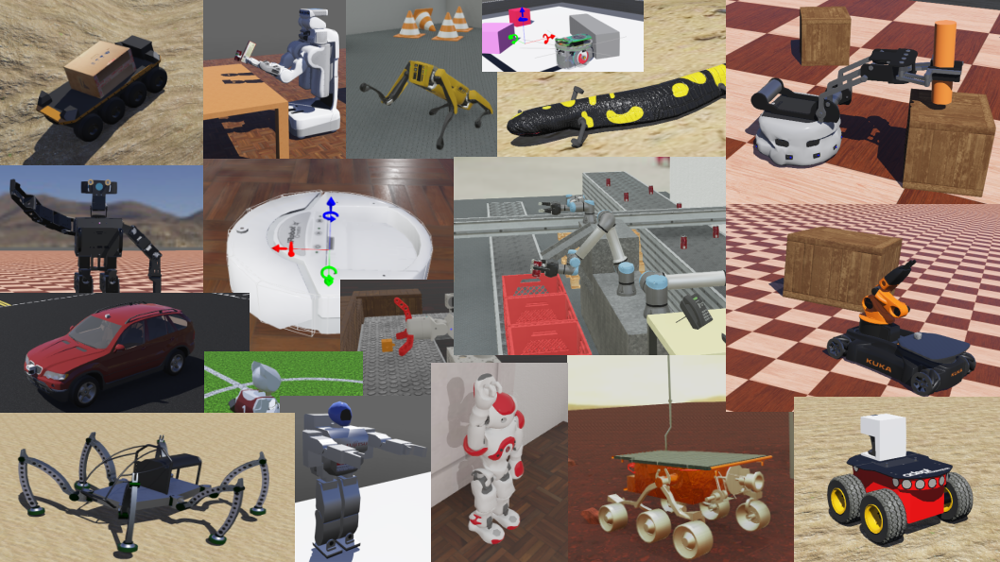

# Lösungen

### A1: Internetrecherche zu Robotersimulatoren (90min) 🌶️🌶️

🎦 Lösungsvideo

<iframe width="560" height="315" src="https://www.youtube.com/embed/MSPQDFibTd0?si=zJ8fEV4XdbK4HqZF" title="YouTube video player" frameborder="0" allow="accelerometer; autoplay; clipboard-write; encrypted-media; gyroscope; picture-in-picture; web-share" allowfullscreen></iframe>

Die Auswahl eines Robotersimulators auf den man setzen möchte, ist ein entscheindender Schritt! Daher sollte die Auwahl wohlüberlegt erfolgen.

Wir wollen einen aktuellen und State-of-the-Art Robotersimulator im Folgenden verwenden und die Roboter im Simulator in Python programmieren.

Führe Sie eine Internetrecherche hierzu durch!

Welche der drei bekannten Robotersimulatoren

- CoppeliaSim
- Gazebo
- Webots
  
wären geeignet, so dass folgende Anforderungen erfüllt sind?

1. der Robotersimulator lässt sich leicht unter Windows und Linux installieren
2. der Robotersimulator bietet eine große Breite an verschiedenen Robotern
3. die Roboter können in Python programmiert werden
4. der Robotersimulator ist kostenfrei auch für Firmen (kostenfrei kommerziell nutzbar)

Füllen Sie hierzu folgende Tabelle mit J (Ja, trifft zu) und N (Nein, trifft nicht zu) aus!
Speichern Sie sich sich auch alle Referenzen (d.h. wo sie die Antwort gefunden haben)!

| Robotersimulator | URL |Einfache Installation | Viele Roboter | Python | Kostenfrei |
|---|---|---|---|---|---|
|CoppeliaSim|---|---|---|---|---|
|Gazebo|---|---|---|---|---|
|Webots|---|---|---|---|---|

Lösung:

| Robotersimulator | URL | Einfache Installation | Viele Roboter | Python | Kostenfrei |
|---|---|---|---|---|---|
|CoppeliaSim|https://www.coppeliarobotics.com/|J|J|J|N|
|Gazebo|https://gazebosim.org/home|N|J|J|J|
|Webots|https://cyberbotics.com/|J|J|J|J|

Referenzen CoppeliaSim:

- [CoppeliamSim bietet einen einfachen Installer für Win/Mac/Linux](https://www.coppeliarobotics.com/downloads)
- [CoppeliaSim bietet viele Robotermodelle](https://www.coppeliarobotics.com/helpFiles/en/userInterface.htm#ModelBrowser)
- [CoppeliaSim: Programmierung in Python möglich](https://www.coppeliarobotics.com/helpFiles/en/writingCode.htm#sixMethods)
- ["CoppeliaSim player"](https://www.coppeliarobotics.com/downloads) darf auch von Firmen verwendet werden, hat aber nicht volle Editierfähigkeiten
- ["CoppeliaSim edu"](https://www.coppeliarobotics.com/downloads) (für Studenten, Lehrer) ist kostenlos, darf aber nicht kommerziell verwendet werden
- ["CoppeliaSim pro"](https://www.coppeliarobotics.com/downloads) ist vollfunktonsfähig. Firmen müssen aber bezahlen. Daher in der Tabelle ein "N"

Referenzen Gazebo:

- [Gazebo Harmonic Installation unter Windows ist problematisch](https://gazebosim.org/docs/harmonic/install_windows) Dort: "WARNING: Current Windows support is experimental."
- [Gazebo bietet viele Modelle](https://app.gazebosim.org/search;q=robot)
- [Gazebo bietet über ROS-Nodes die Möglichkeit Python Skripte anzubinden](https://gazebosim.org/features)
- [Gazebo ist kostenfrei für den kommerziellen Bereich](https://learn.e.ros4.pro/en/robotic_simulators/comparison/)

Referenzen Webots:

- [Webots lässt sich unter Win/Mac/Linux installieren](https://cyberbotics.com/#download)
- [Webots bietet viele Standardroboter](https://cyberbotics.com/doc/guide/samples-demos)
- [Webots Roboter lassen sich in Python programmieren](https://cyberbotics.com/doc/guide/using-python)
- [Webots ist kostenfrei](https://cyberbotics.com/#services) Die Firma hinter Webots (Cyberbotics Ltd. aus Lausanne / Schweiz) verdient Geld durch Beratung bei der Software, nicht durch den Verkauf.

### A2: Installation von Webots und Überblick verschaffen (90 min) 🌶️

🎦 Lösungsvideo

<iframe width="560" height="315" src="https://www.youtube.com/embed/o56vxnH50ew?si=xDM8b1Lvq-t8y4oo" title="YouTube video player" frameborder="0" allow="accelerometer; autoplay; clipboard-write; encrypted-media; gyroscope; picture-in-picture; web-share" allowfullscreen></iframe>

Da bei der vorherigen Aufgabe Webots in allen Spalten ein "J" erhalten hat, ist es unser Robotersimulator in dem Python-Lernpfad!

Installiere daher jetzt als nächstes Webots.

Wir wollen uns als erstes einen Überblick über die Möglichkeiten dieses Robotersimulators verschaffen. Nach dem Start von Webots sollte die "Guided Tour" automatisch starten. Du kannst diese aber auch immer selber nachträglich nochmal unter "Help -> Webots Guided Tour" neu starten.

Klicke dich jetzt Schritt für Schritt kurz durch die ersten 19 der 69 Demos / Tours, starte jedes Demo indem du den ">" Button drückst und bearbeite dabei folgende Arbeitsaufträge:

- Gibt es nur Roboter mit Rädern oder auch mit Beinen?
- Gibt es nur Roboter oder auch andere "Simulationsmodelle"?
- Erstelle ein kleines Screenshotbild von jedem besuchten Demo und füge alle Bilder zu einer großen Collage (ein großes Bild) auf einer PowerPoint-Folie zusammen.
- Experimentiere dabei auch mit der Steuerung der Kameraansicht. Wie kannst du die Kameraansicht steuern?

Ziel dieser Aufgabe ist, es die Breite der Fähigkeiten des Robotersimulators möglichst rasch kennen zu lernen und die Steuerung der Kameransicht zu beherrschen.

Lösung:

Es gibt in Webots nicht nur mobile Roboter mit Rädern, sondern auch "humanoide" Roboter (die haben eine menschliche Gestalt=Rumpf+Kopf+Arme+Beine), Tierähnliche Roboter (wie Eidechsenroboter), Roboterarme (wie sie z.B. an Förderbändern stehen und zum Schweißen verwendet werden) und Fahrzeuge (z.B. Autos).

Steuerung der Kameraansicht:
- linke Maustaste + Maus bewegen ("Tilt"): Verändert Winkel der Kamera (3D Rotation der Kamera)
- rechte Maustaste + Maus bewegen ("Pan"): Verändert x,y Kameraposition (3D Position der Kamera im Raum)
- Mausrad ("Pan"): Verändert z Kameraposition ("rein/raus-zoomen in Szene")
- Sehr hilfreich: Automatisches Einstellen der Kameraansicht des Roboters ist über "View --> Follow Object --> Pan and Tilt Shot" möglich!

"Pan" meint hier Kameraschwenk. "Tilt" meint hier Kamerakippung.

Colllage:

### A3: Bekannte Firmen und Forschungseinrichtungen die Webots verwenden (20 min) 🌶️

🎦 Lösungsvideo

<iframe width="560" height="315" src="https://www.youtube.com/embed/9UzkR2qSfW8?si=jFZXeQW8A_zl38oV" title="YouTube video player" frameborder="0" allow="accelerometer; autoplay; clipboard-write; encrypted-media; gyroscope; picture-in-picture; web-share" allowfullscreen></iframe>

Versuche herauszufinden, welche Firmen und Forschungsinstitutionen Webots verwenden? Gibt es bekannte große Player, die Webots einsetzen?

Liste der Firmen und renomierten Forschungsinstitutionen, die Webots einsetzen:

Siehe am Ende der Webseite:

https://cyberbotics.com/#contact

Firmen, die Webots einsetzen (u.a.):

- EADS
- GE
- Hitachi
- Honda
- Huawei
- John Deere
- NASA
- Panasonic
- Renault / Nissan / Mitsubishi
- SRI International
- Samsung
- Siemens
- Sony
- Thales
- Toyota
- Vorwerk

Renomierte Forschungsinstituionen, die Webots einsetzen (u.a.):

- Berkely University
- University of Edinburgh
- University of Michigan
- University of Oxford
- University of Toronto
- Boston University
- Caltech
- Carnegie Mellon University
- Columbia University
- Duke University
- Ecole Polytechnique Federale de Lausanne
- ETH Zürich
- Harvard University
- Imperial College London
- Kings College London
- MIT (Massachusetts Insitute of Technology)
- Northwestern University
- Stanford University
- Tokio Institute of Technology
- UCLA (University of California, Los Angeles)
- Universität Zürich 
