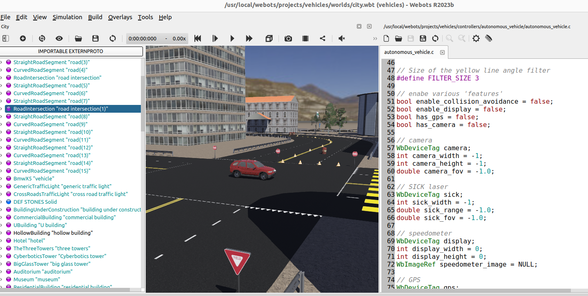

# Webots als Fahrerassisstenzentwicklungs-Simulator

🎦 Video

<iframe width="560" height="315" src="https://www.youtube.com/embed/Z9HA6Cxi9CM?si=vaNogqg2PYxuHeln" title="YouTube video player" frameborder="0" allow="accelerometer; autoplay; clipboard-write; encrypted-media; gyroscope; picture-in-picture; web-share" allowfullscreen></iframe>

## Einführung [10 min]

Fahrerassistenzsysteme (FAS) sind Technologien, die entwickelt werden, um die Sicherheit und den Komfort beim Autofahren zu erhöhen. Diese Systeme nutzen eine Vielzahl von Sensoren und Softwarealgorithmen, um das Fahrzeug und seine Umgebung zu überwachen und in bestimmten Situationen unterstützend einzugreifen. Zu den gängigen FAS gehören unter anderem:

- Adaptive Geschwindigkeitsregelung (ACC): Passt die Fahrzeuggeschwindigkeit automatisch an, um einen sicheren Abstand zum vorausfahrenden Fahrzeug zu halten.
- Spurhalteassistent: Warnt den Fahrer, wenn das Fahrzeug unbeabsichtigt die Fahrspur verlässt, und kann korrigierend eingreifen.
- Notbremsassistent: Erkennt potenzielle Kollisionen und initiiert automatisch eine Bremsung, um Unfälle zu vermeiden oder deren Schwere zu verringern.

## Die Rolle von Simulatoren in der Entwicklung

Die Entwicklung und das Testen von FAS erfordern umfangreiche und oft komplexe Szenarien, um ihre Zuverlässigkeit und Effektivität sicherzustellen. Hier kommen Simulatoren wie Webots ins Spiel. Simulatoren bieten mehrere Vorteile:

- Sicherheit: Sie ermöglichen das Testen von Systemen in gefährlichen Szenarien, ohne Menschen oder Ausrüstung zu gefährden.
- Kosteneffizienz: Physikalische Tests können teuer sein, besonders wenn sie spezielle Ausrüstung oder Einrichtungen erfordern.
- Reproduzierbarkeit: Simulierte Tests können exakt reproduziert werden, was für die Validierung und Vergleichbarkeit der Ergebnisse wichtig ist.
- Szenariovielfalt: Simulatoren können eine breite Palette von Szenarien darstellen, von alltäglichen Fahrsituationen bis hin zu seltenen oder extremen Bedingungen.

## Beispiele und Anwendungen

Webots ist ein Beispiel für einen leistungsstarken Simulator, der in der Entwicklung von FAS eingesetzt wird. Einige spezifische Anwendungen sind:

- Entwicklung von Algorithmen: Simulatoren ermöglichen die schnelle Iteration und Optimierung von Algorithmen unter verschiedenen Bedingungen, ohne reale Fahrzeuge modifizieren zu müssen.
- Sensoriksimulation: Webots kann verschiedene Sensortypen wie Lidar, Radar und Kameras simulieren, um das Zusammenspiel dieser Sensoren in einem FAS zu testen.
- Virtuelle Crashtests: Anstatt reale Fahrzeuge in Crashtests zu verwenden, können Entwickler virtuelle Tests durchführen, um die Reaktion von FAS auf Unfallszenarien zu bewerten.
- Training von KI-Systemen: Für FAS, die auf künstlicher Intelligenz basieren, können Simulatoren riesige Mengen an Trainingsdaten generieren, um die KI zu trainieren und zu verbessern.

Die Entwicklung moderner Fahrerassistenzsysteme ist eine komplexe Aufgabe, die durch den Einsatz von Simulatoren wie Webots erheblich erleichtert wird. Diese Simulatoren bieten sichere, kosteneffiziente und vielseitige Plattformen für das Testen und Verfeinern von FAS. Sie sind unverzichtbar für die Zukunft der Fahrzeugtechnologie, insbesondere im Hinblick auf zunehmend autonome Fahrzeuge.

## Zielsetzung für diesen Skriptabschnitt

Als Vorbereitung für das nächste Skriptteil, indem wir ein eigenes einfaches Fahrerassistenzsystem in Python und Webots entwickeln werden, sollen Sie nun erstmal versuchen

- eine Straßenwelt mit Fahrzeug in Webots zu aktivieren
- den Benutzer das Fahrzeug per Tastatur steuern lassen

Damit bauen wir uns ein solides Fundament für das nächste Zie auf: die Entwicklung eines einfachen Fahrerassistenzsystems.

## Aufgaben [200 min]

### A1: Webots und Fahrzeugsimulation [15 min] 🌶️🌶

Vielleicht denken Sie: "Webots ist doch ein Robotersimulator? Kann man da wirklich auch Fahrzeuge mit simulieren?"

- Versuchen Sie herauszufinden, ob Webots wirklich die Simulation von Fahrzeugen unterstützt!
- Welche Fahrzeuge sind als (PROTO-)Modelle bereits in Webots enthalten?
- Wo haben Sie hierzu jeweils eine Antwort gefunden?

### A2: Code-Snippet zur Steuerung eines Fahrzeugs [45 min] 🌶️🌶️

Nutzen Sie die Webots-Dokumentation um herauszufinden wie man ein Fahrzeug aus Python heraus steuern kann! Suchen Sie nach solch einem Code-Snippet!

Welche Steuerung des Fahrzeugs wird in Ihrem gefundenen Python-Code-Snippet vorgeführt?

### A3: Stadt-Welt kopieren [20 min] 🌶️🌶️

Wir wollen möglichst rasch eine Welt mit Straßen, Gebäuden, etc., ohne, dass wir diese selber aufbauen müssen.

Daher: Starten Sie die "Help --> Webots Guided Tour" die Demos und wählen Sie das "city.wbt" Demo aus.

Hier gibt es bereits eine vollständig aufgebaute Stadt und ein Fahrzeug, das bereits autonom über einen Controller (geschrieben allerdings in der Programmiersprache C) fährt.

Finden Sie heraus wo die "city.wbt" Datei liegt.

Erstellen Sie dann ein eigenes neues Projekt, in der Sie diese Welt rüber kopieren, damit wir diese Welt im Folgenden nutzen können.

Hinweis: die "Welt" city.wbt enthält sowohl die Gebäude, die Straßen, die Ampeln als auch das bereits eingefügte Fahrzeug.

### A4: Fahrzeug mit Tastatur steuern [120 min] 🌶️🌶️🌶️

Erstellen Sie nun einen neuen Python-Controller, so dass der Benutzer per Tastatur das Fahrzeug durch die simulierte Stadt fahren kann!

Versuchen Sie dazu als erstes über die Webots Dokukmentation heraus zu finden, wie Sie Tastatureingaben vom Benutzer einlesen können. Reagieren Sie dann auf die Tastatureingaben so dass man mittels folgender Tasten das Fahrzeug steuern kann:

| Taste  | Bedeutung |
| ------ | --------- |
| i      | Geschwindigkeit erhöhen |
| k      | Geschwindigkeit reduzieren |
| j      | Lenkrad ein Stück weiter nach links |
| l      | Lenkrad ein Stück weiter nach rechts |

Versuchen Sie auch herauszufinden, wie Sie Webots einstellen, damit die Kamera zum Fahrzeug nachgeführt wird!

[Lösungen](webots_fahrzeug_steuern_aus_python_loesungen.md)
