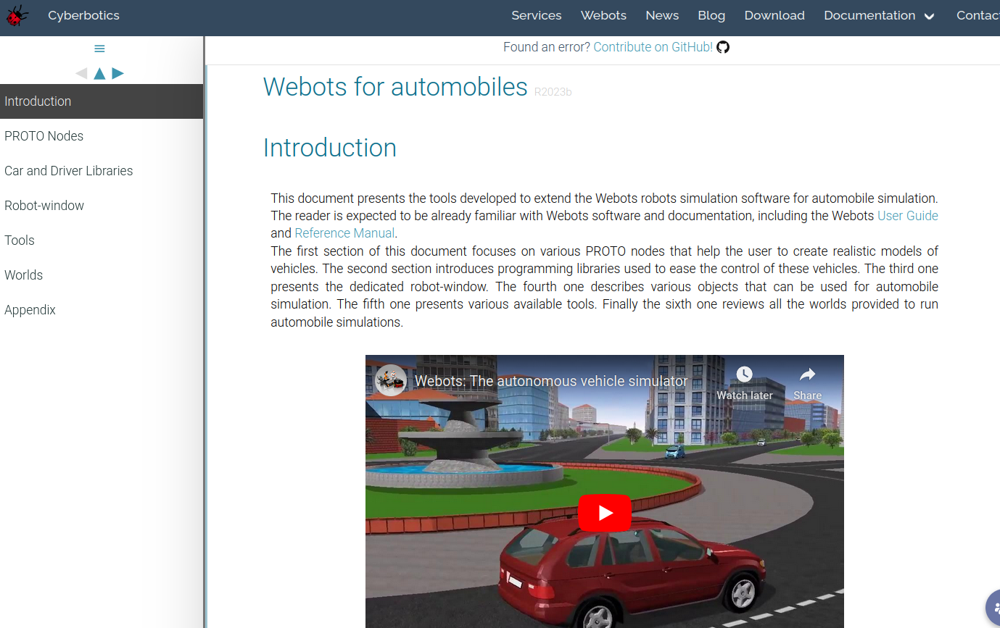
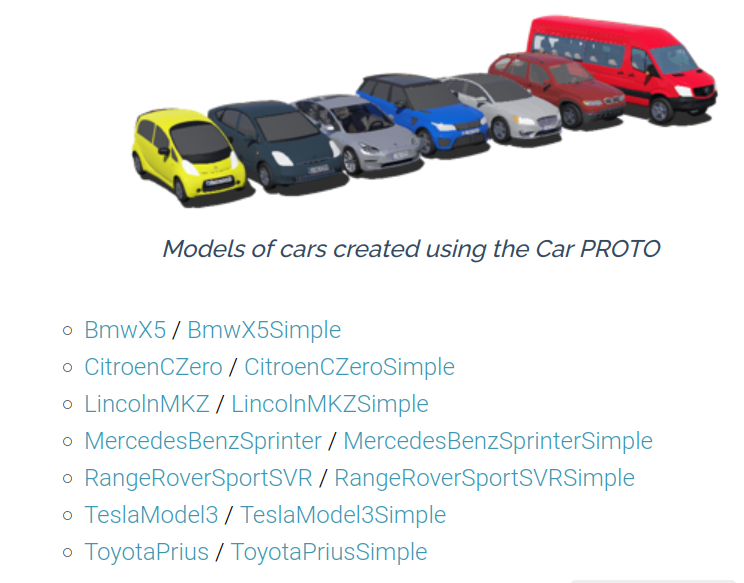
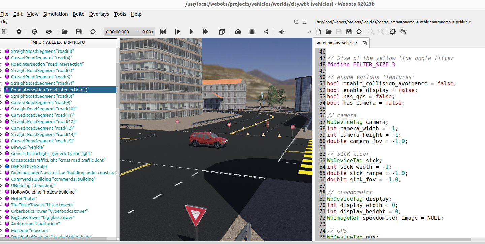

# Lösungen

### A1: Webots und Fahrzeugsimulation [15 min] 🌶️🌶

Vielleicht denken Sie: "Webots ist doch ein Robotersimulator? Kann man da wirklich auch Fahrzeuge mit simulieren?"

- Versuchen Sie herauszufinden, ob Webots wirklich die Simulation von Fahrzeugen unterstützt!
- Welche Fahrzeuge sind als (PROTO-)Modelle bereits in Webots enthalten?
- Wo haben Sie hierzu jeweils eine Antwort gefunden?

Lösung:

Ja, Webots unterstützt die Simulation von Fahrzeugen:



Quelle: https://cyberbotics.com/doc/automobile/introduction


Folgende Fahrzeuge sind bereits verfügbar:



Quelle: https://cyberbotics.com/doc/automobile/proto-nodes 

### A2: Code-Snippet zur Steuerung eines Fahrzeugs [45 min] 🌶️🌶️

Nutzen Sie die Webots-Dokumentation um herauszufinden wie man ein Fahrzeug aus Python heraus steuern kann! Suchen Sie nach solch einem Code-Snippet!

Welche Steuerung des Fahrzeugs wird in Ihrem gefundenen Python-Code-Snippet vorgeführt?

Lösung:

Die Steuerung eines Autos in Webots ist ziemlich simpel:

https://cyberbotics.com/doc/automobile/cpp-java-and-python-wrappers-of-the-automobile-libraries

Das folgende Codestückchen zeigt wie man den Lenkwinkel und die Geschwindigkeit (in km/h) setzen kann.

Man kann es hier finden:

https://cyberbotics.com/doc/automobile/cpp-java-and-python-wrappers-of-the-automobile-libraries?tab-language=python


```python
import math

from vehicle import Driver

driver = Driver()
driver.setSteeringAngle(0.2)
driver.setCruisingSpeed(20)

while driver.step() != -1:
  angle = 0.3 * math.cos(driver.getTime())
  driver.setSteeringAngle(angle)
```

Steuerung hier:

Während die Geschwindigkeit des Fahrzeugs konstant auf 20km/h gesetzt ist, wird der Lenkwinkel über die Cosinus-Funktion kontinuierlich verändert.

D.h., das Auto wird so in dem Code Snippet gesteuert, dass es mal nach links, mal nach rechts fährt.

### A3: Stadt-Welt kopieren [20 min] 🌶️🌶️

Wir wollen möglichst rasch eine Welt mit Straßen, Gebäuden, etc., ohne, dass wir diese selber aufbauen müssen.

Daher: Starten Sie die "Help --> Webots Guided Tour" die Demos und wählen Sie das "city.wbt" Demo aus.

Hier gibt es bereits eine vollständig aufgebaute Stadt und ein Fahrzeug, das bereits autonom über einen Controller (geschrieben allerdings in der Programmiersprache C) fährt.



Finden Sie heraus wo die "city.wbt" Datei liegt.

Erstellen Sie dann ein eigenes neues Projekt, in der Sie diese Welt rüber kopieren, damit wir diese Welt im Folgenden nutzen können.

Hinweis: die "Welt" city.wbt enthält sowohl die Gebäude, die Straßen, die Ampeln als auch das bereits eingefügte Fahrzeug.

Lösung:

Die city.wbt liegt im Installationsverzeichnis von Webots unter:

webots/projects/vehicles/worlds/

Unter Linux ist das beispielsweise:

/usr/local/webots/projects/vehicles/worlds/

Dann unter "File --> New Project Directory" ein neues Projektverzeichnis machen und die Welt city.wbt dort unter worlds reinkopieren.

### A4: Fahrzeug mit Tastatur steuern [120 min] 🌶️🌶️🌶️

Erstellen Sie nun einen neuen Python-Controller, so dass der Benutzer per Tastatur das Fahrzeug durch die simulierte Stadt fahren kann!

Versuchen Sie dazu als erstes über die Webots Dokukmentation heraus zu finden, wie Sie Tastatureingaben vom Benutzer einlesen können. Reagieren Sie dann auf die Tastatureingaben so dass man mittels folgender Tasten das Fahrzeug steuern kann:

| Taste  | Bedeutung |
| ------ | --------- |
| i      | Geschwindigkeit erhöhen |
| k      | Geschwindigkeit reduzieren |
| j      | Lenkrad ein Stück weiter nach links |
| l      | Lenkrad ein Stück weiter nach rechts |

Versuchen Sie auch herauszufinden, wie Sie Webots einstellen, damit die Kamera zum Fahrzeug nachgeführt wird!

Lösung:

Hier ist ein möglicher einfacher Python-Controller, der das Fahrzeug steuert:


```python
"""benutzer_steuert_fahrzeug controller."""

from controller import Robot, Keyboard
from vehicle import Driver

print("Steuern Sie selber das Fahrzeug!")

# Erzeuge einen "Roboter"-Controller
# Heute ist der Roboter ein Fahrzeug
robot = Robot()

timestep = 64

keyboard = Keyboard()
keyboard.enable(timestep)

driver = Driver()

speed = 0.0
angle = 0.0

def set_speed(new_speed):
    driver.setCruisingSpeed(new_speed)
    print("New speed:", new_speed)
    
def set_angle(new_angle):
    driver.setSteeringAngle(new_angle)
    print("New angle:", new_angle)

wait_time = 0
while driver.step() != -1:
    key=keyboard.getKey()
    
    if wait_time == 0:
       
        if key==73: # Taste i
           speed += 2.0
           set_speed( speed )
           wait_time = 10
           
        if key==74: # Taste j
           angle -= 0.05
           set_angle( angle )
           wait_time = 10
           
        if key==75: # Taste k
           speed -= 2.0
           set_speed( speed )
           wait_time = 10
           
        if key==76: # Taste l
           angle += 0.05
           set_angle( angle )
           wait_time = 10
       
    wait_time -= 1
    if wait_time < 0:
        wait_time = 0
```

Damit man das Auto beim Fahren stets im Blick behält:

"View --> Follow Object --> Mounted Shot" einstellen!
