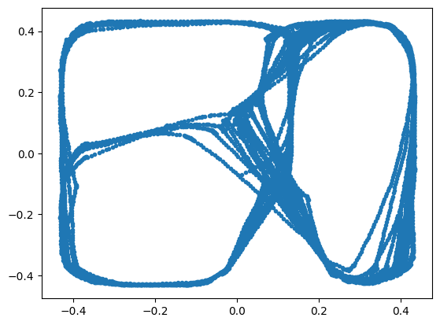
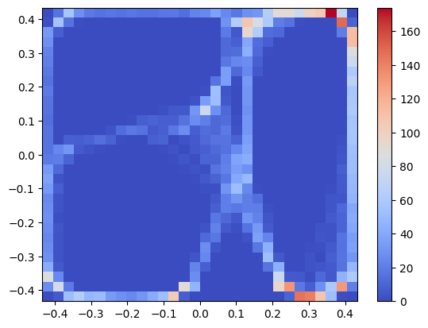
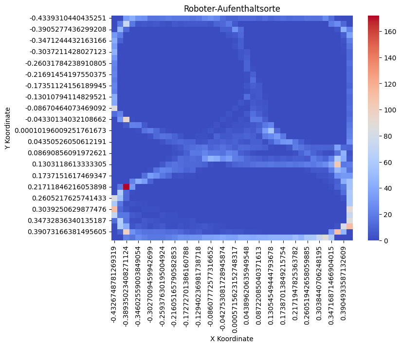

# Lösungen

### A1: Demo nachvollziehen und Kopie einer Webots Welt anlegen [15 min] 🌶️

<details>
<summary>
🎦 Lösungsvideo
</summary>
<iframe width="560" height="315" src="https://www.youtube.com/embed/1McaumaFQ9c?si=v0mOappPduaciPOc" title="YouTube video player" frameborder="0" allow="accelerometer; autoplay; clipboard-write; encrypted-media; gyroscope; picture-in-picture; web-share" allowfullscreen></iframe>
</details>


Wir wollen es uns einfach machen: wir nehmen eines der bestehenden Demos aus Webots als Grundlage für das Folgende. Öffnen Sie dazu in Webots unter

    "Help --> Webots Guided Tour ..."

bei 

    "Devices Tour"
    
das Demo

    gps.wbt

Es enthält einen einfachen "selbst gebauten" Roboter "myRobot".

Das Demo wird allerdings nur mit einem C-Controller geliefert. Schauen Sie sich erstmal das Demo an. Über den Tastendruck "G" (das 3D Window muss den Eingabefokus haben, d.h. bitte zuerst einmal in das 3D Window klicken!) wird Ihnen die GPS- bzw. Weltkoordinate (x,y,z) des Roboters angezeigt.

Erstellen Sie jetzt ein neues Projektverzeichnis und kopieren Sie die gps.wbt Datei hier rein!

### A2: C-Controller in Python umschreiben [45 min] 🌶️🌶️ 

<details>
<summary>
🎦 Lösungsvideo
</summary>
<iframe width="560" height="315" src="https://www.youtube.com/embed/-HSsxj76l4c?si=WNFNYaaoZRovAWa1" title="YouTube video player" frameborder="0" allow="accelerometer; autoplay; clipboard-write; encrypted-media; gyroscope; picture-in-picture; web-share" allowfullscreen></iframe>
</details>


Sie haben ja bereits einmal für den epuck-Roboter einen Python-Controller geschrieben. Der "myBot" ist aus dem vorherigen Demo hat allerdings etwas andere Distanzsensorbezeichnungen.

Finden Sie durch "Blick auf den C Code" heraus welche es sind und erstellen Sie analog einen neuen Python-Controller für diese Welt und diesen Roboter "myBot", so dass die Hindernissvermeidung aus dem C-Demo genauso in Python abläuft!

Lösung für diese Aufgabe? Siehe Lösung bei A3!

### A3: GPS-Koordinaten in Python auslesen und als Pandas Tabelle wegschreiben [45 min] 🌶️🌶️🌶

<details>
<summary>
🎦 Lösungsvideo
</summary>
<iframe width="560" height="315" src="https://www.youtube.com/embed/paPfy0l0tb0?si=TMtaEs-skuUJxYNG" title="YouTube video player" frameborder="0" allow="accelerometer; autoplay; clipboard-write; encrypted-media; gyroscope; picture-in-picture; web-share" allowfullscreen></iframe>
</details>


Ergänzen Sie nun Ihren Webots Python Controllercode so, dass sie ...

- Zugriff auf den GPS Sensor erhalten
- den GPS Sensor aktivieren ("enable")
- in jedem Simulationsschleifendurchlauf auch die GPS Koordinaten über den GPS Sensor auslesen
- die GPS Koordinaten in einer Liste sammeln
- aus der Liste  der GPS Koordinaten regelmäßig eine Pandas-Tabelle erzeugen
- die Pandas-Tabelle regelmäßig in einer Datei namens "koordinaten.csv" speichern

Python-Lösung für A2 und A3:


```python
# Hindernisse vermeiden + Positionen aufzeichnen Controller.


from controller import Robot, Motor
import pandas as pd
import numpy as np

print("Controller Hindernisse vermeiden + Positionen aufzeichnen gestartet!")

TIME_STEP = 64
MAX_MOTOR_SPEED = 6.28

# Eine Robotercontrollerinstanz erzeugen
robot = Robot()

# Handles für den Motor holen
leftMotor = robot.getDevice('left wheel motor')
rightMotor = robot.getDevice('right wheel motor')

# Zielposition der Räder auf Unendlich setzen
# D.h. so viel wie: Wir steuern jetzt gleich über
# die Geschwindigkeitskontrolle der Räder und geben
# NICHT eine Zielposition für die Räder vor
leftMotor.setPosition(float('inf'))
rightMotor.setPosition(float('inf'))

leftMotor.setVelocity (0)
rightMotor.setVelocity(0) 

# Zugriff auf Sensoren ds0-ds1 vorbereiten
ds0 = robot.getDevice("ds0")
ds1 = robot.getDevice("ds1")
ds0.enable(TIME_STEP)
ds1.enable(TIME_STEP)

# Zugriff auf GPS vorbereiten
gpsSensor = robot.getDevice("gps")
gpsSensor.enable(TIME_STEP)

SPEED = 6
randomize = True

fname = "koordinaten.csv"
coords = []

# Hauptsimulationsschleife
# Wird ausgeführt, bis Webots den Robotcontroller stoppt
while robot.step(TIME_STEP) != -1:

    ds0_value = ds0.getValue()
    ds1_value = ds1.getValue()
    #print(ds0_value, ds1_value)
    gpsCoords = gpsSensor.getValues()
    print(gpsCoords)
    coords.append( tuple(gpsCoords) )
    
    t = pd.DataFrame(coords, columns=["x", "y", "z"])
    t.to_csv( fname, index=False )

    if ds1_value > 500:
      
      #
      # If both distance sensors are detecting something, this means that
      # we are facing a wall. In this case we need to move backwards.
      #
      if ds0_value > 200:
        left_speed = -SPEED
        right_speed = -SPEED / 2
        
      else:
        #
        # We turn proportionnaly to the sensors value because the
        # closer we are from the wall, the more we need to turn.
        #
        left_speed = -ds1_value / 100
        right_speed = (ds0_value / 100) + 0.5

    elif ds0_value > 500:
    
      left_speed = (ds1_value / 100) + 0.5
      right_speed = -ds0_value / 100
      
    else:
    
      #
      # If nothing was detected we can move forward at maximal speed.
      #
      left_speed = SPEED
      right_speed = SPEED
      
    # Randomisiere die Bewegung (damit der Roboter keine festen Schleifen fährt)?
    if randomize:
        left_speed +=  np.random.uniform(-1.5, 1.5)
        right_speed +=  np.random.uniform(-1.5, 1.5)
    
    # Setze Motorgeschwindigkeiten
    leftMotor.setVelocity (left_speed)
    rightMotor.setVelocity(right_speed)
    

```

### A4: Analyse der vom Roboter besuchten Koordinaten [60 min] 🌶️🌶️

<details>
<summary>
🎦 Lösungsvideo
</summary>
<iframe width="560" height="315" src="https://www.youtube.com/embed/oxgND0waLDw?si=tED3ZjpAqrFtHNkM" title="YouTube video player" frameborder="0" allow="accelerometer; autoplay; clipboard-write; encrypted-media; gyroscope; picture-in-picture; web-share" allowfullscreen></iframe>
</details>


Wir haben jetzt eine tolle Datengrundlage (für Data Science!): in "koordinaten.csv" stehen alle Koordinaten drin, die der Roboter besucht hat. Vor lauter Zahlen sehen wir aber nichts. Es "schreit hier regelrecht" nach einer Visualisierung der vom Roboter besuchten Koordinaten / Stellen in der Welt.

Genau das sollen Sie jetzt tun!

Überlegen Sie sich mit Ihrem Vorwissen zu Matplotlib und Seaborn welche Visualisierungsmöglichkeiten wir für die Koordinaten haben, welche sinnvoll sind und setzen Sie mindestens zwei Visualisierungsmöglichkeiten in Python mit Matplotlib / Pandas um!

Visualisierungslösungen:


```python
# Koordinaten-Tabelle wieder einlesen
import pandas as pd
fname = "webots_loesungen/mybot/controllers/hindernisse_vermeiden_und_positionen_aufzeichnen/koordinaten.csv"
coords = pd.read_csv(fname)
print(coords)
```

                 x         y         z
    0     0.010988 -0.069651 -0.001727
    1     0.020758 -0.063267 -0.001007
    2     0.030267 -0.057144 -0.000744
    3     0.038076 -0.051890 -0.000543
    4     0.046309 -0.045854 -0.000439
    ...        ...       ...       ...
    9085  0.153422  0.393171  0.000180
    9086  0.159986  0.397272  0.000004
    9087  0.157571  0.395750  0.000062
    9088  0.155039  0.394383 -0.000002
    9089  0.162068  0.397522 -0.000051
    
    [9090 rows x 3 columns]


```python
# Lösung 1: Scatterplot der besuchten (x,y)-Koordinaten
import matplotlib.pyplot as plt
plt.scatter(coords["x"], coords["y"], marker=".")
plt.show()
```


    

    


```python
# Lösung 2: 2D-Histogramm der besuchten (x,y)-Koordinaten
# Vorteil: Man sieht auch die Aufenthaltsdauer!
# Grund: dort wo viele Punkte sind, wird das 2D Bin "reichlich" gefüllt
import matplotlib.pyplot as plt
plt.hist2d(coords["x"], coords["y"], bins=30, cmap="coolwarm")
plt.colorbar()
plt.show()
```


    

    


```python
import pandas as pd
import numpy as np
import seaborn as sns
import matplotlib.pyplot as plt
import matplotlib.ticker as ticker

# Erstellen Sie ein 2D-Histogramm der x- und y-Koordinaten
histogram, xedges, yedges = np.histogram2d(coords['x'], coords['y'], bins=40)

# Konvertieren Sie das Histogramm in eine Seaborn-freundliche Form
heatmap_data = pd.DataFrame(histogram, index=xedges[:-1], columns=yedges[:-1])

# Erstellen Sie die Heatmap
plt.figure(figsize=(8, 6))
ax = sns.heatmap(heatmap_data, cmap='coolwarm')
plt.title("Roboter-Aufenthaltsorte")
plt.xlabel('X Koordinate')
plt.ylabel('Y Koordinate')

plt.show()
```


    

    


```python
histogram
```


    array([[  0.,   0.,  33., ...,   1.,   0.,   0.],
           [  0.,  19.,  74., ...,  26.,  11.,   0.],
           [  1.,  46.,  11., ...,   4.,  43.,  22.],
           ...,
           [  0.,  60.,  42., ...,   3.,  83., 112.],
           [  0.,   9.,  99., ..., 110.,  46.,   0.],
           [  0.,   0.,  21., ...,   1.,   0.,   0.]])


