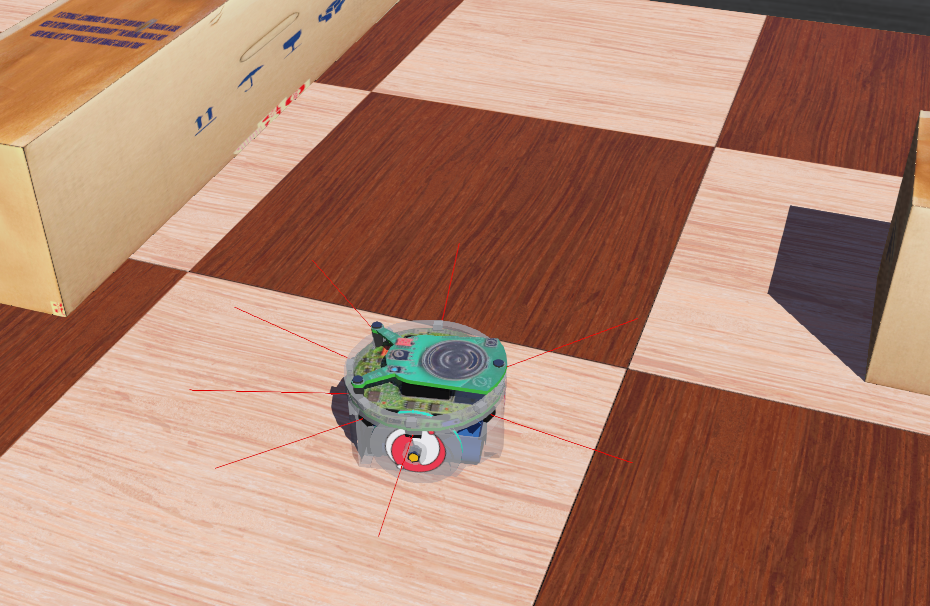

# Lösungen

### A1: Einarbeitung in Braitenberg Vehikel [60 min] 🌶️🌶️

<details>
<summary>
🎦 Lösungsvideo
</summary>
<iframe width="560" height="315" src="https://www.youtube.com/embed/ETi3jQ2oeIc?si=OeEiBz450yook6lM" title="YouTube video player" frameborder="0" allow="accelerometer; autoplay; clipboard-write; encrypted-media; gyroscope; picture-in-picture; web-share" allowfullscreen></iframe>
</details>


Braitenberg Vehikel sind ein historisch wichtiger Meilenstein in der Geschichte der Robotik. Für uns - so werden sie sehen - bieten sie eine tolle Möglichkeit einfache Roboterkontrollarchitekturen umzusetzen.

Führen Sie nun eine Internet-Recherche durch:
- Was sind Braitenberg Vehikel?
- Handelt es sich dabei um eine reaktive, deliberative oder hybride Roboterkontrollarchitektur?
- Welche Varianten von Braitenberg Vehikeln gibt es bzw. kann man unterscheiden?

Lösung:

Braitenberg-Vehikel sind eine Form von Robotern, die von dem italienischen Kybernetiker und Neurologen Valentino Braitenberg in seinem Buch "Vehicles: Experiments in Synthetic Psychology" vorgestellt wurden. Diese Konzepte wurden entwickelt, um zu zeigen, wie einfache Mechanismen zu komplexem Verhalten führen können.

Was sind Braitenberg-Vehikel?

Braitenberg-Vehikel sind einfache, hypothetische Fahrzeuge, die mit Sensoren und Motoren ausgestattet sind. Die Sensoren sind so konzipiert, dass sie auf bestimmte Umweltreize reagieren, wie z.B. Licht oder Wärme. Die Reaktion der Sensoren steuert direkt die Motoren des Vehikels, was zu einer Bewegung des Fahrzeugs führt. Diese Vehikel sind so gestaltet, dass sie ohne komplexe Steuerungssysteme oder Computer auskommen. Sie zeigen, wie vermeintlich intelligente Verhaltensweisen durch sehr einfache Mechanismen erzeugt werden können.

Klassifizierung der Roboterkontrollarchitektur

Braitenberg-Vehikel fallen klar in die Kategorie der reaktiven Roboterkontrollarchitekturen. Sie basieren auf direkten, unmittelbaren Reaktionen auf Umweltstimuli ohne interne Repräsentation der Welt oder Planungsprozesse. Ihr Verhalten wird ausschließlich durch die physische Konfiguration von Sensoren und Motoren bestimmt, was eine einfache und direkte Antwort auf Umgebungsreize ermöglicht.

Varianten von Braitenberg-Vehikeln

Es gibt verschiedene Varianten von Braitenberg-Vehikeln, die unterschiedliche Verhaltensweisen aufweisen, abhängig von der Art und Weise, wie ihre Sensoren und Motoren verbunden sind:

- Attraktion und Abneigung: Einige Vehikel bewegen sich auf eine Lichtquelle zu (Attraktion), während andere von ihr weglaufen (Abneigung). Dies wird durch die Verbindung der Sensoren mit den Motoren bestimmt.

- Komplexeres Verhalten: Durch die Variation der Sensorempfindlichkeit, der Motorstärke und der Art der Verbindung (z.B. kreuzweise Verbindung der Sensoren mit den Motoren) können komplexere Verhaltensweisen wie z.B. das Verfolgen oder Fliehen vor beweglichen Objekten erzeugt werden.

- Aggressives und ängstliches Verhalten: Einige Vehikel können so konstruiert werden, dass sie sich auf eine Quelle zubewegen und dann abrupt abbiegen, was als "aggressives" oder "ängstliches" Verhalten interpretiert werden könnte.

Braitenberg-Vehikel sind ein faszinierendes Konzept, das zeigt, wie einfache Regeln und physische Konfigurationen zu komplexem und scheinbar intelligentem Verhalten führen können.

Grundkonzept eines Braitenberg-Vehikels

Ein Braitenberg-Vehikel besteht typischerweise aus zwei Rädern (oder zwei Motoren), die unabhängig voneinander gesteuert werden können. An jedem Rad ist ein Sensor angebracht, der auf bestimmte Umgebungsreize wie Licht, Wärme oder in manchen Fällen Nähe (durch Ultraschall- oder Infrarotsensoren) reagiert. Die Reaktion des Sensors beeinflusst direkt die Geschwindigkeit oder die Drehrichtung des zugehörigen Rads.
Hindernisvermeidung mit einem Braitenberg-Vehikel

Um Hindernisvermeidung zu erreichen, kann das Vehikel mit Sensoren ausgestattet werden, die auf Nähe reagieren. Das grundlegende Prinzip für die Hindernisvermeidung ist wie folgt:

- Sensor-Motor-Kopplung: Jeder Nähesensor ist mit dem Motor auf der gleichen Seite des Vehikels verbunden. Das bedeutet, wenn der linke Sensor ein Hindernis erkennt, wird der linke Motor aktiviert und ebenso für rechts

- Reaktionsweise: Wenn das Vehikel auf ein Hindernis zufährt, detektiert der Nähesensor dieses Hindernis. Der Sensor aktiviert daraufhin den Motor auf der gleichen Seite stärker.

- Ausweichmanöver: Durch die erhöhte Aktivität des Motors auf der Seite, wo das Hindernis detektiert wurde, dreht sich das Vehikel vom Hindernis weg. Beispielsweise, wenn ein Hindernis näher am linken Sensor ist, erhöht sich die Geschwindigkeit des linken Motors, was dazu führt, dass das Vehikel nach rechts dreht und somit dem Hindernis ausweicht.

- Feinabstimmung: Die Empfindlichkeit der Sensoren und die Stärke der Motorreaktion können feinabgestimmt werden, um die Effizienz der Hindernisvermeidung zu optimieren. Je empfindlicher der Sensor, desto früher kann das Vehikel auf ein Hindernis reagieren.

Zusätzliche Überlegungen

- Sensorreichweite: Die Reichweite der Sensoren bestimmt, wie früh das Vehikel auf ein Hindernis reagiert. Sensoren mit längerer Reichweite ermöglichen eine frühere Reaktion, was besonders in schnellen oder komplexen Umgebungen nützlich sein kann.

- Komplexität: Obwohl Braitenberg-Vehikel in ihrer Grundform sehr einfach sind, können sie durch Hinzufügen weiterer Sensoren oder durch komplexere Verkabelungs- und Verarbeitungsregeln verfeinert werden, um verbesserte oder spezialisierte Verhaltensweisen wie genauere Hindernisvermeidung zu erreichen.

Ein einfaches Braitenberg-Vehikel kann also eine Verhaltensweise wie Hindernisvermeidung durch eine direkte und einfache Kopplung von Nähesensoren und Motoren erreichen.

### A2: Braitenberg Vehikel in Python/Webots programmieren [150 min] 🌶️🌶️

<details>
<summary>
🎦 Lösungsvideo
</summary>
<iframe width="560" height="315" src="https://www.youtube.com/embed/xePhTjYqXoE?si=OiQlNFmlH3nTKNoz" title="YouTube video player" frameborder="0" allow="accelerometer; autoplay; clipboard-write; encrypted-media; gyroscope; picture-in-picture; web-share" allowfullscreen></iframe>
</details>


Sie sollen nun ein einfaches Braitenberg Vehikel in Webots mit Python umsetzen.

Nehmen Sie dazu den epuck-Roboter aus dem vorherigen Kapitel und die vorherige aufgebaute .wbt Welt, in der der epuck-Roboter noch zufällig umhergefahren ist.

Jetzt soll der epuck-Roboter auch auf seine Umwelt reagieren. Dazu sollen seine Abstandssensoren ausgelesen werden und die Werte sollen direkt bestimmen wie schnell die beiden Motoren links und rechts sich drehen.

Versuchen Sie zuerst herauszufinden, wie man die Abstandssensorwerte des epuck-Roboters in Python auslesen kann. Nutzen Sie dazu sowohl die Webots Dokumentation als auch Codebeispiele, die Sie im Internet hierzu suchen.

Wählen Sie dann zwei Absstandsensoren S1, S2, die jeweils nach vorne links bzw. vorne rechts im Winkel von ca. -45° und +45° ausgerichtet sind. Steuern Sie dann den Roboter dann sinngemäß in etwa so, dass S1 den linken Motor steuert und S2 den rechten Motor und zwar so, dass der Roboter vor Hindernissen ausweicht.

Experimentieren Sie hierzu im Robotersimulator und der vorher erstellten .wbt-Welt mit den vielen Hindernissen, bis der Roboter zufriedenstellend vor Hindernissen ausweicht.

Gehen Sie hierzu eventuell von dem Braitenberg-Vehikel zu einem Zustandsgesteuerten Controller über, der vom Prinzip her etwas Ähnliches macht wie das Braitenberg-Vehikel:

    Wenn links ein Hindernis, dann drehe nach rechts
    Wenn rechts ein Hindernis, dann drehe nach links
    Ansonsten fahre nach vorne

Lösung:

Die Dokumentation von Webots zeigt sehr schön die Anordnung der Sensoren des epuck-Roboters:

[Link](https://cyberbotics.com/doc/guide/tutorial-4-more-about-controllers?tab-language=python)

ps6 und ps1 scheinen hiernach gut geeignet zu sein, um die Rolle von S1 und S2 zu übernehmen.

Sie können unter "View --> Optional Rendering --> Show DistanceSensor Rays" auch die Distanzsensoren als rote Linien anzeigen:




```python
"""Codelösung: Braitenberg Vehikel  Controller.

Ein reaktiver Roboter Controller zur Hindernisvermeidung
(Obstacle Avoidance)
"""

from controller import Robot, Motor

print("Controller: Braitenberg Vehikel gestartet.")

TIME_STEP = 64
MAX_MOTOR_SPEED = 6.28

# Eine Robotercontrollerinstanz erzeugen
robot = Robot()

# Handles für den Motor holen
leftMotor = robot.getDevice('left wheel motor')
rightMotor = robot.getDevice('right wheel motor')

# Zielposition der Räder auf Unendlich setzen
# D.h. so viel wie: Wir steuern jetzt gleich über
# die Geschwindigkeitskontrolle der Räder und geben
# NICHT eine Zielposition für die Räder vor
leftMotor.setPosition(float('inf'))
rightMotor.setPosition(float('inf'))

leftMotor.setVelocity (0)
rightMotor.setVelocity(0) 

# Zugriff auf Sensoren ps0-ps7 vorbereiten
ps = []
psNames = [
    'ps0', 'ps1', 'ps2', 'ps3',
    'ps4', 'ps5', 'ps6', 'ps7'
]

for i in range(8):
    ps.append(robot.getDevice(psNames[i]))
    ps[i].enable(TIME_STEP)
    
    print( f"Distance sensor {i} max value={ps[i].getMaxValue()}" )
    
# Exemplarisch für einen Sensor den maximalen Sensorwert bestimmen
max_sensor_value = ps[0].getMaxValue()

# Wir implementieren hier eigentlich zwei verschiedene Controller:
# Braitenberg: Kopplung linker Sensor --> linker Motor, analog rechts
# State Machine: Zustandsmaschine mit ähnlichem Verhalten wie Braitenberg
#mode = "Braitenberg"
mode = "State machine"

print("Controller mode:", mode)

# Hauptsimulationsschleife
# Wird ausgeführt, bis Webots den Robotcontroller stoppt
while robot.step(TIME_STEP) != -1:

    psValues = []
    for i in range(8):
        psValues.append(ps[i].getValue())

    if mode=="Braitenberg":

        # Hole Abstandssensorwert links und rechts
        left_sensor_value  = psValues[6]
        right_sensor_value = psValues[1]
        
        # Normiere Abstandssensorwerte auf [0,1]
        left_sensor_value  /= max_sensor_value
        right_sensor_value /= max_sensor_value
        #print(left_sensor_value, right_sensor_value)
        
        speed = 10.0
            
        left_motor_speed = left_sensor_value * MAX_MOTOR_SPEED * speed
        right_motor_speed = right_sensor_value * MAX_MOTOR_SPEED * speed
        if left_motor_speed > MAX_MOTOR_SPEED:
            left_motor_speed = MAX_MOTOR_SPEED
        if right_motor_speed > MAX_MOTOR_SPEED:
            right_motor_speed = MAX_MOTOR_SPEED
        
        # print(left_motor_speed, right_motor_speed)    
        

        
    if mode == "State machine":
     
         # Hindernis links oder rechts?
        right_obstacle = psValues[0] > 80.0 or psValues[1] > 80.0 or psValues[2] > 80.0
        left_obstacle = psValues[5] > 80.0 or psValues[6] > 80.0 or psValues[7] > 80.0

        # Geradeausfahren mit 50% der Maximalgeschwindigkeit
        left_motor_speed  = 0.5 * MAX_MOTOR_SPEED
        right_motor_speed = 0.5 * MAX_MOTOR_SPEED
        
        # Wenn Hindernisse da sind, aber drehen!
        if left_obstacle:
            # Drehe nach rechts
            left_motor_speed  = 0.5 * MAX_MOTOR_SPEED
            right_motor_speed = -0.5 * MAX_MOTOR_SPEED
        elif right_obstacle:
            # Drehe nach links
            left_motor_speed  = -0.5 * MAX_MOTOR_SPEED
            right_motor_speed = 0.5 * MAX_MOTOR_SPEED
           
    # Setze Motorgeschwindigkeiten
    leftMotor.setVelocity (left_motor_speed)
    rightMotor.setVelocity(right_motor_speed) 
    
```
