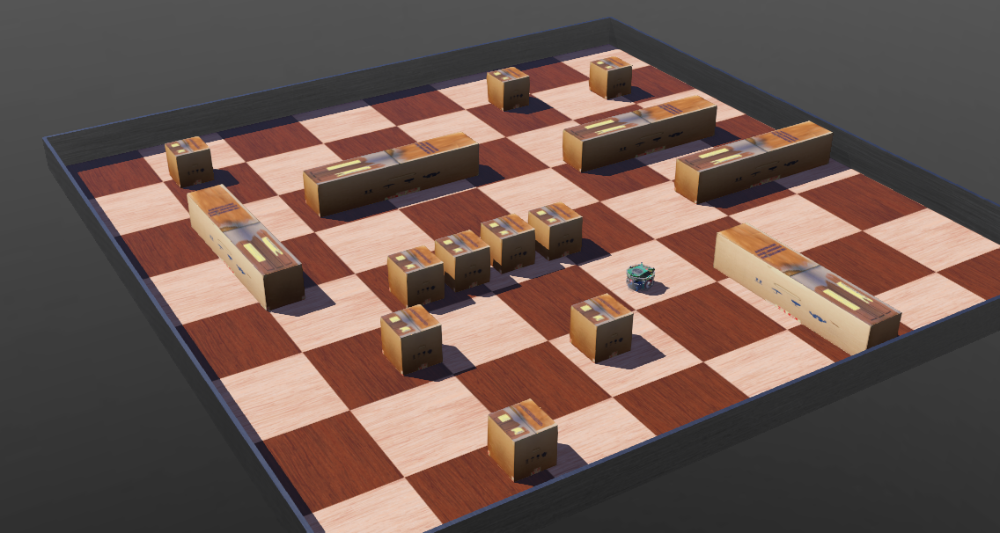
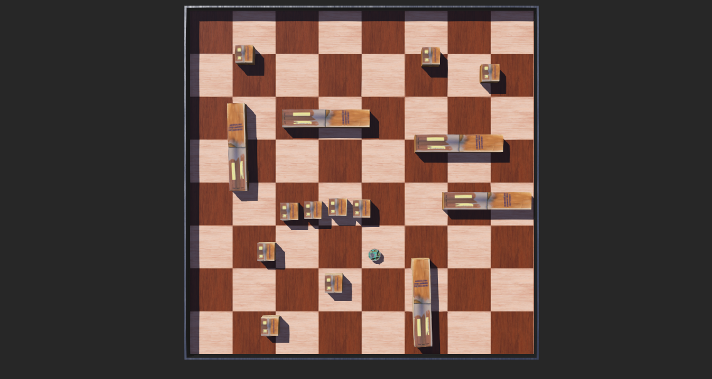

# Robotik: Einen Webots-Roboter aus Python heraus steuern

## Einführung [15 min]

### Webots

Webots dient als fortschrittliche Open-Source-Software zur Simulation von Robotern. Entwickelt, um die Komplexität der Robotik zugänglicher zu machen, wird es in Forschung, Bildung und Industrie eingesetzt. Der größte Vorteil von Webots liegt in seiner Fähigkeit, realistische 3D-Umgebungen zu erstellen, in denen Benutzer ihre Roboterkonzepte testen können, ohne sich um die Kosten oder die physische Beschädigung realer Roboter sorgen zu müssen.

### Das .wbt Dateiformat

Das .wbt-Dateiformat ist ein zentrales Element der Webots-Robotersimulationsplattform. Diese Dateien sind für das Definieren und Konfigurieren von Simulationsszenarien in Webots unerlässlich. Im Grunde sind .wbt-Dateien die Baupläne, die festlegen, wie eine virtuelle Welt und die darin agierenden Roboter aussehen und funktionieren.

### Struktur und Inhalt einer .wbt-Datei

Eine .wbt-Datei ist im Wesentlichen eine Textdatei, die eine hierarchische Struktur von Knoten und Feldern verwendet, um die Elemente einer Simulation zu beschreiben. Jeder Knoten in einer .wbt-Datei repräsentiert ein Objekt oder eine Entität in der virtuellen Welt – dies kann ein Roboter, ein Hindernis, eine Beleuchtungsquelle oder jede andere Komponente sein. Die Felder innerhalb jedes Knotens definieren spezifische Eigenschaften wie Größe, Form, Position, Textur und physikalische Eigenschaften wie Masse oder Reibung.

### Beispiel eines einfachen .wbt-Knotens:

Der folgende Ausschnitt definiert einen einfachen festen Körper (Solid) mit einer Boxform.

    Solid {
        translation 0 0 0
        children [
            Shape {
                geometry Box {
                    size 1 1 1
                }
                appearance Appearance {
                    material Material {
                        diffuseColor 1 0 0
                    }
                }
            }
        ]
    }

### Erstellung und Bearbeitung von .wbt-Dateien

.wbt-Dateien können entweder manuell in einem Texteditor oder über die grafische Benutzeroberfläche von Webots bearbeitet werden. Die GUI-Option ist besonders nützlich für Anfänger oder diejenigen, die eine visuellere Herangehensweise bevorzugen. Sie ermöglicht es Benutzern, Objekte zu verschieben, zu drehen und ihre Eigenschaften über ein intuitives Interface anzupassen, während die Änderungen automatisch in der .wbt-Datei reflektiert werden.

### Anwendung und Bedeutung in der Robotersimulation

Das .wbt-Format ermöglicht eine hohe Flexibilität und Genauigkeit bei der Gestaltung von Simulationsumgebungen. Von einfachen Szenarien, wie einem Roboter, der durch ein Labyrinth navigiert, bis hin zu komplexen Simulationen, die ganze Städte oder interaktive Systeme mit mehreren Robotern umfassen, ist fast alles möglich.

### Programmierung von Robotern in Webots

Webots unterstützt mehrere Programmiersprachen, was es zu einer flexiblen Wahl für verschiedene Arten von Benutzern macht. Zu den prominenten gehören:

- Python: Aufgrund seiner Einfachheit und Popularität ist Python eine der am häufigsten verwendeten Sprachen in Webots.
- C++: Für Benutzer, die höhere Leistung und Kontrolle bevorzugen, bietet Webots auch Unterstützung für C++.

## Aufgaben [210 min]

Die folgenden Aufgaben dienen dazu, dass Sie Schritt-für-Schritt
- eine eigene erste Welt (.wbt) in Webots erstellen
- einen Roboter hinzufügen
- und lernen den Roboter aus Python heraus zu steuern

### A1: Das erste Webots Tutorial durcharbeiten (90min) 🌶️🌶️

Für Webots gibt es bereits eine eigene Dokumentation. Sie finden Sie unter

[https://cyberbotics.com/doc/guide/index](https://cyberbotics.com/doc/guide/index)

Ein guter Einstieg bietet dabei das folgende Tutorial "Your First Simulation in Webots (30min)":

[https://cyberbotics.com/doc/guide/tutorial-1-your-first-simulation-in-webots](https://cyberbotics.com/doc/guide/tutorial-1-your-first-simulation-in-webots)

Arbeiten Sie dieses Tutorial nun durch! Angeblich braucht man nur 30min. Der Ersteller dieses Skriptteils schätzt die Zeit für Anfänger aber deutlich höher ein, eher 90min!

### A2: Eine erste eigene Welt erstellen (30min) 🌶️🌶️

Erstellen Sie nun eine neue Webots Welt, die sie anders als im Tutorial zuvor selber gestalten.

Unser Ziel wird es später sein, ein Python-Programm zu entwickeln, das einen Roboter durch eine Welt fahren lassen kann, ohne, dass dieser anstößt (Hindernissvermeidung, engl. obstacle avoidance).

Die Welt, die Sie nun in Webots erstellen, werden wir später für diese Aufgabe wiederverwenden! Zuvor müssen wir jedoch erst noch lernen, wie man einen Webots-Roboter überhaupt aus Python heraus steuern kann.

Die Welt soll wie im Tutorial aus Aufgabe 1 eine Wand haben, damit der Roboter nicht "abhauen" kann. Stellen Sie in die Welt aber mehrere unterschiedliche Objekte, so dass wir später eine vielseitigere Welt für das Testen der Hindernisvermeidung haben!

Die Welt soll folgendermaßen aussehen:

- Größe des für den Roboter mit einer Wand eingeschlossenen Bereichs: 2x2m = 4qm
- Ein "epuck" Robotermodell der Firma GCtronic soll hinzugefügt werden: https://www.gctronic.com/e-puck2.php
- Es sollen im Gegensatz zum Tutorial aus Aufgabe 1 interessantere Situation für eine spätere Hindernissvermeidung gebaut werden wie
    -  Gänge bestehend aus mehreren Objekten
    -  Unterschiedlichste Objekte in die Welt eingefügt werden
 
Die Welt soll in etwa so aussehen (Ansicht von der Seite):

Die Welt soll in etwa so aussehen (Ansicht von oben):

### A3: Den epuck-Roboter aus Python heraus steuern (90 min) 🌶️🌶️🌶️

In dem Tutorial, das Sie in Aufgabe 1 durchgearbeitet haben, wurde bereits ein Robotercontroller in Python geschrieben.

Nutzen Sie jetzt den bestehenden Python Code und schreiben Sie den Code so um, dass der Roboter zufällig durch die Welt fährt.

Keine Sorge: Wenn der Roboter irgendwo anstößt, stößt er halt an! Das ignorieren wir hier noch.

Nutzen Sie dazu das Konzept einer Zustandsmaschine. Wählen Sie jeweils einen zufälligen Zustand aus, der dann für eine gewisse zufällige Zeit aufrecht erhalten wird:

- Zustand 1: Roboter dreht sich nach links
- Zustand 2: Roboter dreht sich nach rechts
- Zustand 3: Roboter fährt nach vorne
- Zustand 4: Roboter fährt rückwärts

Geben Sie dem Benutzer auch in der Webots Console (mit print) aus, in welchem der vier Zustände (Verhaltensweisen) der Roboter gerade ist.

[Lösungen](webots_roboter_aus_python_steuern_loesungen.md)
