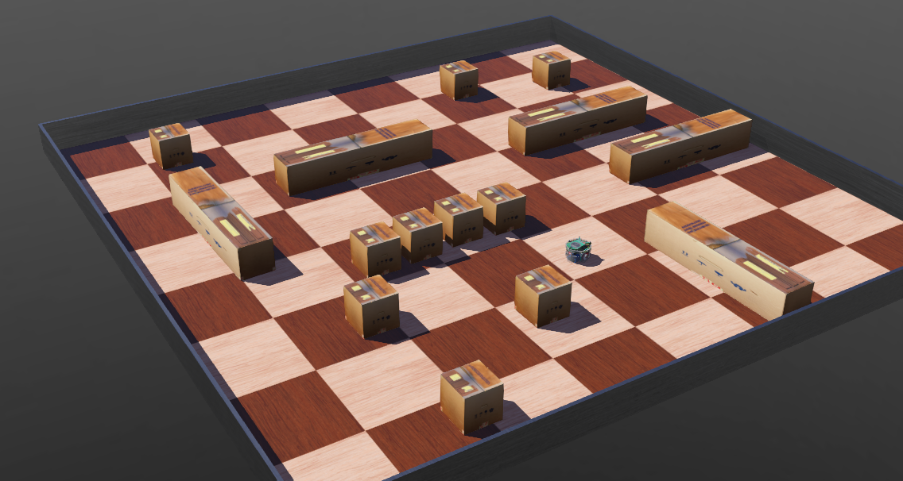
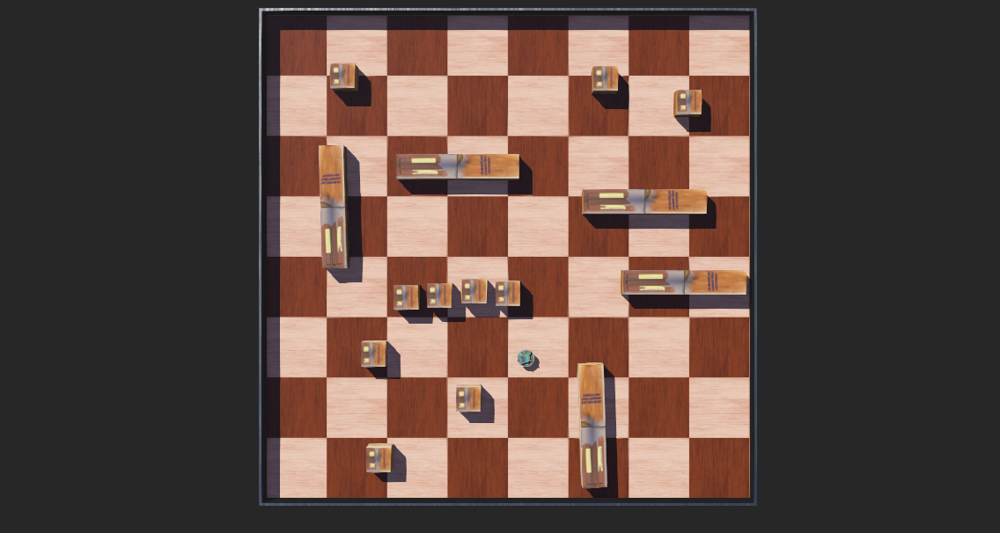

# Lösungen

### A1: Das erste Webots Tutorial durcharbeiten (90min) 🌶️🌶️

<details>
<summary>
🎦 Lösungsvideo
</summary>
<iframe width="560" height="315" src="https://www.youtube.com/embed/6m239dRzwaQ?si=KkJ1AhFg5I7Li0F_" title="YouTube video player" frameborder="0" allow="accelerometer; autoplay; clipboard-write; encrypted-media; gyroscope; picture-in-picture; web-share" allowfullscreen></iframe>
</details>


Für Webots gibt es bereits eine eigene Dokumentation. Sie finden Sie unter

[https://cyberbotics.com/doc/guide/index](https://cyberbotics.com/doc/guide/index)

Ein guter Einstieg in Webots bietet dabei das folgende Tutorial "Your First Simulation in Webots (30min)":

[https://cyberbotics.com/doc/guide/tutorial-1-your-first-simulation-in-webots](https://cyberbotics.com/doc/guide/tutorial-1-your-first-simulation-in-webots)

Arbeiten Sie dieses Tutorial nun durch! Angeblich braucht man nur 30min. Der Ersteller dieses Skriptteils schätzt die Zeit für Anfänger aber deutlich höher ein, eher 90min!

### A2: Eine erste eigene Welt erstellen (30min) 🌶️🌶️

<details>
<summary>
🎦 Lösungsvideo
</summary>
<iframe width="560" height="315" src="https://www.youtube.com/embed/23rw6g0iDc8?si=gpFvk4wXaSvuQm8L" title="YouTube video player" frameborder="0" allow="accelerometer; autoplay; clipboard-write; encrypted-media; gyroscope; picture-in-picture; web-share" allowfullscreen></iframe>
</details>


Erstellen Sie nun eine neue Webots Welt, die sie anders als im Tutorial zuvor selber gestalten.

Unser Ziel wird es später sein, ein Python-Programm zu entwickeln, das einen Roboter durch eine Welt fahren lassen kann, ohne, dass dieser anstößt (Hindernissvermeidung, engl. obstacle avoidance).

Die Welt, die Sie nun in Webots erstellen, werden wir später für diese Aufgabe wiederverwenden! Zuvor müssen wir jedoch erst noch lernen, wie man einen Webots-Roboter überhaupt aus Python heraus steuern kann.

Die Welt soll wie im Tutorial aus Aufgabe 1 eine Wand haben, damit der Roboter nicht "abhauen" kann. Stellen Sie in die Welt aber mehrere unterschiedliche Objekte, so dass wir später eine vielseitigere Welt für das Testen der Hindernisvermeidung haben!

Die Welt soll folgendermaßen aussehen:

- Größe des für den Roboter mit einer Wand eingeschlossenen Bereichs: 2x2m = 4qm
- Ein "epuck" Robotermodell der Firma GCtronic soll hinzugefügt werden: https://www.gctronic.com/e-puck2.php
- Es sollen im Gegensatz zum Tutorial aus Aufgabe 1 interessantere Situation für eine spätere Hindernissvermeidung gebaut werden wie
    -  Gänge bestehend aus mehreren Objekten
    -  Unterschiedlichste Objekte in die Welt eingefügt werden
 
Die Welt soll in etwa so aussehen (Ansicht von der Seite):



Die Welt soll in etwa so aussehen (Ansicht von oben):



Lösung:

[Lösung .wbt-Datei](webots_loesungen/eigene_welt_viele_hindernisse/worlds/quadratische_welt_viele_hindernisse.wbt)

### A3: Den epuck-Roboter aus Python heraus steuern (90 min) 🌶️🌶️🌶️

<details>
<summary>
🎦 Lösungsvideo
</summary>
<iframe width="560" height="315" src="https://www.youtube.com/embed/Knayk-MdgtM?si=G65vBcLvMG4WlKFp" title="YouTube video player" frameborder="0" allow="accelerometer; autoplay; clipboard-write; encrypted-media; gyroscope; picture-in-picture; web-share" allowfullscreen></iframe>
</details>


In dem Tutorial, das Sie in Aufgabe 1 durchgearbeitet haben, wurde bereits ein Robotercontroller in Python geschrieben.

Nutzen Sie jetzt den bestehenden Python Code und schreiben Sie den Code so um, dass der Roboter zufällig durch die Welt fährt.

Keine Sorge: Wenn der Roboter irgendwo anstößt, stößt er halt an! Das ignorieren wir hier noch.

Nutzen Sie dazu das Konzept einer Zustandsmaschine. Wählen Sie jeweils einen zufälligen Zustand aus, der dann für eine gewisse zufällige Zeit aufrecht erhalten wird:

- Zustand 1: Roboter dreht sich nach links
- Zustand 2: Roboter dreht sich nach rechts
- Zustand 3: Roboter fährt nach vorne
- Zustand 4: Roboter fährt rückwärts

Geben Sie dem Benutzer auch in der Webots Console (mit print) aus, in welchem der vier Zustände (Verhaltensweisen) der Roboter gerade ist.

Lösung:

Wichtig ist hier im "Scene Tree" das Controller-Skript zu setzen / auszuwählen. Dies war auch im Tutorial (siehe Aufgabe 1) beschrieben:


Der Roboter-Controller in Python:


```python
"""zufaelliges_rumfahren controller.

Der Roboter fährt hier zufällig herum
Wenn wir anstoßen, stoßen wir halt an ...
"""

from controller import Robot, Motor

print("Controller: Zufälliges Rumfahren gestartet.")

TIME_STEP = 64
MAX_SPEED = 6.28

# Eine Robotercontrollerinstanz erzeugen
robot = Robot()

# Handles für den Motor holen
leftMotor = robot.getDevice('left wheel motor')
rightMotor = robot.getDevice('right wheel motor')

# Zielposition der Räder auf Unendlich setzen
# D.h. so viel wie: Wir steuern jetzt gleich über
# die Geschwindigkeitskontrolle der Räder und geben
# NICHT eine Zielposition für die Räder vor
leftMotor.setPosition(float('inf'))
rightMotor.setPosition(float('inf'))

# Hauptsimulationsschleife
# Wird ausgeführt, bis Webots den Robotcontroller stoppt
import random

# Startzustand: Nach vorne fahren
zustand = 3
counter = 50

zustandsdic = {1 : "Drehe nach links",
               2 : "Drehe nach rechts",
               3 : "Fahre vorwärts",
               4 : "Fahre rückwärts"}

# Geschwindigkeit der Motoren definieren
# 0.0: Motor steht
# 1.0: Motoren drehen sich maximal schnell
speed = 0.4

while robot.step(TIME_STEP) != -1:

    # Wenn die Zeit für die vorherige
    # Verhaltensweise abgelaufen ist,
    # setze einen neuen zufälligen Zustand
    # (Verhaltensweise) und wähle
    # eine zufällige Zeitdauer hierfür aus
    if counter==0:
                
        if zustand==1 or zustand==2:
            # Nach drehen: nach vorne oder rückwärts fahren
            zustand=random.randint(3,4)
            
            # Zeitdauer fürs nach vorne oder rückwärts fahren
            counter=random.randint(50,80)
            
        elif zustand==3 or zustand==4:
            # Nach vorne/rückwärts fahren: drehen
            zustand=random.randint(1,2)
            
            # Zeitdauer fürs Drehen
            counter=random.randint(15,50)
                        
        name_zustand = zustandsdic[zustand]
        print(f"Neuer Zustand #{zustand}/{name_zustand} für {counter} Schritte.")
    else:
        counter -= 1
        
    #print(zustand, counter)
    if zustand==1:
        leftMotor.setVelocity (-speed * MAX_SPEED)
        rightMotor.setVelocity(+speed * MAX_SPEED)        
    if zustand==2:
        leftMotor.setVelocity (+speed * MAX_SPEED)
        rightMotor.setVelocity(-speed * MAX_SPEED)
    if zustand==3:
        leftMotor.setVelocity (+speed * MAX_SPEED)
        rightMotor.setVelocity(+speed * MAX_SPEED)
    if zustand==4:
        leftMotor.setVelocity (-speed * MAX_SPEED)
        rightMotor.setVelocity(-speed * MAX_SPEED)
```
