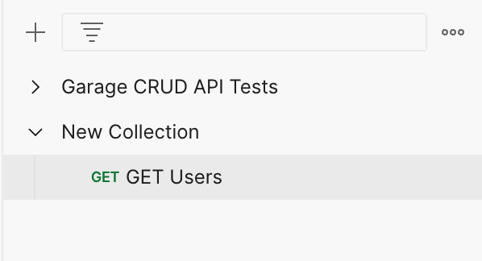
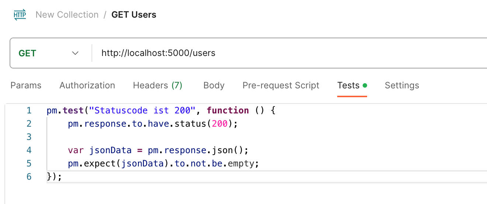
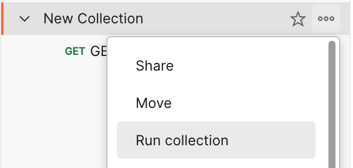
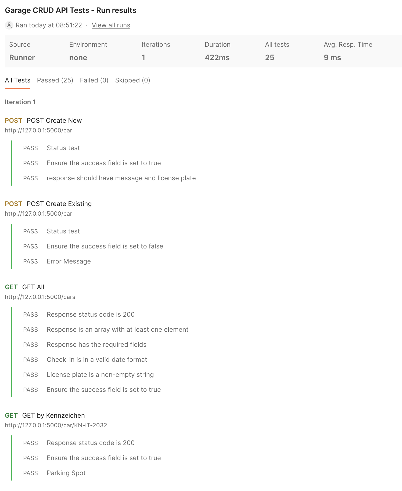

# Tag 2 - APIs Bauen

### Inhalt
- Wie baut man eine API?
  - Wie funktionieren APIs intern?
    - Flussdiagram
    - API Architektur Prinzipien
      - JSON (und XML)
    - Deployment (Ausblick)
      - Cloud (Azure)
      - Docker
    - Flask & Django
      - Intro & Unterschiede
      - Beispiele
        - Hallo Welt der APIs
          - Live-Coding zur Demonstration der "Einfachheit"
        - localhost / HTTP(S) Server
          - Wie kann ein lokales Programm auf HTTP Requests nach "außen" hören?

    - Flask Advanced
      - Restful API Designs
      - ORMs
      - Routen
      - Data Handling
      - Fehler Codes
      - Postman & Python Requests Testing
        - Wie testet man einfach APIs? (Rückblick Testing 4-5)
        - Postman Collections Repeatable Testing mit Postman

# Wie baut man eine API?
## Rückblick - Was ist eine API?
Im letzten Kapitel haben wir gelernt, dass API für Application Programming Interface steht. APIs ermöglichen es Entwicklern, komplexe Funktionen zu nutzen, ohne diese von Grund auf neu entwickeln zu müssen. So können beispielsweise Entwickler einer Wetter-App die API eines Wetterdienstes nutzen, um aktuelle Wetterdaten abzurufen, anstatt selbst eine umfassende Wetterdateninfrastruktur aufzubauen.

## Tagesprojekt
Ziel des heutigen Tages ist es, eine eigene RESTful FLASK API mit CRUD Funktion für das Management von Stellplätzen in einer Garage zu erstellen und diese mit einer Postman Collection zu testen.


## Entwerfen einer API
Der Aufbau einer effektiven API erfordert ein solides Verständnis der Grundprinzipien und besten Praktiken in der Softwareentwicklung.
**Deshalb beginnt der Entwurf einer API mit der Definition ihrer Funktionalität und der Daten, die sie verwalten soll.**

### Festlegung der Anforderungen und Endpoints
Endpoints sind die spezifischen Ansprechpartner innerhalb einer API, über die Interaktionen stattfinden. Sie bestimmen, wie die API aufgerufen wird und welche Ressourcen oder Dienste sie bietet.

#### Designprinzipien
Beim entwerfen einer API liegt der Fokus auf die Verständlichkeit und Nutzbarkeit der späteren Nutzer. Deshalb ist es umso wichtiger folgende Prinzipien zu kennen.

**Klarheit und Einfachheit**: Endpoints sollten intuitiv und leicht zu verstehen sein. Ein guter Endpoint beschreibt die Ressource oder Aktion, die er repräsentiert. Wie im Kapitel zu Clean Code beschrieben, kann man z.B. über die Bezeichnung der Endpunkte bereits viel Klarheit geben.

Für die Funktion, einen Nutzer per ID abzufragen, ist der Endpoint `get_user_by_id` besser als z.B. nur `get_user`. 

**Konsistenz**: Einheitliche Benennung und Strukturierung der Endpoints erleichtern die Nutzung der API. Vor allem das [Schema](#definition-des-schemas-für-requests-und-responses) der Responses muss so konsistent wie möglich gewählt sein, sodass den Nutzern die Einarbeitung erleichtert wird.

**Ressourcenorientierung**: In RESTful APIs repräsentiert jeder Endpoint idealerweise eine spezifische Ressource oder eine Sammlung von Ressourcen. Das [Single Responsibility Prinzip](https://www.linkedin.com/pulse/single-responsibility-principle-software-design-sanjoy-kumar-malik/) ist vor allem beim API-Design ein wichtiges Konzept. 

### Definition des Schemas für Requests und Responses
#### Request und Response Struktur
Jeder API-Request und -Response folgt einem spezifischen Schema, normalerweise in JSON oder XML. Dieses Schema definiert, wie Daten gesendet und empfangen werden.

#### JSON und XML
**JSON (JavaScript Object Notation)**: Leichtgewichtig und die am häufigsten verwendete Formatierung für API-Interaktionen. Es ist leicht lesbar und zu schreiben und wird heutzutage für fast alle APIs verwendet.

**XML (eXtensible Markup Language)**: Eine ältere, oft in Legacy-Projekten verwednete, Alternative zu JSON, die in manchen Systemen immer noch verwendet wird. XML ist strenger strukturiert als JSON und enthält meist konkrete Informationen zu Dateitypen. Anstelle von Objektnotation (`user.name`) wird XPath (`//user/name`) zur Abfrage einzelner Werte verwendet.


## Entwicklungswerkzeuge
Wie für die Entwicklung von anderen Spezialthemen gibt es auch für APIs ein zusätzlichen Toolset. Da vor allem großen Wert auf das Testen und die Dokumentation von APIs gelegt wird, sind **API-Design-Tools** wie [Postman](https://www.postman.com/), zum einfachen Testen, und [Swagger](https://swagger.io/), zur Dokumentation, hilfreich.

[Postman]() werden wir im Lauf des heutigen Tages näher behandelt. Swagger wird später näher behandelt und Teil Projektwoche.


## Implementierung
Die Implementierung einer API kann eine komplexe Aufgabe sein und umfasst folgende Schritte. Speziell bei der Entwicklung von APIs kann ein Test-Driven Developmentansatz unerwünschte Probleme vermeiden und zusätzlichen Aufwand durch den Fokus auf die Planung verhindern.

### 1. Planung
### Funktionsanforderungen

#### Anforderungsdokument
Die Erstellung eines umfassenden Anforderungsdokuments ist der erste Schritt in der Planungsphase. Es spezifiziert die funktionalen und nicht-funktionalen Anforderungen der API. Dazu gehört die Definition der zu unterstützenden Operationen, Sicherheitsanforderungen, Datenmodelle und Integrationen mit externen Diensten oder Datenbanken. Gerade für Projekte mit mehreren Teammitgliedern liegt der Erfolg in der Schaffung einer klaren und strukturierten Grundlage für die Entwicklung, die sicherstellt, dass alle Teammitglieder ein gemeinsames Verständnis der Ziele und Anforderungen haben.

#### API Architektur Prinzipien 
Auch die Wahl einer Architektur hängt von den spezifischen Anforderungen und dem Kontext ab. REST ist eine gängige Wahl für Web-APIs. Die Verwendung von JSON als Datenformat ist weit verbreitet, leichtgewichtig und einfach zu integrieren, was z.B. besonders wichtig für die Leistung und Skalierbarkeit der API ist.

### Auswahl der Technologie 
Die Auswahl des richtigen Frameworks und der Technologien erfolgt stets auf Basis der Anforderungen. Die meisten Frameworks unterstützen Grundlegende Funktionalitäten. Bei kleineren Projekten ist die Wahl der TEchnologie also deutlich weniger kritisch. API Frameworks wie [Flask oder Django](#web-api-frameworks) bieten eine robuste Basis für die Entwicklung von APIs in Python. Beide haben eingebaute Tools für Routing, Fehlerbehandlung und mehr.

### 2. Umsetzung
### Testen
Wie bereits in Wochen 4-5 erwähnt, sind Tests entscheidend, um die Zuverlässigkeit und Sicherheit der API zu gewährleisten. Dabei unterscheidet man zwischen verschiedenen Stufen.

**Unit-Tests** konzentrieren sich auf die kleinsten Teile der Anwendung, wie einzelne Funktionen oder Klassen, und stellen sicher, dass diese wie erwartet funktionieren.

**Integrationstests** prüfen das Zusammenspiel zwischen verschiedenen Komponenten der API, um sicherzustellen, dass sie zusammen korrekt funktionieren. Im heutigen Tagesprojekt werden wir uns vor allem auf diese Art der Tests mit Postman fokussieren. 

**End-to-End-Tests** hingegen simulieren reale Benutzerszenarien und prüfen die gesamte Anwendung in einer Umgebung, die der Produktionsumgebung ähnlich ist.

### Implementierung
Die Implementierung der API und der dafür nötigen Funktionalität nimmt of nur einen kleinen Teil der Entwicklung von Backend-Anwendungen in Anspruch. Im Falle, dass alle Anforderungen sowie die Tests bereits vordefiniert sind (TDD-Ansatz), ist die Entwicklung der Funktionen vergleichsweise unkompliziert.


### 3. Dokumentation
Auch wenn das Dokumentieren die am meisten vernachlässigte Aufgabe bei der Projekterstellung ist, ist sie doch unerlässlich für die Benutzerfreundlichkeit und Wartbarkeit der API. Sie sollte klar, vollständig sein und bei Änderungen konstant aktualisiert werden. Eine gute Dokumentation ermöglicht es Entwicklern, die API effizient zu nutzen und zu verstehen, und reduziert den Aufwand für Support und Fehlerbehebung.

Zu den Best Practices gehören unter anderem:

**Klarheit, Vollständigkeit und Konsistenz**: Die Dokumentation sollte umfassend sein, alle wichtigen Aspekte wie Endpoints, Parameter, Datenformate und Fehlercodes abdecken. Sie muss klar und präzise formuliert sein, um Missverständnisse zu vermeiden.

**Zielgruppenorientierung und Zugänglichkeit**: Die Dokumentation muss auf die Bedürfnisse der Zielgruppe, insbesondere Entwickler, zugeschnitten sein, einschließlich technischer Details und praktischer Beispiele.
Sie sollte leicht zugänglich, benutzerfreundlich und suchfreundlich gestaltet sein, um eine effiziente Nutzung zu ermöglichen.

**Interaktive Elemente und Versionierung**: Moderne API-Dokumentation sollte interaktive Beispiele enthalten, die das Testen der API direkt aus der Dokumentation heraus ermöglichen.
Eine klare Dokumentation der Versionsgeschichte hilft Benutzern, Änderungen und deren Auswirkungen auf ihre Anwendungen zu verstehen.


### 4. Deployment (Ausblick)
Der letze Schritt der Projektentwicklung ist die Veröffentlichung und Bereitstellung der API für die interne oder externe Nutzung. Jede (API)-Anwendung läuft auf einer Infrastruktur, heutzutage in den meisten Fällen einem virtuellen Cloud-Server.

#### Cloud 
Die Bereitstellung der Applikation über die Cloud bietet Skalierbarkeit, Zuverlässigkeit und oft Kosteneffizienz. Azure, welches in der kommenden Woche behandelt wird, ist eine beliebte Wahl mit einer breiten Palette von Diensten und Tools, die die Bereitstellung und das Management von APIs erleichtern. Im Kontext einer Cloudumgebung stoßen wir vermehrt auch auf den Begriff Docker-Container.

#### Docker
Die Verwendung von Containern wie [Docker](https://www.docker.com/) für das Deployment bietet zahlreiche Vorteile, wie Portabilität, Konsistenz und Isolation. Docker erleichtert das Deployment und das Management von Anwendungen und ihrer Abhängigkeiten, was besonders in komplexen oder skalierenden Umgebungen nützlich ist.


# Web API Frameworks
## Flask & Django
Flask und Django bieten zwei sehr unterschiedliche Ansätze für die Entwicklung von Webanwendungen und APIs in Python. Flask ist ideal für schnelle Entwicklung, kleine Projekte oder wenn eine hohe Flexibilität erforderlich ist. Django hingegen bietet ein umfassendes Ökosystem für größere und komplexere Anwendungen. **Die Wahl zwischen Flask und Django hängt von den spezifischen Anforderungen des Projekts, der bevorzugten Arbeitsweise des Entwicklerteams und der Komplexität der zu entwickelnden Anwendung ab**.

## Flask: Das Mikro-Framework
### Konzept und Philosophie
Flask ist ein leichtgewichtiges und flexibles Mikro-Framework für Python, entworfen für kleine bis mittelgroße Anwendungen und einfache Web-Dienste.
Es legt großen Wert auf Einfachheit und Erweiterbarkeit und bietet die Freiheit, die meisten Aspekte der Anwendung nach Bedarf zu gestalten.

### Hauptmerkmale von Flask:

**Minimalistischer Kern**: Flask kommt mit sehr wenig eingebauter Funktionalität. Dies ermöglicht eine hohe Anpassungsfähigkeit, erfordert aber auch, dass Entwickler viele Funktionen selbst implementieren oder Erweiterungen nutzen.

**Erweiterungen**: Eine breite Palette von Erweiterungen verfügbar, die nahtlos integriert werden können, um Funktionen wie Datenbankanbindung, Formularverarbeitung, Authentifizierung etc. hinzuzufügen.

**Einfache Routengestaltung**: Flask ermöglicht eine einfache und intuitive Routendeklaration mit Python-Dekoratoren.

### Einrichtung einer API mit Flask
**1. Installation**: Beginne mit der Installation von Flask mittels `pip install flask`.

**2. Anwendungserstellung**: Erstelle eine neue Python-Datei und importiere Flask.

**3. Route definieren**: Beachte, dass in Flask eine API oft als eine einfache Funktion beginnt, die über eine Annotation mit einem URL-Endpunkt verknüpft wird.

```python
from flask import Flask
app = Flask(__name__)

@app.route('/') # Flask URL-Endpunkt Annotation
def hello_world():
    return 'Hallo Welt!'

if __name__ == '__main__':
    app.run(debug=True, port=5000)
```
**4. Server starten**: Führe die Anwendung aus, um den lokalen Server zu starten.

## Django: Das "Batterien-inbegriffen"-Framework
### Konzept und Philosophie
Django ist ein leistungsstarkes und voll ausgestattetes Web-Framework für größere Anwendungen und Plattformen.
Sein Ansatz „Batterien inbegriffen“ bedeutet, dass es mit vielen integrierten Funktionen für die gängigsten Entwicklungsaufgaben kommt.

### Hauptmerkmale von Django
**Vollständige Entwicklungsumgebung**: Es bietet eine robuste Basis für Datenbankmodelle, Benutzerverwaltung, Sicherheitsmechanismen und mehr.

**ORM (Object-Relational Mapping)**: Eines der Kernmerkmale von Django ist sein ORM-System, das eine Abstraktionsschicht über die Datenbank bietet und SQL-Abfragen durch Python-Code ersetzt.

**Admin-Oberfläche**: Eine eingebaute Admin-Oberfläche ermöglicht einfache Verwaltung von Datenmodellen und Benutzerkonten.

### Einrichtung einer API mit Django
Im direkten Vergleich wird der Unterschied von Flask und Django klar, denn es erfordert ein wenig mehr Setup als Flask, bietet aber von Anfang an mehr Funktionalität.

**1. Installation und Projektstart**: Installiere Django und starten ein neues Projekt mit `django-admin startproject myproject`.

**2. Anwendung erstellen**: Erstelle eine neue Anwendung mit `python manage.py startapp myapp`.

**3. Views und URLs definieren**: Django verwendet keine Annotations sondern ein Muster von Views und URLs um Anfragen zu verarbeiten.
- In `views.py`, erstelle eine Funktion, die eine HTTP-Antwort zurückgibt. 
- In `urls.py`, definiere eine URL-Route, die der View-Funktion entspricht.

```python
# views.py
from django.http import HttpResponse

def hello_world(request):
    return HttpResponse('Hallo Welt!')

# urls.py
from django.urls import path
from . import views

urlpatterns = [
    path('', views.hello_world),
]
```
**4. Server starten**: Führe `python manage.py runserver 8000` aus, um den Server zu starten. 

## Lokaler HTTP Server
Ein lokaler HTTP(S) Server ermöglicht es, Webanwendungen und APIs auf einem lokalen Rechner zu entwickeln und zu testen. Sowohl Flask als auch Django bieten eingebaute Entwicklungsserver, die für Testzwecke und während der Entwicklung verwendet werden können. Diese Server sind jedoch nicht für den produktiven Einsatz gedacht, da sie nicht für hohe Lasten oder Sicherheitsanforderungen optimiert sind.

Für Produktionsumgebungen sollten auf jeden Fall robustere Serverlösungen wie [Apache](https://httpd.apache.org/) verwendet und [HTTPS](https://www.cloudflare.com/de-de/learning/ssl/what-is-https/) konfiguriert werden.


## Aufgaben
Zeit: 5-10 min / Aufgabe
1. **Hello World Flask & Django API**: Erstellt jeweils einen GET Endpunkt der den Text "Hallo Welt!" als Response zurückgibt in Flask und Django.
2. **Reflexionsrunden Django vs Flask**: In Gruppen von 2, vergleicht gemeinsam die Lesbarkeit, Einfachheit und den Syntax der beiden Frameworks.

### Musterlösungen
<details>
  <summary>1. Flask & Django Hello World</summary>
  
  **Flask**
  ```python
  from flask import Flask
app = Flask(__name__)

@app.route('/') # Flask URL-Endpunkt Annotation
def hello_world():
    return 'Hallo Welt!'

if __name__ == '__main__':
    app.run(debug=True, port=5000)
  ```

  **Django**
  ```python
  # views.py
from django.http import HttpResponse

def hello_world(request):
    return HttpResponse('Hallo Welt!')

# urls.py
from django.urls import path
from . import views

urlpatterns = [
    path('', views.hello_world),
]
  ```
</details>

<br>

# Flask Advanced
## Planung einer RESTful API in Flask
### Schritt 1: Zieldefinition und Funktionsumfang
**Ermittlung der Kernfunktionen**: Definiere die Hauptaufgaben, die Ihre API erfüllen soll. Ein Beispiel könnte das Verwalten von Benutzerkonten, das Posten von Nachrichten in einem sozialen Netzwerk oder das Abwickeln von Transaktionen in einem E-Commerce-System sein.

**Anwendungsfälle identifizieren**: Überlege, welche Aktionen die Benutzer durchführen sollen. Dazu gehören das Erstellen, Lesen, Aktualisieren und Löschen von Daten (CRUD-Operationen).

**Sicherheitsmaßnahmen planen**: Überlege, ob und wie die API gesichert wird. Das könnte z.B. über Authentifizierungstoken, OAuth oder andere Mechanismen funktionieren. Hierfür gibt es Flask-Erweiterungen wie Flask-JWT oder Flask-OAuthlib.

### Schritt 2: Endpoint-Strukturierung
**Ressourcenbasiertes Design**: RESTful APIs sind in der Regel ressourcenorientiert. Dies bedeutet, dass die Endpoints um die Ressourcen (wie Benutzer, Produkte, Nachrichten) herum strukturiert werden sollten. Zum Beispiel also wie folgend.

- `/users` für das Auflisten aller Benutzer oder das Erstellen eines neuen Benutzers.
- `/users/<id>` für das Abrufen, Aktualisieren oder Löschen eines spezifischen Benutzers.
- `/products/<id>/reviews` für das Anzeigen oder Hinzufügen von Bewertungen zu einem bestimmten Produkt.

### Schritt 3: Datenmodellierung
**Datenstruktur festlegen**: Definiere, wie die Daten strukturiert sein sollen. Welche Attribute hat beispielsweise ein Benutzer? Name, E-Mail, Passwort usw. sind gängige Felder.

**Beziehung zwischen Datenmodellen**: Bestimme die Beziehungen zwischen den Modellen. Zum Beispiel könnte ein Benutzer mehrere Bestellungen haben, und jede Bestellung könnte mehrere Produkte enthalten.

**Datenbankintegration mit SQLAlchemy**:
Flask arbeitet nicht direkt mit einer Datenbank, aber z.B. kann SQLAlchemy verwendet werden, um Modelle zu definieren, die Ihre Datenstrukturen repräsentieren.
Beispiele hierfür findest du in [Woche 6-7](../../datenbanken/datenbanken.md).

## Umsetzung einer RESTful API in Flask
### Routen
Das Kernstück jeder Flask-Anwendung sind die Routen, die bestimmen, wie Anfragen an verschiedene URLs gehandhabt werden. Ein Beispiel für eine einfache Route haben wir bereits im Teil [Einrichtung einer API mit Flask](#einrichtung-einer-api-mit-flask) gesehen.


```python
@app.route('/')
def home():
    return "Hallo Welt!"
```

RESTful Design definiert die Existenz der CRUD Operationen. Mit Flask können wir diese Endpoints wie folgt abbilden. Das explizite Angeben der unterstützen Methoden macht den Code auszeichnender und hilft bei der späteren Generierung der Dokumentation.

**GET**: Abrufen von Nutzerdaten. (Basisroute):
```python
@app.route('/users', methods=['GET'])
def get_users():
    # Logik, um Benutzerdaten abzurufen
```

**POST**: Erstellen eines neuen Nutzers (Basisroute).
```python
@app.route('/users', methods=['POST'])
def create_user():
    # Logik, um einen neuen Benutzer zu erstellen
```

**PUT**: Aktualisieren eines bestehenden Nutzers (Variable Route).
```python
@app.route('/users/<id>', methods=['PUT'])
def update_user(id):
    # Logik, um Benutzerdaten zu aktualisieren
```

**DELETE**: Löschen eines Nutzers (Variable Route).
```python
@app.route('/users/<int:id>', methods=['DELETE'])
def delete_user(id):
    # Logik, um einen Benutzer zu löschen
```


### Datenverarbeitung
Die Datenverarbeitung, z.B. von JSON Daten, sowohl als Payload in der Anfrage als auch in der Antwort ist für die effiziente Nutzung von APIs relevant. Deshalb bietet Flask das `request`-Objekt um Daten aus Anfragen abzurufen.
```python
@app.route('/users', methods=['POST'])
def create_user():
    user_data = request.json
    # Verarbeiten von user_data
```

Für das einfach Senden von JSON-Objekten in der Antwort nutzen wir `jsonify`.
```python
@app.route('/users/<int:id>', methods=['GET'])
def get_user(id):
    # Angenommene Hilfsfunktion zur Datenbankabfrage
    user = get_user_by_id(id)  
    return jsonify(user)
```

Für das handling von Form-Daten gibt es ein Objektattribute namens `form`. Es beinhaltet alle request-Formular Daten.
```python
@app.route('/submit-form', methods=['POST'])
def handle_data():
    name = request.form['name']
    age = request.form['age']
    # Verarbeiten der Daten
    return jsonify({"message": "Formular erhalten"}), 200
```


### Fehlercodes und Ausnahmebehandlung
Bei der Behandlung von Fehlern ist die korrekte Verwendung von HTTP-Fehlercodes entscheidend, um dem Client-Ende nützliches Feedback zu geben. Alle Status Codes sind standardisiert und können z.B. auf der [SelfHTML Seite](https://wiki.selfhtml.org/wiki/HTTP/Statuscodes) eingesehen werden. Es sollte immer der präzise HTTP-Statuscodes gesendet werden um den Zustand der Anfrage zu kommunizieren.

**`404 Nicht gefunden`**
```python
@app.route('/users/<int:id>')
def get_user(id):
    user = get_user_by_id(id)
    if not user:
        return jsonify({"error": "Benutzer nicht gefunden"}), 404 
    return jsonify(user)
```

**`400 Schlechte Anfrage`**
```python
@app.route('/cars', methods=['POST'])
def create_car():
    data = request.json
    if not valid_car_data(data):
        return jsonify({"error": "Ungültige Daten"}), 400
    # Erstellen eines neuen Autos
    return jsonify({"message": "Auto erstellt"}), 201
```

**`401 Unautorisiert`**
```python
@app.route('/secure-area')
def secure_area():
    if not user_is_authenticated():
        return jsonify({"error": "Unautorisiert"}), 401
    return jsonify({"message": "Willkommen im sicheren Bereich"})
```


## Testing einer RESTful API in Flask
Abhängig von der Art der Tests ([Unit, Integration oder End-To-End](#2-umsetzung)) gibt es verschiedene Möglichkeiten diese zu implementieren. Das Testen mit Python Requests und Postman bietet eine sich ergänzende Kombination, die Funktionalität und Zuverlässigkeit einer Flask-API sicherzustellen. 

Während Python Requests ideal für das Schreiben automatisierter Testskripte (Unit Tests) ist, bietet Postman eine leistungsstarke Plattform für manuelles Testing, Automatisierung und Dokumentation (vor allem Integrationstests). Durch die Kombination beider Methoden kann ein robustes Testframework für APIs aufgebaut werden.


### Testing mit Python Requests
Die Python Requests Library haben wir bereits kennen gelernt. Sie ist eine einfache, aber leistungsstarke HTTP-Bibliothek, die für das Senden aller Arten von HTTP-Anfragen verwendet werden kann und somit perfekt geeignet um unsere API zu testen.

**Grundlegendes Testing**: In diesem Beispiel wird eine GET-Anfrage an die /users-Route gesendet. Es wird überprüft, ob der Statuscode 200 ist und ob die Antwort JSON-Daten enthält.
Erweiterte Testbeispiele

```python
import requests

def test_get_users():
    response = requests.get('http://localhost:5000/users')
    assert response.status_code == 200
    assert response.json() is not None
```

**Fehlerbehandlung testen**: Dieser Test überprüft, ob die API korrekt auf nicht gefundene Ressourcen mit einem 404-Fehler reagiert.

```python
def test_get_user_not_found():
    response = requests.get('http://localhost:5000/users/999')
    assert response.status_code == 404
```

### Testing mit Postman
Postman ist ein beliebtes Werkzeug für das Testen von APIs und das Werkzeug der Wahl für das kommende Tagesprojekt. Es bietet eine benutzerfreundliche Oberfläche und leistungsstarke Funktionen zum Erstellen, Testen und Dokumentieren von APIs.

#### Erstellen eines neuen Requests


#### Erstellen einer Postman Collections


#### Erstellen eines Tests für einen GET-Endpoint
Füge im nächsten Schritt den Status-Code Test im "Tests"-Tab hinzu.
```javascript
pm.test("Statuscode ist 200", function () {
    pm.response.to.have.status(200);

    var jsonData = pm.response.json();
    pm.expect(jsonData).to.not.be.empty;
});
```


Über einen Rechtsklick auf die Collection können dann alle Requests inklusive tests in der angegebenen Reihenfolge getestet werden.



#### Automatisierung und wiederholbares Testing
Postman ermöglicht es, alle Anfragen innerhalb einer Collection automatisch auszuführen. Das ist nützlich, um Regressionstests durchzuführen.



Zusätzlich bietet Postman die Möglichkeit, Collections über die [Postman API](https://www.postman.com/postman/workspace/postman-public-workspace/documentation/12959542-c8142d51-e97c-46b6-bd77-52bb66712c9a) oder [Newman](https://www.npmjs.com/package/newman) (eine Command-Line-Version von Postman) in CI/CD-Pipelines zu integrieren. Das ermöglicht das automatische Testen von APIs bei jedem Build oder Deployment.


## Dokumentation einer RESTful API in Flask
Wie bereits ausführlich im Kapitel [Dokumentation](#3-dokumentation) besprochen, ist eine ausführliche und gut strukturierte Dokumentation entscheidend für eine professionelle API. Auch hierfür gibt es nützliche Tools die die Dokumentation deutlich vereinfachen.

### Swagger / OpenAPI
[Swagger](https://swagger.io/) bietet eine grafische Benutzeroberfläche und Werkzeuge zur Erstellung interaktiver API-Dokumentationen. Flask-APIs können mit [Flask-Swagger](https://pypi.org/project/flask-swagger/) integrieren, um automatisch eine Dokumentation zu generieren.

### MkDocs oder Sphinx:
Für eine eher traditionelle Dokumentation können Werkzeuge wie [MkDocs](https://www.mkdocs.org/) verwendet werden, die z.B. Markdown nutzen, um Seiten und Navigation zu erstellen.

### Beispielstruktur einer API-Dokumentation

```python
# Meine RESTful API

## Übersicht
- Endpoints
- Fehlercodes

## Endpoints

### GET /users
- Beschreibung: Abrufen einer Liste aller Benutzer.
- Parameter: Keine.

- Beispielanfrage: GET /users

- Beispielantwort (JSON):
  {
    "users": [
      {"id": 1, "name": "John Doe"},
      {"id": 2, "name": "Jane Doe"}
    ]
  }

### POST /users
Beschreibung: Erstellen eines neuen Benutzers.
Parameter: name (String), email (String).

Beispielanfrage (JSON): POST /users
{
  "name": "Max Mustermann",
  "email": "max@example.com"
}

Beispielantwort (JSON):
{
  "message": "Benutzer erstellt",
  "userId": 3
}

### Fehlercodes
400 Bad Request: Ungültige Anfragedaten.
404 Not Found: Ressource nicht gefunden.
500 Internal Server Error: Allgemeiner Serverfehler.
```


## Komplex-Aufgabe (Capstone Projekt)
**CRUD Garagen Management API**
> Zeit: 45-60 min 

Erstelle eine FLASK RESTful API mit CRUD Funktion für das Management von Stellplätzen in einer Garage.
Hierbei sollen Fahrzeuge mit ihrem Kennzeichen eingebucht und einem Stellplatz zugewiesen werden.
Beim Abholen des Fahrzeuges wird das Datum ebenfalls persistiert.
Zusätzlich soll es auch möglich sein, Fahrzeuge neue Stellplätze zuzuweisen.

**Anforderungen**
- Flask API mit CRUD Funktionalität
  - Anzeigen aller Fahrzeuge in der Garage
  - Anzeigen des Stellplatzes eines einzelnen Fahrzeugs basierend auf dem Kennzeichen
  - Einbuchen eines neuen Fahrzeugs (und zuweisen des Parkplatzes) 
  - Updaten einzelner Fahrzeuge um den Stellplatz zu ändern 
  - Updaten einzelner Fahrzeuge bei Abholung
  - Löschen einzelner Fahrzeuge per ID
- Plane die API zuerst mit Stift und Papier
- Definiere dann die Integration Tests mit Postman als Collection für einen Test Driven Development Anstatz
- Nutze SQLALCHEMY als Toolkit

**Bonus**
- **Automatische Parkplatzzuweisung** - Ändere die Parkplatzzuweisung von Nutzerangabe auf automatisch. Neue Fahrzeuge sollen automatisch auf leere Parkplatze zugewisen werden.
- **Größenbasiertes Parken** - Füge weitere Informationen zu Fahrzeugen und Stellplätzen hinzu. (Kleines Auto - kleiner Parkplatz)
- **Kostenberechnung** - Bei Abholung des Fahrzeuges soll die Zeitdifferenz mit einem Kostenfaktor berechnet und mit ausgegeben werden.

**Ressourcen**
- [SQLAlchemy Dokumentation](https://docs.sqlalchemy.org/en/20/)
- [Postman Testing Docu](https://learning.postman.com/docs/writing-scripts/test-scripts/)

<details>
  <summary>Musterlösung</summary>
  
  ```python
  from flask import Flask, request, jsonify
from flask_sqlalchemy import SQLAlchemy
from datetime import datetime

app = Flask(__name__)
app.config['SQLALCHEMY_DATABASE_URI'] = 'sqlite:///garage.db'
db = SQLAlchemy(app)

class Car(db.Model):
    id = db.Column(db.Integer, primary_key=True)
    license_plate = db.Column(db.String(80), nullable=False)
    check_in = db.Column(db.DateTime, nullable=False, default=datetime.utcnow)
    pick_up = db.Column(db.DateTime, nullable=True)
    parking_spot = db.Column(db.String(80), nullable=True)

    def __repr__(self):
        return f'<Car {self.license_plate}>'

@app.before_first_request
def create_tables():
    db.create_all()

@app.route('/car', methods=['POST'])
def check_in_car():
    data = request.get_json()
    existing_car = Car.query.filter_by(license_plate=data['license_plate']).first()

    if existing_car:
        return jsonify({'success': False, 'message': f"Auto mit dem Kennzeichen '{data['license_plate']}' ist bereits geparkt."}), 400
    
    new_car = Car(license_plate=data['license_plate'], parking_spot=data.get('parking_spot'))
    db.session.add(new_car)
    db.session.commit()
    return jsonify({'success': True, 'message': f"Auto mit dem Kennzeichen '{new_car.license_plate}' eingecheckt mit ID {new_car.id}"}), 201

@app.route('/car/<license_plate>', methods=['GET'])
def get_car_by_license_plate(license_plate):
    car = Car.query.filter_by(license_plate=license_plate).first()
    if car:
        parking_spot_msg = f"Das Fahrzeug mit dem Kennzeichen {car.license_plate} steht auf Parkplatz {car.parking_spot}." if car.parking_spot else f"Das Fahrzeug mit dem Kennzeichen {car.license_plate} hat keinen zugewiesenen Parkplatz."
        return jsonify({'success': True, 'message': parking_spot_msg}), 200
    else:
        return jsonify({'success': False, 'message': 'Auto mit dem angegebenen Kennzeichen wurde nicht gefunden.'}), 404

@app.route('/cars', methods=['GET'])
def get_cars():
    cars = Car.query.all()
    car_data = [
        {'id': car.id, 
         'license_plate': car.license_plate, 
         'check_in': car.check_in.strftime("%Y-%m-%d %H:%M:%S"), 
         'pick_up': car.pick_up.strftime("%Y-%m-%d %H:%M:%S") if car.pick_up else None,
         'parking_spot': car.parking_spot
        } for car in cars
    ]
    return jsonify({'success': True, 'cars': car_data}), 200

@app.route('/car/<int:id>', methods=['PUT'])
def update_car(id):
    car = Car.query.get_or_404(id)
    data = request.get_json()
    action = data.get('action')

    if action == 'change_parking':
        car.parking_spot = data.get('parking_spot')
        db.session.commit()
        return jsonify({'success': True, 'message': f'Parkplatz des Autos mit dem Kennzeichen {car.license_plate} aktualisiert zu {car.parking_spot}.'}), 200
    elif action == 'pick_up':
        car.pick_up = datetime.utcnow()
        db.session.commit()
        return jsonify({'success': True, 'message': f'Auto mit dem Kennzeichen {car.license_plate} wurde abgeholt.'}), 200
    else:
        return jsonify({'success': False, 'error': 'Ungültige Aktion spezifiziert.'}), 400

@app.route('/car/<int:id>', methods=['DELETE'])
def delete_car(id):
    car = Car.query.get_or_404(id)
    db.session.delete(car)
    db.session.commit()
    return jsonify({'success': True, 'message': f'Auto mit dem Kennzeichen {car.license_plate} und ID {id} gelöscht.'}), 200

if __name__ == '__main__':
    app.run(debug=True)
  ```

### Tests
[Postman Collection](../assets/Garage%20CRUD%20API%20Tests.postman_collection.json)


</details>


## Weiterführende Materialien
- **Rate Limiting**: API Einschränkungen mit dem offiziellen [Flask Limiter Extension](https://flask-limiter.readthedocs.io/en/stable/)