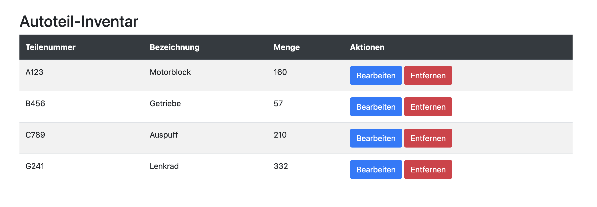
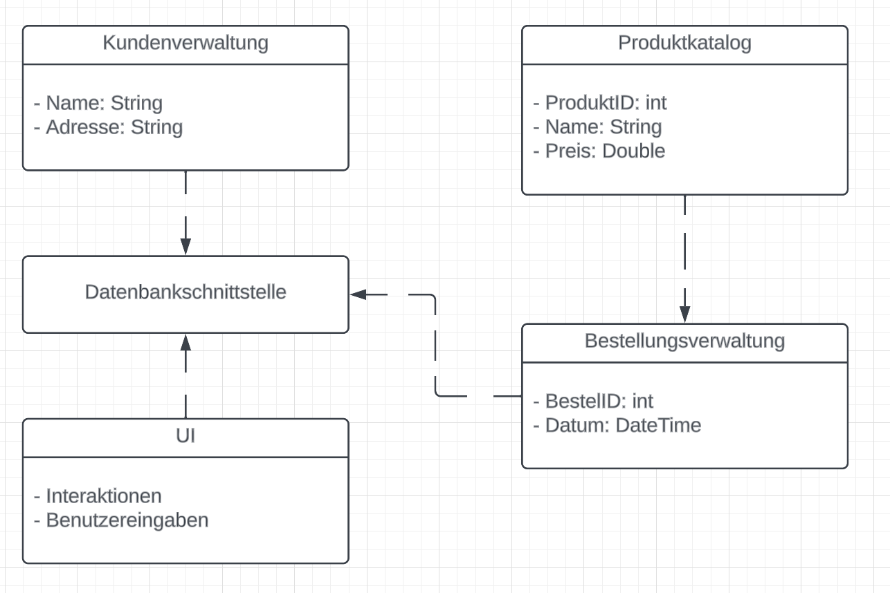
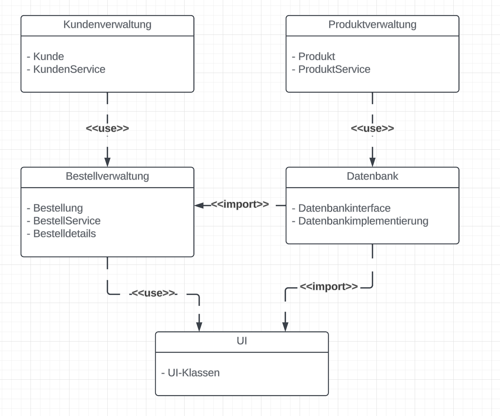
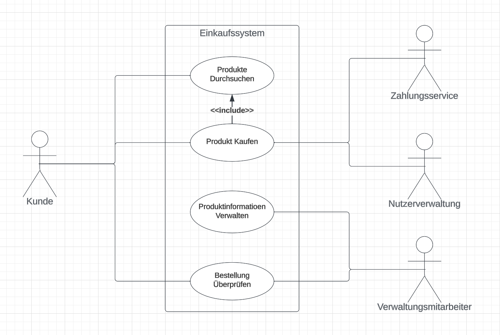
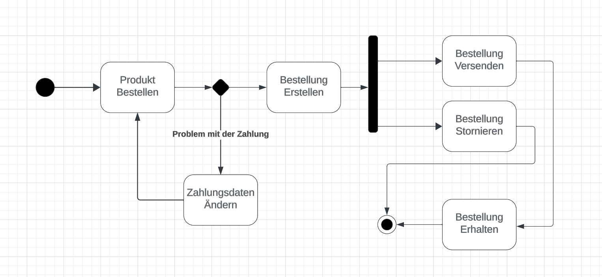
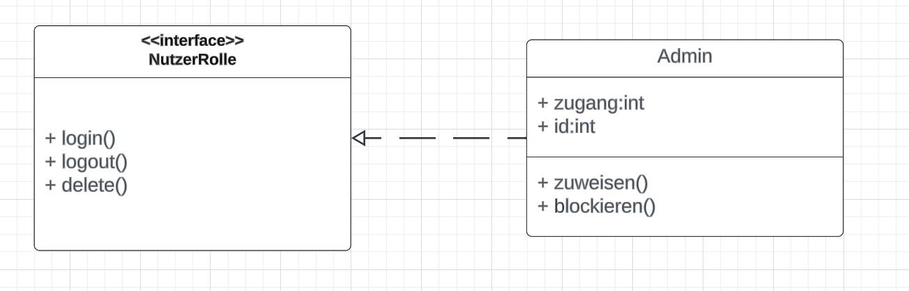
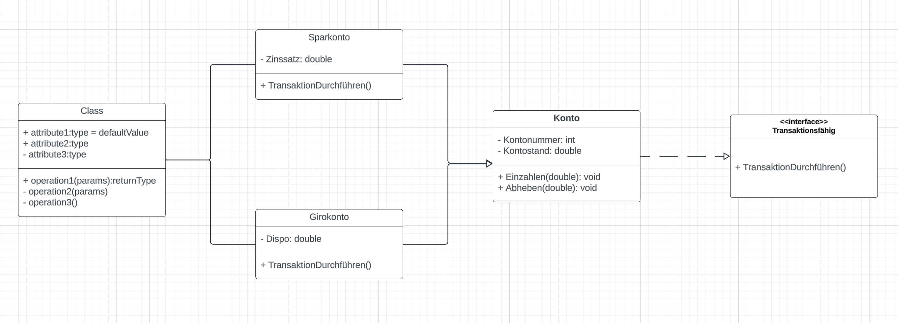
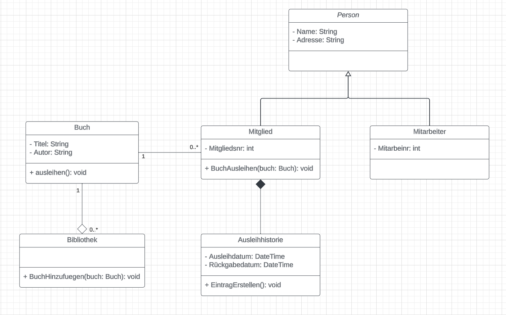

# Tag 5 - Web Applikationen Planen & Bauen

## JavaScript Recap 
Bei der Erstellung einer Website kommen zahlreiche Technologien und Praktiken zum Einsatz, die zusammenspielen, um ein nahtloses, interaktives Nutzererlebnis zu erstellen. 

### Fragen
Zeit: 1-2 min / Frage
1. Was ist der Hauptunterschied zwischen `let`, `const` und `var` in JavaScript?
2. Wie funktionieren Template Literals in JavaScript und gib ein Beispiel?
3. Wie werden Arrays in JavaScript manipuliert? Nenne ein Beispiel für das Hinzufügen eines Elements.
4. Was ist ein JavaScript Promise und wie wird es typischerweise verwendet?
5. Beschreibe die Grundstruktur eines Event Listeners in JavaScript.
6. Was sind die Hauptvorteile der Verwendung der Fetch API in JavaScript?
7. Wie unterscheidet sich asynchroner von synchronem Code in JavaScript? Gib ein Beispiel mit `async` und `await`.
8. Erkläre, wie die DOM-Manipulation in JavaScript funktioniert. Gib ein Beispiel für das Ändern des Inhalts eines Elements.
9. Erkläre den Unterschied und die Anwendungsfälle von addEventListener im Vergleich zu On-Event-Attributen wie onclick in JavaScript.
10. Wie kann der lokale Speicher im Browser mittels JavaScript genutzt werden? Gib ein Beispiel für das Speichern und Abrufen von Daten.

# Projekte mit Struktur
In der Softwareentwicklung, insbesondere bei Web- und Cloud-Applikationen, ist ein effektives Projektmanagement unerlässlich, um komplexe Anforderungen zu managen, die Qualität zu sichern und Projekte termingerecht und im Rahmen des Budgets zu liefern.

## Tagesprojekt
Ziel des heutigen Tages ist es, in 2er Teams an einem vollständigen Projektentwicklungszyklus zu arbeiten. Hierbei geht es vor allem darum, sowohl die Planung über UML und Architekturdiagram, als auch die Aufteilung der Aufgaben und Implementierung zu vertiefen.



### Projektmanagement und Positionen
Auch wenn es oftmals vernachlässigt wird ist Projektmanagement entscheidend für den Erfolg von Softwareprojekten. Folgend drei relevante Methoden.

1. **Wasserfallmodell**: Eine lineare und sequenzielle Methode, bei der das Projekt in vordefinierte Phasen aufgeteilt wird, wie Anforderungserfassung, Design, Implementierung, Testen und Wartung. Jede Phase muss abgeschlossen sein, bevor zur nächsten übergegangen wird.

2. **Scrum**: Ist ein agiles Framework, das Teamzusammenarbeit betont. Es basiert auf iterativer Entwicklung, wobei das Projekt in kurze Arbeitsphasen (Sprints) aufgeteilt wird und regelmäßige Meetings (Daily Scrum, Sprint Review, Sprint Retrospective) stattfinden. Teams sind oft cross-funktional und selbstorganisiert, und es gibt Rollen wie den Scrum Master und Product Owner.

   - **Sprint Planning**: Das Team trifft sich, um die Ziele für den nächsten Sprint festzulegen und Aufgaben aus dem Produkt-Backlog auszuwählen.
   - **Daily Scrum**: Tägliche kurze Meetings, in denen Fortschritte besprochen und Hindernisse identifiziert werden.
   - **Sprint Review**: Am Ende des Sprints wird die fertiggestellte Arbeit präsentiert und Feedback gesammelt.
   - **Sprint Retrospective**: Das Team reflektiert den vergangenen Sprint und identifiziert Bereiche zur Verbesserung.

3. **Agile**: Ein flexibler Ansatz, der Anpassungsfähigkeit und Kundeneinbindung betont. Es gibt keinen festen Projektplan, sondern das Projekt entwickelt sich durch kontinuierliche Feedbackschleifen mit dem Kunden. Agile Methoden, wie Kanban, legen Wert auf laufende Verbesserungen und schnelle Reaktion auf Veränderungen.

#### Positionen und Jobs im Team
Die Rollen in einem Projektteam variieren je nach Methodik und Projektgröße. Typischerweise gibt es folgende 5 Rollen mit jeweils einer bis mehreren Personen.

- **Projektmanager**: Verantwortlich für die Planung, Ausführung und Schließung des Projekts.
  
- **UI/UX-Designer**: Entwerfen das Nutzererlebnis und die Benutzeroberfläche.

- **Entwickler**: Programmieren die Software und implementieren die Funktionalitäten.
  
- **Tester**: Stellen sicher, dass die Software fehlerfrei funktioniert.
  
- **DevOps**: Integrieren Entwicklung und Betrieb, um die Lieferung und Wartung der Software zu optimieren.

### Projektplanung mit UML
Unified Modeling Language (UML) ist eine visuelle Sprache zur Darstellung von Software-Designs. Sie bietet verschiedene Diagrammtypen, um verschiedene Aspekte eines Systems darzustellen. UML hilft bei der Analyse, dem Entwurf und der Dokumentation von Softwareprojekten. Es existieren eine Vielzahl von Diagrammtypen, die in zwei Hauptkategorien unterteilt sind: **Strukturdiagramme** und **Verhaltensdiagramme**.

#### Strukturdiagramme
Diese Diagramme fokussieren sich auf die statischen Aspekte eines Systems.

**[Klassendiagramme](https://www.lucidchart.com/pages/de/uml-klassendiagramme)**: Das Klassendiagramm ist das zentrale Element der UML und unverzichtbar für das Design objektorientierter Systeme. Es stellt Klassen, ihre Attribute, Methoden und die Beziehungen zwischen ihnen dar. Klassen, als grundlegende Bausteine, werden durch Rechtecke repräsentiert, die in drei Teile untergliedert sind: den Klassennamen, ihre Attribute und die Methoden. Die Beziehungen zwischen den Klassen, wie Assoziationen, Aggregationen und Kompositionen, werden durch verschiedene Arten von Verbindungslinien dargestellt.

Sämtliche Klassen verfügen zusätzlich, je nach gewollter Sichtbarkeit, über unterschiedliche Zugriffsebenen. Diese werden durch das jeweilige Zeichen an Attributen wie Methoden definiert.
 - Öffentlich (`+`)
 - Privat (`-`)
 - Geschützt (`#`)
 - Paket (`~`)
 - Abgeleitet (`/`)
 - Statisch (`unterstrichen`)

Beispielsweise könnte ein Klassendiagramm für ein Einkaufssystem Klassen wie `Kunde`, `Produkt` und `Bestellung` enthalten. Attribute könnten bei `Kunde` beispielsweise `Name`, `Adresse` sein, während Methoden `ProduktHinzufügen()`, `BestellungAufgeben()` umfassen könnten.


**[Komponentendiagramme](https://www.lucidchart.com/pages/de/uml-komponentendiagramm)**: Komponentendiagramme visualisieren die Organisation und Beziehungen zwischen verschiedenen Softwarekomponenten. Sie sind besonders nützlich in großen Systemen, um die Struktur der Softwarearchitektur und Abhängigkeiten zwischen Modulen und Schnittstellen darzustellen.



**[Paketdiagramme](https://www.lucidchart.com/pages/de/uml-paketdiagramm)**: Paketdiagramme organisieren Elemente eines Systems in "Paketen". Diese Diagramme sind hilfreich, um die Struktur großer Systeme zu verstehen und zu zeigen, wie Klassen oder Komponenten in logische Module gruppiert sind.



**[Verteilungsdiagramme](https://www.lucidchart.com/pages/de/tutorial-fur-verteilungsdiagramme)**: Verteilungsdiagramme zeigen die physische Verteilung von Softwarekomponenten auf Hardware. Sie sind wichtig, um zu verstehen, wie verschiedene Teile eines Systems auf Servern, Clients und anderen Geräten verteilt sind.


#### Verhaltensdiagramme
Diese Diagramme beschreiben die dynamischen Aspekte und das Verhalten von Systemelementen.

**[Anwendungsfalldiagramme](https://www.lucidchart.com/pages/de/uml-anwendungsfalldiagramm)**: Anwendungsfalldiagramme illustrieren die Funktionalitäten eines Systems aus der Sicht des Benutzers. Sie sind nützlich, um die Interaktion zwischen Benutzern (oder "Akteuren") und dem System zu verstehen.



**[Aktivitätsdiagramme](https://www.lucidchart.com/pages/de/uml-aktivitatsdiagramme)**: Aktivitätsdiagramme stellen den Fluss von Aktivitäten und die Reihenfolge von Operationen dar. Sie sind nützlich, um den Workflow oder Geschäftsprozess in einem System zu verstehen.


**[Zustandsdiagramme](https://www.lucidchart.com/pages/de/maschinenzustandsdiagramm)**: Zustandsdiagramme zeigen die verschiedenen Zustände, die ein Objekt während seines Lebenszyklus durchlaufen kann. Sie sind wichtig, um das Verhalten von Objekten in Reaktion auf Ereignisse darzustellen.



**[Sequenzdiagramme](https://www.lucidchart.com/pages/uml-sequence-diagram)**: Sequenzdiagramme illustrieren die Interaktionen zwischen Objekten in einer zeitlichen Abfolge. Sie zeigen, wie Objekte zusammenarbeiten, um eine Funktion auszuführen.


#### Vererbung und Klassentypen
Um komplexere Beziehungen in UML modellieren zu können, gibt es auch hier die Konzepte aus der Objektorientierung.

**`Vererbung`**: In UML wird Vererbung durch eine Linie dargestellt, die von der abgeleiteten Klasse (Unterklasse) zu ihrer Basisklasse (Oberklasse) führt. Diese Linie endet bei der Basisklasse mit einem leeren Dreieck.


**`Implementierung`**: Die Implementierung eines Interfaces wird in UML als `gestrichelte Linie` mit einem nicht ausgefüllten Dreieck am Ende dargestellt, das auf das Interface zeigt.



**`Abstrakte Klasse`**: Eine abstrakte Klasse wird in UML meist durch *`Kursivschrift`* ihres Namens kenntlich gemacht. Sie enthält oft abstrakte Methoden, die keine Implementierung besitzen.

**`Interfaces`**: Interfaces werden wie Klassen dargestellt, jedoch wird der Klassenname oft mit dem Schlüsselwort `«interface»` darüber notiert. Sie definieren Methoden, die von implementierenden Klassen bereitgestellt werden müssen.

**`Methoden`**: Methoden, die von einer Oberklasse geerbt werden, müssen nicht notwendigerweise in der UML-Diagramm für die Unterklasse erneut aufgelistet werden, es sei denn, `sie werden überschrieben` oder ihre Bedeutung ist für das Verständnis der Unterklasse wesentlich.


#### Assoziationen, Aggregation und Komposition
**`Assoziationen`**: In UML wird eine Assoziation durch eine `einfache Linie zwischen zwei Klassen` dargestellt. Oft wird die Assoziation mit Rollennamen und Multiplizitäten an beiden Enden gekennzeichnet, um die Art der Beziehung zu präzisieren.

Die Multiplizität gibt an, wie viele Instanzen der einen Klasse mit der anderen in Beziehung stehen können. Zum Beispiel würde `„1“ für eine Eins-zu-Eins-Beziehung` und `„1..*“ für eine Eins-zu-viele-Beziehung` stehen.

**`Aggregation`**: Aggregation wird als eine spezielle Form der Assoziation dargestellt, die eine „hat-ein“-Beziehung darstellt. In UML wird dies durch eine `Linie mit einer leeren Raute` am Ende der Linie bei der Klasse gezeigt, die das Ganze repräsentiert.

**`Komposition`**: Komposition ist eine stärkere Form der Aggregation, die eine exklusive Besitzbeziehung anzeigt. In UML wird dies durch eine `Linie mit einer gefüllten Raute` am Ende der Linie bei der Klasse dargestellt, die das Ganze repräsentiert. Die gefüllte Raute impliziert, dass die Lebensdauer der Teilobjekte eng mit der des Ganzen verbunden ist. 


#### Praktisches Beispiel
Um zu verstehen, wie Klassen strukturiert sind, wie sie miteinander interagieren und wie Schnittstellen zur Definition gemeinsamer Funktionalitäten genutzt werden können, schauen wir uns ein Beispiel genauer an.

1. **Klassendiagramm**: 
   - Eine Klasse `Kunde` mit Attributen wie `Kundennummer` und `Name` und Methoden wie `Login()` und `ÜberweisungTätigen()`.
   - Eine Klasse `Konto` mit Attributen `Kontonummer`, `Kontostand` und Methoden wie `Einzahlen(double betrag)` und `Abheben(double betrag)`.

2. **Schnittstellen**: 
   - Eine Schnittstelle `Transaktionsfähig` mit der Methode `TransaktionDurchführen()`.

3. **Vererbung und Implementierung**: 
   - Die Klasse `Girokonto` und `Sparkonto` erben von `Konto` und implementieren die Schnittstelle `Transaktionsfähig`.

Diese Struktur zeigt die Beziehungen und Abhängigkeiten zwischen den Klassen und wie sie über Vererbung und Schnittstellen interagieren.

- Die Klasse Kunde hat grundlegende Attribute wie Kundennummer und Name, sowie Methoden wie Login() und ÜberweisungTätigen().
- Die Schnittstelle Transaktionsfähig definiert eine Methode TransaktionDurchführen().
- Die Klassen Girokonto und Sparkonto erben von der abstrakten Klasse Konto und implementieren zusätzlich die Schnittstelle Transaktionsfähig.
- Die Konto-Klasse hat Attribute Kontonummer und Kontostand, sowie Methoden Einzahlen() und Abheben().
- Girokonto hat ein zusätzliches Attribut Dispo, Sparkonto hat ein Attribut Zinssatz. Beide Klassen definieren die Methode TransaktionDurchführen() gemäß der Schnittstelle.



## Aufgaben
Zeit: 10-15 min / Aufgabe
1. **Einfaches Klassendiagramm**: Erstelle ein einfaches UML-Klassendiagramm für ein Bibliothekssystem.
   - Modelliere die Klassen Buch und Mitglied.
   - Die Klasse Buch sollte die Attribute Titel und Autor und eine Methode ausleihen() haben.
   - Die Klasse Mitglied sollte die Attribute Name und Mitgliedsnummer und eine Methode BuchAusleihen() enthalten.
   - Stelle eine Assoziation zwischen Buch und Mitglied dar, um das Ausleihen zu visualisieren.


2. **Erweitertes Klassendiagramm mit Aggregation**: Erweitere das Bibliothekssystem um Aggregationsbeziehungen.
   - Füge eine Klasse Bibliothek hinzu, die mehrere Buch-Objekte aggregiert.
   - Die Klasse Bibliothek sollte eine Methode BuchHinzufügen() enthalten.
   - Zeige eine Aggregationsbeziehung zwischen Bibliothek und Buch


3. **Komplexes Klassendiagramm mit Vererbung und Komposition**: Entwickle ein umfassendes Modell mit Vererbung und Komposition.
   - Erstelle eine abstrakte Klasse Person mit den Attributen Name und Adresse.
   - Leite die Klassen Mitglied und Mitarbeiter von Person ab.
   - Füge eine Klasse Ausleihhistorie hinzu, die eine Kompositionsbeziehung zu Mitglied hat und die Historie der ausgeliehenen Bücher aufzeichnet.
   - Die Klasse Ausleihhistorie sollte Attribute wie Ausleihdatum und Rückgabedatum und eine Methode EintragHinzufügen() haben.
   - Visualisiere die Vererbung zwischen Person, Mitglied und Mitarbeiter und die Kompositionsbeziehung zwischen Mitglied und Ausleihhistorie.


4. **Komplexe UML-Modellierung mit Schnittstellen und Mehrfachvererbung**: Entwickle ein erweitertes UML-Klassendiagramm, das Schnittstellen und Mehrfachvererbung für ein Online-Shop-System umfasst.
   - Definiere eine Schnittstelle Zahlbar mit der Methode bezahlen().
   - Erstelle Klassen Rechnung und PayPalZahlung, die die Schnittstelle Zahlbar implementieren.
   - Füge eine abstrakte Klasse OnlineArtikel hinzu mit Attributen Preis und DigitaleLieferung und einer Methode Herunterladen().
   - Leite die Klassen EBook und MusikAlbum von OnlineArtikel ab.
   - Erstelle eine Mehrfachvererbungsbeziehung, in der EBook sowohl von OnlineArtikel als auch von Zahlbar erbt.


### Musterlösungen
<details>
  <summary>1. Einfaches Klassendiagramm</summary>
  
- Zwei Klassen: Buch und Mitglied.
- Klasse Buch hat Attribute Titel: String, Autor: String und eine Methode ausleihen().
- Klasse Mitglied hat Attribute Name: String, Mitgliedsnummer: Int und eine Methode BuchAusleihen(buch: Buch).
- Eine Assoziationslinie zwischen Buch und Mitglied zeigt die Beziehung an.


</details>

<details>
  <summary>2. Erweitertes Klassendiagramm mit Aggregation</summary>
  
- Neue Klasse Bibliothek mit einer Methode BuchHinzufügen(buch: Buch).
- Aggregationsbeziehung zwischen Bibliothek und Buch, dargestellt durch eine Linie mit einer leeren Raute am Bibliothek-Ende.
- Die Klasse Bibliothek enthält eine Liste von Büchern.


</details>

<details>
  <summary>3. Komplexes Klassendiagramm mit Vererbung und Komposition</summary>
  
- Abstrakte Klasse Person mit Name: String und Adresse: String.
- Klassen Mitglied und Mitarbeiter erben von Person.
- Klasse Ausleihhistorie mit Ausleihdatum: Date, Rückgabedatum: Date und EintragErstellen().
- Kompositionsbeziehung zwischen Mitglied und Ausleihhistorie, dargestellt durch eine Linie mit einer gefüllten Raute am Mitglied-Ende.
- Vererbungslinien von Person zu Mitglied und Mitarbeiter mit einem ausgefüllten Dreieck am Person-Ende.


</details>

<details>
  <summary>4. Komplexe UML-Modellierung mit Schnittstellen und Mehrfachvererbung</summary>

- Die Schnittstelle Zahlbar hat die Methode bezahlen().
Klassen Rechnung und PayPalZahlung implementieren Zahlbar und enthalten die Methode bezahlen().
- Die abstrakte Klasse OnlineArtikel hat Preis: Double, DigitaleLieferung: Boolean und die Methode Herunterladen().
- Klassen EBook und MusikAlbum erben von OnlineArtikel und enthalten spezifische Attribute und Methoden.
- EBook zeigt eine Schnittstelle zur Zahlbar-Schnittstelle zusätzlich zur Vererbung von OnlineArtikel.


</details>

## Test Driven Development
Um die Relevanz von Test Driven Developments nochmals hervorzuheben und die Konzepte zu festigen, schauen wir uns den Ansatz nochmal kurz an.

Wichtig zu verstehen ist, dass Test Driven Development eine umgekehrte Vorgehensweise fördert als ein normaler Entwicklungszyklus. Zuerst werden die Anforderungen als spezifische Testfälle definiert und dann wird der Code so entwickelt, dass diese Tests bestanden werden. 

Es erfordert natürlich eine initiale Zeitinvestition, um Tests zu schreiben, die sich jedoch langfristig auszahlt. Gerade für Teams, die neu in TDD sind, kann es eine zusätzliche Herausforderung sein, effektive Testfälle zu schreiben und den TDD-Rhythmus zu erlernen.

### Der TDD-Zyklus
Der TDD-Prozess folgt einem wiederholenden Zyklus, bekannt als "Red-Green-Refactor":

**Red**: Schreiben eines neuen Tests, der fehlschlägt, weil die geforderte Funktionalität noch nicht implementiert ist.

**Green**: Schreiben des minimal notwendigen Codes, um den Test zu bestehen.

**Refactor**: Überarbeiten des Codes, um Redundanzen zu beseitigen und die Qualität zu verbessern.

### Praktisches Beispiel
Bei der Entwickelung einer Anwendung zur Verwaltung von Kundendaten könnte ein TDD-Prozess folgendermaßen aussehen.

**Schreiben eines Tests für eine neue Funktion**: Überprüft, ob ein neuer Kunde korrekt zur Datenbank hinzugefügt wird.

  ```python
  def test_add_customer():
      customer = Customer(name="John Doe", age=30)
      customer_id = customer_service.add_customer(customer)
      assert customer_service.get_customer(customer_id) == customer
  ```

**Implementieren der Funktion**:
 - Schreiben des minimalen Codes, um den Test zu bestehen.
 - Beispiel: Implementierung der `add_customer`- und `get_customer`-Methoden in `customer_service`.

**Refaktorisieren**: Überarbeiten des Codes, um Duplikationen zu entfernen und die Lesbarkeit zu verbessern.


## Domain Driven Design
Domain Driven Design ist ein Ansatz in der Softwareentwicklung, der den Fokus auf das Herzstück der Anwendung, die Geschäftslogik und Prozesse, legt. Es basiert auf der engen Zusammenarbeit zwischen technischen Experten und Domain-Experten, um ein tiefes Verständnis der Domain zu erreichen und dieses in der Softwarestruktur widerzuspiegeln. In Woche 9 wird das Konzept DDD nochmals aufgegriffen und mit konkreten Aufgaben trainiert.

### Kernkonzepte von DDD
Im Herzen des Domain Driven Designs stehen mehrere Schlüsselkonzepte, die zusammen ein starkes Fundament für die Entwicklung komplexer Softwaresysteme bilden.

**Ubiquitous Language**: Eine einheitliche Sprache, die von allen Beteiligten verwendet wird, um Missverständnisse zu vermeiden und Klarheit zu schaffen. Ubiquitous Language erleichtert die Kommunikation zwischen technischen und nicht-technischen Teammitgliedern.

**Entitäten**: Objekte mit einer eindeutigen Identität, die über ihre Lebensdauer hinweg konstant bleibt, auch wenn sich ihre Eigenschaften ändern.

**Wertobjekte**: Objekte, die durch ihre Attribute definiert werden und keine eigene Identität haben.

**Aggregate**: Eine Gruppe von Entitäten und Wertobjekten, die als Einheit betrachtet werden, mit einer klar definierten Root-Entität.

**Repositories**: Schnittstellen, die den Zugriff auf Aggregate und deren Persistierung in einer Datenquelle ermöglichen.

### Designprinzipien
Domain Driven Design ist nicht nur eine Ansammlung von Praktiken und Mustern, sondern auch eine Denkweise, die tiefgreifende Prinzipien in den Vordergrund stellt.

**Modellzentrierter Ansatz**: Das Domain-Modell steht im Mittelpunkt der Entwicklung. Durch die Fokussierung auf die Geschäftslogik und -prozesse wird die Softwareentwicklung zielgerichteter und effizienter.

**Isolation der Domain**: Geschäftslogik sollte von technischen Aspekten der Anwendung isoliert sein. Das Design ist dadurch anpassungsfähiger an sich ändernde Geschäftsanforderungen.

**Subdomains**: Identifizierung verschiedener Teilbereiche innerhalb der Gesamtdomain, die unabhängig modelliert werden können.

**Bounded Contexts**: Klare Abgrenzung, innerhalb derer ein spezifisches Domain-Modell Gültigkeit hat.

### Praktisches Beispiel
Das folgende Beispiel zeigt, wie DDD dabei helfen kann, ein komplexes System in der Automobilproduktion zu strukturieren und zu managen, indem es ein klares Modell der Geschäftsdomäne bietet.

**Ubiquitous Language** alle Teammitglieder (Ingenieuren, Managern, Vertriebsmitarbeitern und Softwareentwicklern) müssen dieselben Begriffe für Produktionsprozesse und -komponenten verwenden. Z.B. `„Modell“`, `„Bauteil“`, `„Fertigungsstraße“`, `„Bestellung“`.

**Auto**: Eine **Entität** mit Eigenschaften wie `Seriennummer`, `Modell`, `Herstellungsdatum`. Die `Seriennummer` dient als eindeutige Identität.

**Mitarbeiter**: Eine **Entität** mit `Mitarbeiter-ID`, `Name`, `Rolle`.

**Adresse**: Ein **Wertobjekt** im Zusammenhang mit Lieferanten oder Kunden, `definiert durch Straße, Stadt, Postleitzahl`. Es hat keine eigene Identität und wird immer im Kontext einer Entität wie „Lieferant“ oder „Kunde“ verwendet.

**Fertigungsauftrag**: Ein **Aggregate** Root, das mehrere Entitäten wie `Auto`, `Bauteil`, `Mitarbeiter` umfasst. Es definiert den gesamten Prozess der Autoproduktion, von der Auswahl der Bauteile bis zur endgültigen Montage.

**Auto Repository**: Eine Schnittstelle, die den Zugriff auf Auto-Entitäten ermöglicht, z. B. `um nach fertigen Autos zu suchen` oder den Status eines Autos zu aktualisieren.

**Mitarbeiter Repository**: Ermöglicht den Zugriff auf Mitarbeiterdaten, `um Informationen wie Arbeitszeiten oder Zuweisungen zu verwalten`.


## Komplex-Aufgaben (Capstone Projekt)
**Inventory-Management-System für Automobilhersteller**
> Zeit: 90-120 min 

Das Ziel dieses Projekts ist die Entwicklung einer interaktiven Webanwendung zur Verwaltung des Inventars von Automobilteilen. Die Anwendung soll eine Übersicht über verschiedene Autoteile bieten, mit der Möglichkeit, neue Teile hinzuzufügen, bestehende zu aktualisieren oder zu entfernen. Wichtig ist die Zusammenarbeit in 2er Gruppen und sich gemeinsam Gedanken über die Aufteilung und Ausführung der Aufgaben zu machen.

**Anforderungen**
- Erstellt ein UML-Diagramm und ein einfaches Architekturdiagramm zur Visualisierung der Systemstruktur.
- Entwerft eine Datenbankstruktur für Autoteile (Teilenummer, Bezeichnung, Menge).
- Nutzt Test Driven Development, einschließlich Python Unit Tests und Postman für API-Tests.
- Entwickelt eine Flask-API zur Verwaltung der Inventardaten.
- Entwicklt eine Benutzeroberfläche zur Interaktion mit der API.
- Bereitet eine kurze Präsentation (5min) des Projektes vor.

**Bonus**
- **Reporting-Funktion**: Möglichkeit, Bestandsberichte zu generieren.
- **Sicherheitsmechanismen**: Implementierung von Authentifizierung und Autorisierung.
- **Responsive Design**: Anpassung an verschiedene Geräte.

**Ressourcen**:
- [Flask-Dokumentation](https://flask.palletsprojects.com/en/2.0.x/)
- [SQLite-Dokumentation](https://www.sqlite.org/docs.html)
- [Bootstrap](https://getbootstrap.com/)


## Weiterführende Materialien
- **IBM UML Basics**: [Einführung in die Unified Modeling Language](https://developer.ibm.com/articles/the-class-diagram/)
- **Test Driven Development (TDD)**: [Die Testgetriebene Entwicklung](https://www.ionos.de/digitalguide/websites/web-entwicklung/test-driven-development/)