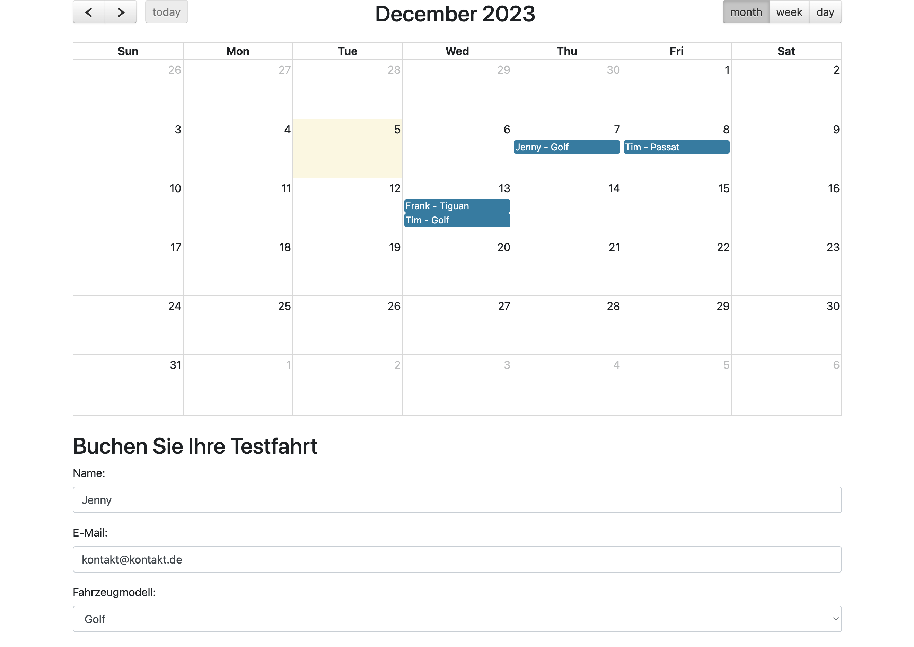

# Tag 4 - Advanced Web Frontends

## Website Basics-Recap 
Bei der Erstellung einer Website kommen zahlreiche Technologien und Praktiken zum Einsatz, die zusammenspielen, um ein nahtloses, interaktives Nutzererlebnis zu erstellen. Die Basis bildet ein Verständnis der Web-Grundlagen – von der Strukturierung und dem Styling von Inhalten bis hin zur Implementierung von Interaktivität und dynamischen Funktionen. 

### Fragen
Zeit: 1-2 min / Frage
1. Was ist der Zweck des `<div>`-Elements in HTML?
2. Wie unterscheiden sich Klassen- und ID-Selektoren in CSS?
3. Was ist das Box-Modell in CSS und welche Komponenten beinhaltet es?
4. Wie unterscheidet sich das Flexbox-Layout von traditionellen Layout-Techniken in CSS?
5. Was sind die Hauptfunktionen von Bootstrap als CSS-Framework?
6. Wie funktioniert responsives Design mit Media Queries?
7. Wozu dient das `<label>`-Element in HTML und wie wird es richtig eingesetzt?
8. Was ist der Unterschied zwischen Inline-Styling und externen CSS-Stylesheets?
9.  Erkläre die Funktionsweise und Anwendung von `<select>` und `<option>` in HTML.
10. Wie kann JavaScript in ein HTML-Dokument eingebunden werden?


# Wie werden Websites Interaktiv?
Bisher waren unsere Websites entweder simple Strukturseiten oder Layoutdesigns. Durch die Kombination von HTML und CSS können bereits Click-Prototypen erstellt werden, zur richtigen Funktionalität fehlt aber noch ein weiteres Konzept - `JavaScript`. 


## Tagesprojekt
Ziel des heutigen Tages ist es, die simple Website zum Buchen von Testfahrten mit verschiedenen VW-Fahrzeugen mit Funktionalität zu erweitern und die gebuchten Fahrten, anstelle einer Flask API Integration, im Local Storage zu speichern.




## Interaktivität mit JavaScript
JavaScript ist das zentrale Werkzeug in der modernen Webentwicklung. Es untersützt dynamische und interaktive Elemente auf Webseiten und wird von allen modernen Browsern unterstützt. Somit ist es universell für die Entwicklung einsetzbar und erleichtert zudem die Entwicklung durch zahlreiche Frameworks und Bibliotheken.

### Basics
Die wichtigsten Grundlagen von JavaScript zu verstehen, ist essentiell für jede Art von Webentwicklung. Folgend die 10 relevantesten Kernkonzepte von JavaScript mit einem kurzen Vergleich zu Python.

#### `Variablen`
Wie in Python sind Variablen grundlegende Bausteine in JavaScript. Sie ermöglichen es, Daten zu speichern und auf sie zu verweisen.

> [Typescript](https://www.typescriptlang.org/) ermöglicht es, auch in JavaScript mit Types zu arbeiten. 

**Javascript**
```javascript
let name = "Max";
const alter = 30;
var beruf = "Entwickler";
```

**Python**
```python
name = "Max"
alter = 30
beruf = "Entwickler
```

#### `Datentypen`
JavaScript ist eine dynamisch typisierte Sprache, die verschiedene Datentypen wie Strings, Zahlen, Booleans, Arrays, Objekte und mehr unterstützt. Es unterscheidet nur zwischen Konstanten und sich verändernden Variablen.

**Javascript**
```javascript
const name = "Anna"; // Konstanter String
var alter = 25; // Variable Zahl
let hobbies = ["Lesen", "Programmieren"]; // Variabler Array
```
**Python**
```python
name = "Anna" # Variabler String
alter = 25 #Variable Zahl
hobbies = ["Lesen", "Programmieren"] # Variabler Array
```

#### `Operatoren`
Operatoren ermöglichen es, einfache bis komplexe mathematische, vergleichende und logische Operationen durchzuführen.

**Javascript**
```javascript
let summe = 10 + 5;
let istGleich = (summe === 15);
let istWahr = (true && false); 
```

**Python**
```python
summe = 10 + 5
istGleich = (summe == 15)
istWahr = (true and false); 
```

#### `Kontrollstrukturen`
Kontrollstrukturen wie if-else-Anweisungen und Schleifen steuern den Fluss eines Programms.

**Javascript**
```javascript
if (alter > 18) {
    console.log("Volljährig");
} else {
    console.log("Minderjährig");
}

for (let i = 0; i < 5; i++) {
    console.log(i);
}
```

**Python**
```python
if alter > 18: 
  print("Volljährig")
else:
  print("Minderjährig")

for (i in range(5)):
  print(i)
```

### `Funktionen`
Funktionen sind auch in JavaScript wiederverwendbare Codeblöcke, die eine spezifische Aufgabe ausführen.

**Javascript**
```javascript
function grueße(name) {
    return `Hallo ${name}!`;
}

let gruß = grueße("Anna"); // "Hallo Anna!"
```

**Python**
```python
def grueße(name): 
  return "Hallo " + name

gruß = grueße("Anna") # "Hallo Anna!"
```

#### `Arrays und Objekte`
Arrays und Objekte ermöglichen es, Sammlungen von Daten zu speichern und zu verwalten.

**Javascript**
```javascript
let farben = ["Rot", "Grün", "Blau"];
farben.push("Gelb");

let person = {
    name: "Max",
    alter: 30,
    beruf: "Entwickler"
};
person.hobby = "Musik";
```

**Python**
```python
farben = ["Rot", "Grün", "Blau"]
farben.append("Gelb")

person = {
    "name": "Max",
    "alter": 30,
    "beruf": "Entwickler"
}
person["hobby"] = "Musik"
```

#### `Fehlerbehandlung`
Auch das Abfangen von Fehlern und Exceptions über `try...catch` is sehr ähnlich.

**Javascript**
```javascript
try { 
    // Code, der einen Fehler werfen könnte 
} catch (error) { 
    console.error(error); 
}
```

**Python**
```python
try:
    # Potenziell fehlerhafter Code
except Exception as error:
    print(error)
```


### Eventhandler
Events sind Aktionen oder Vorkommnisse, die im Browser stattfinden und von JavaScript erkannt werden können. Diese können Benutzerinteraktionen wie Klicks, Mausbewegungen, Tastendrücke oder auch Systemereignisse wie das Laden einer Seite sein.

**`click`-Event**: Wird ausgelöst, wenn der Benutzer auf ein Element klickt.

```javascript
document.getElementById("meinButton").onclick = function() {
    alert("Button geklickt!");
};
```

**`hover`-Event**: Wird ausgelöst, wenn der Mauszeiger über ein Element bewegt wird.

```javascript
document.getElementById("meinElement").onmouseover = function() {
    console.log("Maus ist über dem Element");
};
```

#### Event Listeners
Um über JavaScript beliebige Event Listener einzubauen, gibt es die `addEventListener` Methode. Hiermit können DOM-Element mit variablem Eventhandling verbunden werden.

Hinzufügen eines `click`-Listeners
```javascript
let button = document.getElementById("meinButton");
button.addEventListener("click", function() {
    console.log("Button wurde geklickt!");
});
```

Reaktion auf ein Tastatur `keydown`-Event:
```javascript
document.addEventListener("keydown", function(event) {
    console.log("Taste gedrückt: " + event.key);
});
```

#### Event Propagation: Bubbling und Capturing
Event Propagation bezeichnet den Weg, den ein Event durch den DOM-Baum nimmt. Es gibt zwei Phasen: Bubbling und Capturing.

Bei komplexen Benutzeroberflächen mit verschachtelten Elementen ermöglicht Event Propagation z.B. dass in einem Menü das Klicken auf ein Untermenü-Element spezielle Aktionen auslösen, während ein Klick auf das Hauptmenü andere Aktionen ausführt.

**Bubbling**: Events "blubbern" von dem Element, das das Event auslöst, bis zum Root-Element des DOM.

```javascript
document.getElementById("kindElement").addEventListener("click", function() {
    console.log("Kind-Element geklickt!");
}, false); // False für Bubbling-Phase
```
**Capturing**: Events werden zuerst auf dem höchsten Level des DOM abgefangen, bevor sie zum auslösenden Element heruntergehen.

```javascript
document.getElementById("elternElement").addEventListener("click", function() {
    console.log("Eltern-Element geklickt!");
}, true); // True für Capturing-Phase
```


### DOM-Manipulation
Im vorherigen Kapitel haben wir bereits das DOM kennen gelernt und verstanden, dass es aus einer Baumstruktur besteht, die die Website aus Eltern- und Kindbeziehungen modelliert.

```css
        html
      /    \
    /        \
  head         body
    |         /  |  \
  title header section footer
            /     /  \     \
          h1     p   img    p
```

#### Elementauswahl und -manipulation
**`getElementById`**: Greift auf ein Element basierend auf seiner ID zu.

```javascript
document.getElementById("meinElement").innerHTML = "Geänderter Text";
```

**``querySelector``**: Ermöglicht eine feinere Auswahl mit CSS-Selektoren.
  
```javascript
document.querySelector(".meineKlasse").style.color = "blau";
```

**`createElement`**: Erstellt dynamisch neue Elemente und fügt diese in den DOM-Baum ein.

```javascript
let neuerAbsatz = document.createElement("p");
neuerAbsatz.innerText = "Ein neuer Absatz";
document.body.appendChild(neuerAbsatz);
```

**`removeChild`**: Enfernt Elemente aus dem DOM.

```javascript
let zuEntfernendesElement = document.getElementById("zuEntfernen");

zuEntfernendesElement.parentNode.removeChild(zuEntfernendesElement);
```


### Fetch API in JavaScript
Auch für JavaScript gibt es die Möglichkeit, eigene und externe APIs anzusprechen. Die `fetch`-API ermöglicht es, wie mit `requests` in Python, HTTP-Anfragen zu stellen und Antworten und Fehler zu handeln.

Ein wesentlicher Unterschied zwischen Python und JavaScript ist, dass `requests` in Python **synchron** ist, während die Fetch API in JavaScript **asynchron** arbeitet.

#### Asynchrone Anfragen und asynchrone Programmierung
Asynchrone Anfragen sind wichtig, um Daten im Hintergrund zu laden, ohne die Benutzeroberfläche zu blockieren. In JavaScript wird dies oft über `Promises` und das `Async/Await`-Pattern realisiert.

**`Promises`**: Ein Promise ist ein Objekt, das für einen Wert steht, der in der Zukunft verfügbar sein könnte. Es kann sich in einem von drei Zuständen befinden: erfüllt, abgelehnt oder ausstehend.

```javascript
fetch('https://api.example.com/data')
    .then(data => console.log('Geladene Daten:', data))
    .catch(error => console.error('Fehler:', error));
```

**`Async/Await`**: Ist eine moderne Art, asynchronen Code zu schreiben. `async` markiert eine Funktion als asynchron, und `await` wartet auf das Ergebnis eines Promises.

```javascript
try {
    let response = await fetch('https://api.example.com/data');

    let data = await response.json();
    console.log('Geladene Daten:', data);
} catch (error) {
    console.error('Fehler:', error);
}
```

####  mit der Fetch API
Die Fetch API bietet natürlich, wie Python `requests`, zugang zu allen HTTP-Methoden wie GET, POST, PUT und DELETE.

`GET`
```javascript
fetch('https://api.example.com/data')
  .then(data => console.log('Geladene Daten:', data))
  .catch(error => console.error('Fehler:', error));
```

`POST`
```javascript
fetch('https://api.example.com/data', {
    method: 'POST',
    headers: {
        'Content-Type': 'application/json'
    },
    body: JSON.stringify({name: 'Neuer Eintrag'})
})
  .then(response => response.json())
  .then(data => console.log(data));
```

#### Error Handling
Durch die Struktur der `fetch`-API und der Nutzung vom `Promise`-Modell ist die Fehlerbehandlung durch die `.catch`-Funktion bereits gegeben.

```javascript
fetch('https://api.example.com/data')
    .then(response => {
        if (!response.ok) {
            throw new Error('Netzwerkantwort nicht ok');
        }
        return response.json();
    })
    .catch(error => console.error('Fetch-Fehler:', error));
```


### Einbindung von JavaScript Frameworks und Libraries
Die Nutzung von externen JavaScript-Bibliotheken und Frameworks ist ein wesentlicher Bestandteil der modernen Webentwicklung. Sie bieten eine Reihe von Funktionen und Werkzeugen, um die Entwicklung effizienter zu gestalten.

#### Einbindung in HTML
JavaScript-Bibliotheken können direkt in HTML-Dokumente eingebunden werden, in der Regel durch das Hinzufügen eines `<script>`-Tags, das auf die Bibliotheksdatei verweist. Nachdem die Bibliothek eingebunden ist, können ihre Funktionen und Objekte im JavaScript-Code verwendet werden.

##### 1. Beispiel für jQuery
Hier wird [jQuery](https://jquery.com/) verwendet, um bei einem Klick auf ein Paragraph-Element (`<p>`) dieses auszublenden.

```html
<!DOCTYPE html>
<html>
<head>
    <title>Meine Webseite</title>
    <!-- Einbindung der externen Library -->
    <script src="https://code.jquery.com/jquery-3.6.0.min.js"></script>
</head>
<body>
    <script>
        // jQuery Code kann hier verwendet werden
        $(document).ready(function() {
            // Fügt Event Listener zu allen <p>-Elementen hinzu.
            $("p").click(function() {
                // Verbirgt das aktuell geklickte Element.
                $(this).hide();
            });
        });
    </script>
</body>
</html>
```

##### 2: Beispiel für Moment.js
Moment.js ist eine Library zur Datums- und Zeitmanipulation und -formatierung.

```html
<!DOCTYPE html>
<html>
<head>
    <title>Moment.js Beispiel</title>
    <!-- Einbindung der externen Library -->
    <script src="https://cdn.jsdelivr.net/npm/moment@2.29.1/min/moment.min.js"></script>
</head>
<body>
    <script>
        // Formatierung des aktuellen Datums
        console.log(moment().format('YYYY-MM-DD'));
    </script>
</body>
</html>
```


### Statische vs. Dynamische Webseiten
#### Statische Webseiten 
Statische Webseiten sind aus einer festen Anzahl vorab erstellter Dateien aufgebaut, die auf einem Webserver gespeichert sind. Diese Dateien, HTML, CSS und JavaScript, werden vom Webbrowser des Benutzers ausgeführt. Statische Webseiten ändern sich nur, wenn ein Entwickler die Quelldateien modifiziert und sie erscheinen jedem Benutzer gleich. Sie sind einfach zu erstellen und zu warten, schneller aufgrund minimaler Backend-Verarbeitung und leichter zu cachen, haben aber Nachteile in Bezug auf Skalierbarkeit, Personalisierung und eingeschränkte Funktionalität für bestimmte Website-Typen, wie E-Commerce-Seiten.
Wir werden uns vor allem auf diese Art der Website konzentrieren.

#### Dynamische Webseiten 
Dynamische Webseiten hingegen präsentieren unterschiedlichen Besuchern verschiedene Informationen, basierend auf Faktoren wie Standort, lokaler Zeit, Einstellungen und Benutzerverhalten. Sie verwenden serverseitige Skriptsprachen wie PHP, Python, Ruby oder serverseitiges JavaScript (NodeJS), um Seiten "on-the-fly" zu erstellen, wenn ein Benutzer eine Seite anfordert. Dynamische Webseiten bieten personalisierte Inhalte und sind flexibler, aber auch komplexer im Aufbau und in der Wartung. Sie können langsamer sein, da sie mehr Backend-Verarbeitung erfordern


## Aufgaben
Zeit: 5-10 min / Aufgabe
1. **Einfache JavaScript Alert-Box**: Implementiert ein einfaches JavaScript-Skript, das beim Laden der Webseite eine Alert-Box anzeigt, die "Hallo Welt!" enthält.

2. **Dynamische Textänderung mit JavaScript**: Fügt ein HTML-Element hinzu (z.B. ein `<p>`-Tag) und verwendet JavaScript, um den Text dieses Elements beim Klicken auf einen Button zu ändern. Zum Beispiel könnte der Text von `"Vor dem Klick"` zu `"Nach dem Klick"` geändert werden.

3. **Einfaches Formular mit Event Listener**: Erstellt ein einfaches HTML-Formular mit einem Texteingabefeld und einem Submit-Button. Verwendet JavaScript, um einen Event Listener hinzuzufügen, der den eingegebenen Text in einer Alert-Box anzeigt, wenn das Formular abgesendet wird.

4. **Einfache DOM-Manipulation**: Implementiert eine Funktion, die ein HTML-Element (z.B. eine Liste) dynamisch basierend auf JavaScript-Array-Daten ändert. Beispielsweise könnte ein Array von Farbnamen verwendet werden, um eine Liste von farbigen Div-Elementen zu erstellen.

5. **Einsatz der Fetch API für eine einfache HTTP-Anfrage**: Schreibt ein JavaScript-Skript, das eine `GET`-Anfrage an eine öffentliche API (wie die [Wetter API](https://open-meteo.com/)) sendet und das Ergebnis in der Konsole oder auf der Webseite anzeigt.

### Musterlösungen
<details>
  <summary>1. Einfache JavaScript Alert-Box</summary>

  ```html
  <!DOCTYPE html>
<html>
<head>
    <title>Einfache Alert-Box</title>
</head>
<body>
    <script>
        alert("Hallo Welt!");
    </script>
</body>
</html>
  ```
</details>

<details>
  <summary>2. Dynamische Textänderung mit JavaScript</summary>

  ```html
  <!DOCTYPE html>
<html>
<head>
    <title>Dynamische Textänderung</title>
</head>
<body>
    <p id="text">Vor dem Klick</p>
    <button onclick="changeText()">Text ändern</button>

    <script>
        function changeText() {
            document.getElementById("text").innerHTML = "Nach dem Klick";
        }
    </script>
</body>
</html>
  ```
</details>

<details>
  <summary>3. Einfaches Formular mit Event Listener</summary>

  ```html
  <!DOCTYPE html>
<!DOCTYPE html>
<html>
<head>
    <title>Formular mit Event Listener</title>
</head>
<body>
    <form id="meinFormular">
        <input type="text" id="eingabefeld">
        <input type="submit" value="Absenden">
    </form>

    <script>
        document.getElementById("meinFormular").addEventListener("submit", function(event){
            event.preventDefault();
            alert(document.getElementById("eingabefeld").value);
        });
    </script>
</body>
</html>
  ```
</details>

<details>
  <summary>4. Einfache DOM-Manipulation</summary>

  ```html
  <!DOCTYPE html>
<!DOCTYPE html>
<html>
<head>
    <title>DOM Manipulation</title>
</head>
<body>
    <div id="farbenListe"></div>

    <script>
        const farben = ["Rot", "Grün", "Blau"];
        const liste = document.getElementById("farbenListe");

        farben.forEach(farbe => {
            const element = document.createElement("div");
            element.innerText = farbe;
            liste.appendChild(element);
        });
    </script>
</body>
</html>
  ```
</details>

<details>
  <summary>5. Einsatz der Fetch API für eine einfache HTTP-Anfrage</summary>

  ```html
  <!DOCTYPE html>
<html>
<head>
    <title>Fetch API Wetteranfrage</title>
</head>
<body>
    <div id="wetterdaten"></div>

    <script>
        const apiUrl = 'https://api.open-meteo.com/v1/forecast?latitude=52.52&longitude=13.405&hourly=temperature_2m';

        fetch(apiUrl)
            .then(response => response.json())
            .then(data => {
                const wetterdaten = JSON.stringify(data, null, 2);
                document.getElementById("wetterdaten").innerText = wetterdaten;
            })
            .catch(error => console.error('Fehler:', error));
    </script>
</body>
</html>
  ```
</details>


## Modern Web Applications
Moderne Webanwendungen sind um ein vielfaches komplexer als die einfachen Websites und JS-Skripte die wir bisher entworfen haben. Der Deep Dive in diese Themen würde den Rahmen hier komplett sprengen. Es ist trotzdem wichtig, die folgenden Themen zur Einordnung kurz gehört zu haben.

### Web APIs
Web-APIs bieten Schnittstellen zwischen JavaScript und Browserfunktionen bzw. Hardware, die weit über das Anzeigen von Webseiten hinausgehen.

#### Geolocation API
Ermöglicht den Zugriff auf geografische Standortdaten und bietet Websites oder Apps die Möglichkeit, Karten oder lokale Geschäftssuche einzubinden.

```javascript
navigator.geolocation.getCurrentPosition(function(position) {
    console.log("Breitengrad: " + position.coords.latitude);
    console.log("Längengrad: " + position.coords.longitude);
});
```

#### Canvas API
Ermöglicht das Zeichnen von 2D- und 3D-Grafiken um z.B. Spiele, Grafikeditoren oder interaktive Bildungsanwendungen zu erstellen.

```javascript
let canvas = document.getElementById('meinCanvas');
let ctx = canvas.getContext('2d');
ctx.fillStyle = 'green';
ctx.fillRect(10, 10, 100, 100);
```

#### Web Storage API
Speichert Daten im Browser des Benutzers und ermöglicht z.B. das Speichern von Benutzerpräferenzen oder Warenkorbinhalten.

```javascript
localStorage.setItem('username', 'MaxMustermann');
console.log(localStorage.getItem('username'));
```

#### WebRTC (Web Real-Time Communication)
Ermöglicht Audio- und Video-Kommunikation in Echtzeit für Tools wie Video-Chat und Online-Konferenz-Tools.

```javascript
// Hinweis: WebRTC benötigt ein komplexeres Setup für Peer-Verbindungen.
let pc = new RTCPeerConnection();
// ...weitere Konfiguration für Video-Chat...
```

#### Service Workers
Ermöglicht Funktionen im Hintergrund, wie das Zwischenspeichern von Webseiten für das Offline-Browsing, was speziell interessant für Progressive Web Apps (PWAs) ist, die schnelles Laden und Offline-Funktionalität bieten.

```javascript
if ('serviceWorker' in navigator) {
    navigator.serviceWorker.register('/sw.js').then(function(registration) {
        console.log('Service Worker registriert:', registration);
    });
}
```

#### Web Audio API
Ermöglicht das Abspielen und Manipulieren von Audioinhalten für z.B. Musik-Apps und Spiele mit Audioeffekten.

```javascript
let audioContext = new AudioContext();
let oscillator = audioContext.createOscillator();
oscillator.connect(audioContext.destination);
oscillator.start();
```

### Moderne JavaScript-Frameworks und -Bibliotheken 
Die wohl relevanteste Entwicklung im Bereich der Webentwicklung sind Frameworks wie Angular, React und Vue. Sie sind sehr populär und werden meist zur Erstellung von komplexeren und interaktiven Benutzeroberflächen genutzt.

#### React
Entwickelt von Facebook, ist [React](https://react.dev/) eine der führenden Bibliotheken für die Erstellung von Benutzeroberflächen. Sie ermöglicht es Entwicklern, komplexe Benutzeroberflächen aus kleinen, wiederverwendbaren Komponenten zu erstellen. Eines der Hauptmerkmale von React ist JSX, eine Syntaxerweiterung, die es erlaubt, HTML-Code in JavaScript zu schreiben. Dies macht den Code übersichtlicher und leichter zu verstehen. Reacts effizientes Update- und Rendering-System ermöglicht es, dass nur die Komponenten, die sich ändern, neu gerendert werden.

```javascript
// React-Komponente mit JSX
class Begrüßung extends React.Component {
  render() {
    return <h1>Hallo, {this.props.name}!</h1>;
  }
}

// Verwendung der Komponente
<Begrüßung name="Max" />
```

#### Vue
[Vue.js](https://vuejs.org/), oft als progressives Framework bezeichnet, zeichnet sich durch seine einfache und flexible Struktur aus. Es erleichtert das Erstellen interaktiver UIs durch ein reaktives und datengetriebenes Modell. Änderungen an Daten führen automatisch zu Updates in der Benutzeroberfläche. Vue ist bekannt für seine Leichtigkeit und schnelle Einarbeitung, was es zu einer beliebten Wahl für viele Entwickler macht.

```js
// Vue-Instanz
new Vue({
  el: '#app',
  data: {
    message: 'Hallo Vue!'
  }
});

// HTML-Template
<div id="app">
  {{ message }}
</div>
```


### JavaScript außerhalb des Browsers
Seit 2009 gibt es zusätzlich zur `Client`-seitigen Entwicklung auch die Möglichkeit `Server`-seitig mit Javascript zu entwickeln. [Node.js](https://nodejs.org) nutzt die V8 JavaScript Engine von Google Chrome und Kernkonzepte wie eine Asynchrone, ereignisgesteuerte Architektur, um eine skalierbare Netzwerkanwendungen anzubieten.

#### Serverseitige Programmierung mit Node.js und Express
Vergleichbar mit Flask in Python, ermöglicht die Kombination von Node.js und [Express](https://expressjs.com/) das Erstellen von serverseitigen Anwendungen, die HTTP-Anfragen bearbeiten können.

```javascript
const express = require('express');
const app = express();

app.get('/', (req, res) => {
    res.send('Hallo Welt!');
});

app.listen(3000, () => {
    console.log('Server läuft auf Port 3000');
});
```

#### Modularität und Strukturierung
Module in Node.js, wie Express, ermöglichen das Teilen des Codes in kleinere, wiederverwendbare Einheiten. Diese Module (oder auch Libraries) können von jedem erstellt und über den Node Package Manager ([npm](https://www.npmjs.com/)) zur Verfügung gestellt werden.

```javascript
// export in einer Datei
export function meineFunktion() { /*...*/ }

// import in einer anderen Datei
import { meineFunktion } from './meineModulDatei';
```

#### Node Package Manager (NPM)
NPM ist ein zentrales Repository für Node.js-Pakete welche das Hinzufügen, Aktualisieren und Verwalten von Bibliotheken und Tools deutlich vereinfacht.

  ```javascript
  // meinModul.js
  exports.meineFunktion = function() {
      console.log("Hallo Welt!");
  };
  ```

  ```javascript
  // app.js
  const meinModul = require('./meinModul');
  meinModul.meineFunktion(); // "Hallo Welt!"
  ```


### Rendering (Ausblick)
Je nach Projektanforderung und Umsetzung kann der Fokus des Renderings entweder auf den Server oder Clienten gelegt werden. Client-Side Rendering bietet eine bessere Benutzererfahrung und reduzierte Serverlast, während Server-Side Rendering Vorteile bei der Ladegeschwindigkeit und SEO bietet.

#### **Client-Side vs. Server-Side Rendering**
- **Client-Side Rendering**: Die Inhalte der Webseite werden im Browser des Benutzers durch JavaScript generiert. Nur das Grundgerüst der Seite wird vom Server geladen. Client-Side Rendering wird häufig in Single Page Applications (SPAs) wie mit React oder Angular erstellten Anwendungen verwendet.

- **Server-Side Rendering**: Die gesamte Webseite inklusive aller Inhalte wird auf dem Server generiert und als fertige HTML-Seite an den Browser gesendet. Server-Side Rendering wird bei traditionellen Webanwendungen und Websites, die schnelles Laden und SEO-Optimierung benötigen, verwendet.

#### Templates (Flask)
Im Kontext von Client-Side und Server-Side Rendering zeigt Flask, wie serverseitiges Rendering in der Praxis umgesetzt wird. Die dynamische Erzeugung von Inhalten auf dem Server kontrastiert mit dem client-seitigen Ansatz moderner SPA-Frameworks wie React oder Vue.

Flask verwendet [Jinja2](https://jinja.palletsprojects.com/en/3.1.x/) als Template-Engine, die es ermöglicht, HTML-Templates mit dynamischen Inhalten zu erstellen.

```python
# app.py - Flask-Server-Datei
from flask import Flask, render_template

app = Flask(__name__)

@app.route('/')
def home():
    return render_template('index.html', name="Max")

if __name__ == '__main__':
    app.run(debug=True)
```

```html
<!-- index.html - Ein einfaches Jinja2-Template -->
<!DOCTYPE html>
<html>
<head>
    <title>Flask Template Beispiel</title>
</head>
<body>
    <h1>Hallo {{ name }}!</h1>
</body>
</html>
```

## Komplex-Aufgaben (Capstone Projekt)
**Interaktive Website für Testfahrten mit einem VW-Fahrzeug**
> Zeit: 60-90 min 

Das Ziel dieses Projektes ist es, die zuvor erstellte HTML + CSS Website mit interaktivität zu versehen. Die Nutzer sollen einen vollen Kalender sehen, die dynamisch mit neuen Testfahrten befüllt wird. Anstelle einer echten Flask API sollen gebuchte Fahrten im Local Storage des Browsers gespeichert werden.
Außerdem soll bei Klick auf die einzelnen Tage angezeigt werden, wer die jeweilige Fahrt gebucht hat.

**Anforderungen**
- Überlege eine passende Struktur um die Form-Daten im Local Storage zu speichern
- Nutzer Event-Listener um den Namen der Testfahrt bei Klick auf eine existierende Buchung anzuzeigen 
- Nutze die [FullCalendar](https://fullcalendar.io/docs) Javascript Library um eine interaktive Ansicht einzubauen.
- Implementiere eine Funktion, die den Kalender automatisch aktualisiert, wenn neue Buchungen hinzugeefügt werden.
- Stell sicher, dass die Nutzer gültige und vollständige Informationen eingeben, bevor sie ihre Buchung abschicken.

**Bonus**
- **Design Upgrade**: Mache deine Website visuell noch schöner indem du mit einer richtigen Website-Struktur arbeitest. (Header, Farben, Logo)
- **Erweiterte Interaktivität**: Füge Funktionen wie die Möglichkeit hinzu, Buchungen zu bearbeiten oder zu löschen, direkt im Kalender.
- **Benutzer-Authentifizierung**: Implementiere eine Art von Benutzerverwaltung, damit Nutzer sich anmelden und nur ihre eigenen Buchungen verwalten können.
- **Flask API** Erstelle eine simple Flask API mit SQL Datenbank um die Testfahrten zu kommunizieren und persitieren.


**Ressourcen**
- [FullCalendar-Dokumentation](https://fullcalendar.io/docs)
- [JavaScript-Formularvalidierung](https://developer.mozilla.org/en-US/docs/Learn/Forms/Form_validation)

<details>
  <summary>Musterlösung</summary>

  ```html
  <!DOCTYPE html>
<html lang="de">
<head>
    <meta charset="UTF-8">
    <meta name="viewport" content="width=device-width, initial-scale=1.0">
    <title>VW Testfahrt Buchung</title>
    <link href="https://maxcdn.bootstrapcdn.com/bootstrap/4.5.2/css/bootstrap.min.css" rel="stylesheet">
    <link href="style.css" rel="stylesheet">
    <!-- FullCalendar CSS -->
    <link href='https://fullcalendar.io/js/fullcalendar-3.1.0/fullcalendar.min.css' rel='stylesheet' />
</head>
<body>
    <div class="container">
        <!-- Kalenderansicht hinzugefügt -->
        <div id='calendar'></div>

        <br />

        <h2>Buchen Sie Ihre Testfahrt</h2>
        <form id="testDriveForm">
            <div class="form-group">
                <label for="name">Name:</label>
                <input type="text" class="form-control" id="name" required>
            </div>
            <div class="form-group">
                <label for="email">E-Mail:</label>
                <input type="email" class="form-control" id="email" required>
            </div>
            <div class="form-group">
                <label for="model">Fahrzeugmodell:</label>
                <select class="form-control" id="model">
                    <option>Golf</option>
                    <option>Passat</option>
                    <option>Tiguan</option>
                </select>
            </div>
            <div class="form-group">
                <label for="date">Wunschtermin:</label>
                <input type="date" class="form-control" id="date" required>
            </div>
            <div class="form-group">
                <label for="time">Uhrzeit:</label>
                <select class="form-control" id="time">
                    <option>10:00</option>
                    <option>11:00</option>
                    <option>12:00</option>
                    <option>13:00</option>
                    <option>14:00</option>
                    <option>15:00</option>
                    <option>16:00</option>
                    <option>17:00</option>
                </select>
            </div>
            <button type="submit" class="btn btn-primary">Testfahrt buchen</button>
        </form>
    </div>
    <script src="https://code.jquery.com/jquery-3.5.1.slim.min.js"></script>
    <script src="https://cdn.jsdelivr.net/npm/@popperjs/core@2.0.9/dist/umd/popper.min.js"></script>
    <script src="https://maxcdn.bootstrapcdn.com/bootstrap/4.5.2/js/bootstrap.min.js"></script>
    <!-- FullCalendar JS -->
    <script src='https://fullcalendar.io/js/fullcalendar-3.1.0/lib/moment.min.js'></script>
    <script src='https://fullcalendar.io/js/fullcalendar-3.1.0/fullcalendar.min.js'></script>
    <script src="script.js"></script> <!-- Ihr eigenes JavaScript-Datei -->
</body>
</html>
  ```

```css
body {
    font-family: Arial, sans-serif;
    background-color: #f4f4f4;
    padding: 20px;
}

.container {
    background-color: white;
    padding: 20px;
    border-radius: 5px;
    box-shadow: 0 0 10px rgba(0,0,0,0.1);
}

h2 {
    color: #333;
}

.form-group {
    margin-bottom: 15px;
}

.form-control {
    border: 1px solid #ddd;
    border-radius: 4px;
    padding: 10px;
    width: 100%;
}

.btn-primary {
    background-color: #007bff;
    border-color: #007bff;
    color: white;
    padding: 10px 15px;
    border-radius: 4px;
    cursor: pointer;
}

.btn-primary:hover {
    background-color: #0056b3;
}
```

```js
document.getElementById('testDriveForm').addEventListener('submit', function(e){
    e.preventDefault();

    // Daten aus dem Formular extrahieren
    let booking = {
        name: document.getElementById('name').value,
        email: document.getElementById('email').value,
        model: document.getElementById('model').value,
        date: document.getElementById('date').value,
        time: document.getElementById('time').value
    };

    // Speichern im Local Storage
    let bookings = JSON.parse(localStorage.getItem('bookings')) || [];
    bookings.push(booking);
    localStorage.setItem('bookings', JSON.stringify(bookings));

    // Kalender aktualisieren
    $('#calendar').fullCalendar('renderEvent', {
        title: booking.name + ' - ' + booking.model,
        start: booking.date,
        allDay: true
    });
});

// Kalender initialisieren
$(document).ready(function() {
    $('#calendar').fullCalendar({
        height: 600,
        header: {
            left: 'prev,next today',
            center: 'title',
            right: 'month,agendaWeek,agendaDay'
        },
        // Klick auf einen Tag im Kalender
        dayClick: function(date, jsEvent, view) {
            let bookings = JSON.parse(localStorage.getItem('bookings')) || [];
            let bookingsOnDate = bookings.filter(booking => booking.date === date.format());
            let message = bookingsOnDate.map(booking => `${booking.name}, ${booking.model} um ${booking.time}`).join('\n');
            if (message) {
                alert(`Buchungen am ${date.format()}:\n\n${message}`);
            } else {
                alert('Keine Buchungen an diesem Datum.');
            }
        },
        // Buchungen aus Local Storage laden
        events: function(start, end, timezone, callback) {
            let bookings = JSON.parse(localStorage.getItem('bookings')) || [];
            let events = bookings.map(booking => ({
                title: booking.name + ' - ' + booking.model,
                start: booking.date,
                allDay: true
            }));
            callback(events);
        }
    });
});
```
</details>

## Weiterführende Materialien
- **Client-Side vs. Server-Side Rendering**: Ein umfassender [Vergleich beider Ansätze](https://www.toptal.com/front-end/client-side-vs-server-side-rendering)
- **Single Page Applications (SPA)**: [Eine detaillierte Erläuterung](https://www.smashingmagazine.com/2018/02/single-page-application-and-multi-page-application-pros-cons/).
- **Progressive Web Apps (PWA)**: Für einen [tiefen Einblick in PWAs](https://web.dev/progressive-web-apps/).