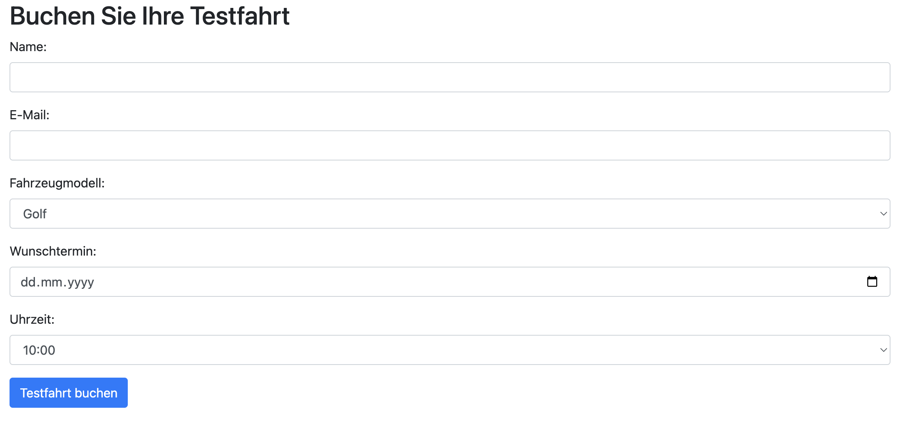
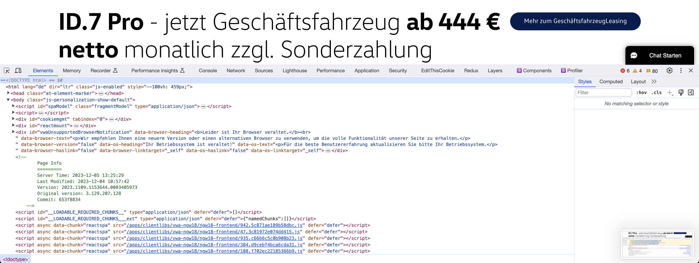
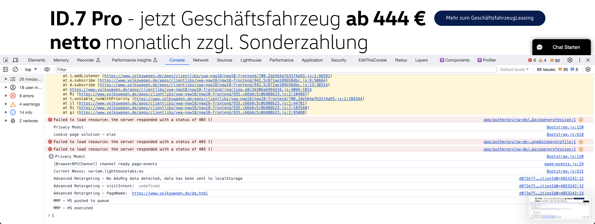
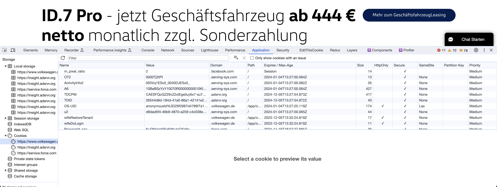
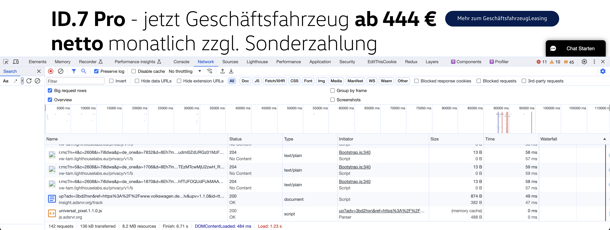

# Tag 3 - Simple Web Frontends

## API-Recap 
Hinter fast jeder modernen Website oder Webanwendung steht ein Backend, das häufig über eine API (Application Programming Interface) mit dem Frontend kommuniziert. 

### Fragen
Zeit: 3 min / Frage
1. Was ist eine API und warum ist sie wichtig?
2. Beschreibe das Prinzip einer RESTful API
3. Was sind die Hauptunterschiede zwischen Flask und Django?
4. Wie kann die Sicherheit einer API gewährleistet werden?
5. Warum ist die Dokumentation einer API wichtig?
6. Wie werden Daten in einer RESTful API übertragen und welche Formate werden typischerweise verwendet?
7. Welche Rolle spielen HTTP-Statuscodes in einer RESTful API und wie sollten sie verwendet werden?

# Wie entsteht eine Website?
Die Erstellung einer Website ist ein dynamischer und iterativer Prozess, der Flexibilität und Anpassungsfähigkeit erfordert. Von der ersten Idee bis zur Veröffentlichung ist jede Phase entscheidend für die Entwicklung einer erfolgreichen Online-Präsenz. In den folgenden Tagen werden wir alle Schritte nach und nach durchführen und so den vollen Prozess kennenlernen. 


## Tagesprojekt
Ziel des heutigen Tages ist es, eine simple Website zum Buchen von Testfahrten mit verschiedenen VW-Fahrzeugen zu erstellen. Vorerst wird nur der visuelle Teil der Website gebaut, im Anschluss dann die Logik.




## Web Basics
Bei der Erstellung einer Website kommen zahlreiche Technologien und Praktiken zum Einsatz, die zusammenspielen, um ein nahtloses, interaktives Nutzererlebnis zu erstellen. Die Basis bildet ein Verständnis der Web-Grundlagen – von der Strukturierung und dem Styling von Inhalten bis hin zur Implementierung von Interaktivität und dynamischen Funktionen. 

### Websites Grundkomponenten
Eine Website setzt sich aus einigen Grundkomponenten zusammen, die nur duch Zusammenarbeit in eine interaktive und visuelle Anwendung verwandeln.  

#### HTML (Hypertext Markup Language)
HTML ist das Grundgerüst jeder Webseite. Es ist die grundlegende Markupsprache für Webseiten. Hierbei definiert sie die Struktur und den Inhalt der Seite mittels `Tags`, die verschiedene Elemente wie Überschriften, Absätze, Bilder und Links markieren. 

```html
<!DOCTYPE html>
<html>
<head>
    <title>Meine Webseite</title>
</head>
<body>
    <header>
        <h1>Willkommen auf meiner Webseite</h1>
    </header>
    <section>
        <p>Hier ist ein interessanter Absatz über das Thema meiner Webseite.</p>
        
    </section>
    <footer>
        <p>Kontakt: info@meinewebsite.com</p>
    </footer>
</body>
</html>
```

#### CSS (Cascading Style Sheets)
CSS ist die Sprache, die für das Styling und das Layout von Webseiten verwendet wird. Mit CSS können Designer und Entwickler das Erscheinungsbild von HTML-Elementen steuern, einschließlich Farben, Schriftarten, Abstände, Positionierung und vieles mehr. CSS ermöglicht damit ein sauberes Trennen von Inhalt (HTML) und Design.

```css
body {
    font-family: Arial, sans-serif;
    background-color: #f4f4f4;
}
header {
    background-color: #007bff;
    color: white;
    padding: 10px 0;
    text-align: center;
}
footer {
    background-color: #333;
    color: white;
    text-align: center;
    padding: 5px 0;
}
```

#### JavaScript (JS)
JavaScript ist eine mächtige Skriptsprache, die verwendet wird, um Webseiten dynamisch und interaktiv zu gestalten. Mit JavaScript können Entwickler auf Browser-Events reagieren, Elemente auf der Seite dynamisch ändern, mit externen Datenquellen kommunizieren und komplexe Animationen und Benutzerinteraktionen erstellen.

```js
document.getElementById("demoButton").addEventListener("click", function() {
    alert("Danke fürs Klicken!");
});
```

#### Das Dokument Objekt Model (DOM)
Das Dokumentenobjektmodell, meistens als DOM bezeichnet, ist eine wesentliche Komponente der Webentwicklung. Es bietet eine strukturierte Darstellung der Inhalte einer Webseite und ermöglicht es Skriptsprachen wie JavaScript, den Inhalt, die Struktur und das Design einer Webseite dynamisch zu ändern.

**Grundkonzept**: Das DOM modelliert eine HTML- oder XML-Seite als Baumstruktur, wobei jedes Element der Seite, wie Textblöcke, Bilder, Links und weitere, als Knoten im Baum dargestellt wird. Diese Baumstruktur besteht aus Eltern- und Kindbeziehungen; beispielsweise ist in HTML das `<body>`-Tag ein Kind des `<html>`-Tags und kann selbst wiederum Kinder wie `<p>`, `<div>`, `` usw. haben.

```css
        html
      /    \
    /        \
  head         body
    |         /  |  \
  title header section footer
            /     /  \     \
          h1     p   img    p
```

**Interaktion mit JavaScript**: Über das DOM können Webentwickler mit JavaScript auf einzelne Elemente der Seite zugreifen, sie verändern, hinzufügen oder entfernen. Beispielsweise kann JavaScript verwendet werden, um auf ein Element mit einer bestimmten ID zuzugreifen und seinen Inhalt zu ändern, ein neues Element zu erstellen und es in den Baum einzufügen oder die Stilattribute eines Elements zu ändern.

```html
<p id="text">Ursprünglicher Text</p>
```

```js
document.getElementById("text").innerHTML = "Neuer Text";
```

**Ereignissteuerung**: Das DOM ermöglicht es aber auch, auf Benutzeraktionen wie Klicks, Tastatureingaben oder Mausbewegungen zu reagieren. Entwickler können Event-Listener zu Elementen hinzufügen, um bestimmte Funktionen auszuführen, wenn diese Ereignisse auftreten.

Stell dir eine einfache Webseite mit einem Absatz (`<p>`) und einem Button (`<button>`) vor. Wenn der Benutzer auf den Button klickt, soll der Text des Absatzes geändert werden.

```html
<p id="text">Ursprünglicher Text</p>
<button id="changeButton">Text ändern</button>
```

```js
document.getElementById("changeButton").addEventListener("click", function() {
    document.getElementById("text").innerHTML = "Neuer Text";
});
```

## Anschauen einer Website mit den Webtools
Um die Komplexität einer modernen Website zu verstehen, schauen wir uns die dahinter liegenden, internen Prozesse einmal genauer an. 

### Elemente
Webentwickler können die Struktur und das Styling von Webseiten-Elementen untersuchen und in Echtzeit bearbeiten. Dies ist hilfreich, um das Layout und das visuelle Design zu optimieren.



### Console
Die Konsole dient als Schnittstelle, um JavaScript-Befehle auszuführen und um System- oder Fehlermeldungen anzuzeigen. Sie ist ein wesentliches Tool für Debugging und Testing.



### Applications: Cookies & Localstorage
Cookies sind Daten, die vom Webserver auf dem Endgerät des Nutzers gespeichert werden und bei späteren Besuchen wieder abgerufen werden können. LocalStorage ermöglicht die Speicherung von Daten direkt im Browser über längere Zeiträume.



### Netzwerkanalyse
Der Network Tab in den Webentwicklungstools der Browser zeigt alle Netzwerkanfragen (Requests) an, die beim Laden einer Webseite gemacht werden. Dies umfasst das Laden von HTML, CSS, JavaScript-Dateien, Medienressourcen wie Bilder und Videos sowie API-Anfragen.




## HTTPS vs HTTP
HTTPS ist die sichere Version des Hypertext Transfer Protocols (HTTP). Es verwendet Verschlüsselung, um die Datenübertragung zwischen dem Webbrowser des Benutzers und dem Webserver zu sichern. Diese Verschlüsselung schützt die Daten vor Lauschangriffen, Manipulationen und Diebstahl.

HTTPS nutzt [TLS](https://www.cloudflare.com/de-de/learning/ssl/transport-layer-security-tls/) (Transport Layer Security) oder dessen Vorgänger [SSL](https://www.cloudflare.com/de-de/learning/ssl/what-is-ssl/) (Secure Sockets Layer) zur Verschlüsselung der Daten. Diese Protokolle verwenden eine Kombination aus asymmetrischer und symmetrischer Verschlüsselung, um sowohl die Identität des Servers zu bestätigen als auch die übertragenen Daten zu schützen.

Der `Handshake-Prozess` ist das Kernelement der sicheren Kommunikation. Beim ersten Verbindungsaufbau führen der Client und der Server einen `Handshake` durch. Dabei werden die Verschlüsselungsparameter festgelegt und der Server authentifiziert sich beim Client, in der Regel durch ein digitales Zertifikat.

Um HTTPS auf einer Webseite zu implementieren, muss der Webseitenbetreiber ein SSL/TLS-Zertifikat von einer Zertifizierungsstelle erwerben und auf seinem Server installieren. Viele Hosting-Anbieter bieten heutzutage aber einfache Möglichkeiten, HTTPS auf Webseiten zu aktivieren.

 
## Web-Accessibility
Web-Accessibility bedeutet, dass Webseiten und Online-Tools so gestaltet und entwickelt werden, dass sie für alle Menschen, einschließlich jener mit Behinderungen, zugänglich sind. Zwei konkrete Beispiele für mehr Accessibility sind die Verwendung von Alt-Texten und Verbesserung von Kontrasten und Farben. 

**Alternative Texte für Bilder (Alt-Texte)**: Bilder sollten mit einem alternativen Text versehen werden, der den Inhalt und Zweck des Bildes beschreibt. Das ist besonders wichtig für Screenreader-Nutzer.

```html

```

## HTML
Vor der Umsetzung der ersten eigene Website, wird eine Auflistung der wichtigsten HTML-`Tags` benötigt. Folgend die in den kommenden Aufgaben notwendigen Tags.

Meist wird die initale Website (Home) unter dem namen `index.html` gespeichert. Webserver liefern das HTML Dokument mit diesem Namen ohne weitere Konfiguration als Standard aus.

### `<!DOCTYPE>`
Gibt den Dokumenttyp und die HTML-Version an. Wichtig für den Browser, um die Seite korrekt zu rendern.

```html
<!DOCTYPE html>
```

### `<html>`
Das Wurzelelement, das das gesamte HTML-Dokument umschließt.
```html
<html lang="en">
</html>
```

### `<head>`
Enthält Metadaten, Links zu Stylesheets, Skripten und andere Informationen, die nicht direkt auf der Webseite angezeigt werden.

```html
<head>
  <title>Seitentitel</title>
</head>
```

### `<title>`
Definiert den Titel der Webseite, der im Browser-Tab angezeigt wird.

```html
<title>Meine Webseite</title>
```

### `<body>`
Der Hauptteil des Dokuments, enthält den sichtbaren Inhalt der Webseite.

```html 
<body>
  <p>Willkommen auf meiner Seite!</p>
</body>
```

### `<h1>` bis `<h6>`
Überschriften-Tags, wobei `<h1>` die wichtigste Überschrift ist und `<h6>` die geringste Wichtigkeit hat.

```html
<h1>Hauptüberschrift</h1>
<h2>Unterüberschrift</h2>
```

### `<footer>`
Definiert den Fußbereich der Webseite.
```html
<footer>Kontakiere Mich: info@kontakt.de</footer>
```

### `<span>`
Ein Inline-Container, der verwendet wird, um Teile des Textes zu stylen oder auszurichten, ohne den Dokumentenfluss zu ändern.

```html
<p>Das ist ein <span class="highlight">wichtiger</span> Textabschnitt.</p>
```

### `<div>`
Ein div ist ein generischer Container für Fließinhalt, oft verwendet, um Layouts mit CSS zu gestalten.

```html
<div class="header">Kopfbereich der Seite</div>
```

### `<p>`
Definiert einen Textabsatz.
```html
<p>Das ist ein Absatz.</p>
```

### `<a>`
Definiert einen Hyperlink, also einen Link auf eine externe Website, Ressource, oder einen Anchor im gleichen Dokument.

```html
<a href="https://www.beispiel.de">Besuche meine Webseite</a>
```

### ``
Bindet ein Bild ein.

```html

```

### `<ul>` und `<ol>`
`<ul>` (unordered list) für ungeordnete Listen und `<ol>` (ordered list) für geordnete Listen. Beide nutzen `<li>` (list item) als Listenelemente.

```html
<ul>
  <li>Listenelement 1</li>
  <li>Listenelement 2</li>
</ul>
<ol>
  <li>Erstes Element</li>
  <li>Zweites Element</li>
</ol>
```

### `<link>`
Wird hier verwendet, um z.B. das externe CSS-Stylesheet einzubinden.

```html
<link rel="stylesheet" type="text/css" href="styles.css">
```

### `<nav>`
Definiert einen Navigationsbereich.

```html
<nav>
    <ul>
        <li><a href="#">Home</a></li>
        <li><a href="#">Kontakt</a></li>
    </ul>
</nav>
```


## CSS
Um die grobe Struktur der angelegten HTML Seite (`index.html`) im zweiten Schritt mit einem Designlayout zu verbessern, nutzen wir ein CSS Stylesheet.

### Wie verbinde ich HTML und CSS
CSS kann auf verschiedene Arten in HTML-Dokumente eingebunden werden, die gängigsten sind Inline-Styling und das Verlinken externer CSS-Dateien.

#### Inline-Styling
Inline-Styling bedeutet, dass der CSS-Code direkt im HTML-Tag über das style-Attribut eingefügt wird. Jedes HTML-Element kann individuell gestaltet werden, aber diese Methode wird oft als weniger effizient angesehen, besonders bei größeren Webseiten, da sie die Wartung und Konsistenz erschweren kann.

```html
<p style="color: blue; font-size: 18px;">Dies ist ein Absatz mit Inline-Styling.</p>
```

#### Externes CSS-Dokument
Eine andere, oft bevorzugte Methode ist das Einbinden von externen CSS-Dateien. Hierbei wird der CSS-Code in separaten `.css`-Dateien geschrieben und dann im `<head>`-Bereich des HTML-Dokuments über das `<link>`-Tag eingebunden. Diese Methode fördert die Wiederverwendbarkeit und erleichtert die Pflege des Codes, da der Stil von mehreren Seiten aus einer zentralen Datei gesteuert werden kann.

**`styles.css`**
```css
p {
    color: blue;
    font-size: 18px;
}
```

**`index.html`**
```html
<!DOCTYPE html>
<html>
<head>
    <link rel="stylesheet" type="text/css" href="styles.css">
</head>
<body>
    <p>Dies ist ein Absatz, der durch eine externe CSS-Datei gestaltet wird.</p>
</body>
</html>
```

### Box-Modell
Das Box-Modell ist ein grundlegendes Konzept in CSS und beschreibt, wie Elemente auf der Seite dargestellt und positioniert werden.

Jedes Element wird als Rechteck dargestellt, das aus `margin` (Außenabstand), `border` (Rahmen), `padding` (Innenabstand) und dem eigentlichen Inhalt besteht.

```css
.box {
    width: 100px;             /* Breite des Inhalts */
    padding: 10px;            /* Innenabstand */
    border: 5px solid black;  /* Rahmen */
    margin: 20px;             /* Außenabstand */
}

+-------------------------------+
|           Margin              |
|  +-------------------------+  |
|  |        Border           |  |
|  |  +-------------------+  |  |
|  |  |     Padding       |  |  |
|  |  |  +-------------+  |  |  |
|  |  |  |   Content   |  |  |  |
|  |  |  +-------------+  |  |  |
|  |  +-------------------+  |  |
|  +-------------------------+  |
+-------------------------------+
```

#### Positionierung
Die Platzierung und Orientierung von Elementen auf einer Website ist für das Layoutdesign essentiell. CSS bietet verschiedene Möglichkeiten, Elemente auf der Seite zu positionieren.

**`static`**: Standard-Positionierung, bei der Elemente in der normalen Flussordnung angezeigt werden.

**`relative`**: Positioniert ein Element relativ zu seiner ursprünglichen Position.

**`absolute`**: Positioniert ein Element absolut innerhalb eines relativ positionierten Elternelements.

**`fixed`**: Positioniert ein Element relativ zum Viewport, es bleibt also bei Scrollen an der gleichen Stelle.

**`sticky`**: Eine Mischung aus relativer und fester Positionierung. Das Element "klebt" beim Scrollen an der bestimmten Position.

### Selektoren
Selektoren sind Muster, die definieren, welche HTML-Elemente durch die CSS-Regeln gestaltet werden.

#### Tag-Selektoren
Selektieren HTML-Elemente direkt. Folgendes Beispiel wendet den Stil auf alle `<p>`-Elemente an.

```css
p { 
  color: blue; 
}
```

#### Klassen-Selektoren (`.`)
Selektieren Elemente basierend auf dem class-Attribut. Folgendes Beispiel wendet den Stil auf alle Elemente mit der Klasse `navbar` an.

```css
.navbar { 
  font-size: 14px; 
}
```

#### ID-Selektoren (`#`)
Selektieren ein spezifisches Element basierend auf dem id-Attribut. Folgendes Beispiel wendet den Stil auf das Element mit der ID `header` an.

```css
#header { 
  background-color: #333; 
}
```

#### Attribut-Selektoren (`[type=]`)
Selektieren Elemente basierend auf einem Attribut oder Attributwert. Folgendes Beispiel selektiert alle Texteingabefelder.

```css
input[type='text'] { 
  border-color: red; 
}
```

#### Pseudo-Klassen und Pseudo-Elemente (`:`)
Selektieren Elemente in einem bestimmten Zustand oder bestimmte Teile eines Elements. Folgendes Beispiel ändert die Farbe von Links beim Überfahren mit der Maus.

```css
a:hover { 
  color: red; 
}
```

### Kombinatoren
Kombinatoren definieren Beziehungen zwischen Selektoren.

#### Nachfahren-Selektor (` `)
Selektiert alle Elemente, die innerhalb eines anderen Elements liegen. Folgendes Beispiel wählt alle `<p>` innerhalb von `<div>`.

```css
div p { 
  color: green; 
}
```

#### Kind-Selektor (`>`)
Selektiert direkte Kinder eines Elements. Folgendes Beispiel wählt direkte `li`-Kinder von `ul`.

```css
ul > li { 
  list-style-type: square; 
}
```

#### Nachbar-Selektor (`+`)
Selektiert ein Element, das direkt auf ein anderes folgt. Folgendes Beispiel wählt das erste `<p>` direkt nach einem `<h1>`.

```css
h1 + p { 
  margin-top: 0; 
}
```

#### Geschwister-Selektor (`~`)
Selektiert alle Elemente auf dem gleichen Level nach einem bestimmten Element. Folgendes Beispiel wählt alle `<p>`, die auf dem gleichen Level nach einem `<h1>` stehen.

```css
h1 ~ p { 
  font-size: 14px; 
}
```

### CSS Attribute
Auch für CSS schauen wir uns eine kurze Auflistung einiger relevanter CSS Attribute und deren Verwendung an, die in bei den kommenden Aufgaben helfen werden.

#### Schriftart definieren (`font-family`)
Legt die Schriftart für den Text im body fest und sorgt für eine einheitliche Schriftart auf der gesamten Webseite.

```css
body {
    font-family: Arial, sans-serif;
}
```

#### Hintergrundfarbe und Textfarbe (`background-color`, `color`)
`background-color` wird verwendet, um die Hintergrundfarbe des header festzulegen, während `color` die Textfarbe bestimmt.

```css
header {
    background-color: #4CAF50;
    color: white;
}
```

#### Textausrichtung (`text-align`)
Bestimmt, wie Text innerhalb eines Elements ausgerichtet wird, hier zentral im header und footer.

```css
header, footer {
    text-align: center;
}
```

#### Padding (`padding`)
Definiert den Abstand zwischen dem Inhalt eines Elements und seinem Rand und verbessert den visuellen Abstand und die Ästhetik von Elementen.

```css
header {
    padding: 10px 0;
}
```

#### Listen-Styling (`list-style-type`, `margin`)
Entfernt Bullet Points von Listen und setzt Außen- und Innenabstände und erzeugt z.B. eine saubere Navigationsleiste.

```css
nav ul {
    list-style-type: none;
    margin: 0;
    padding: 0;
}
```

#### Float-Layout (`float`)
Bestimmt, wie ein Element im Fluss des Dokuments schwimmt. Hier werden z.B. li-Elemente nebeneinander statt untereinander angeordnet.

```css
nav ul li {
    float: left;
}
```

#### Hyperlink-Styling (`text-decoration`, `:hover`):
Entfernt die Unterstreichung von Links und definiert Hover-Effekte, was die Benutzerinteraktion mit Links verbessern kann.

```css
nav ul li a {
    text-decoration: none;
}
nav ul li a:hover {
    background-color: #111;
}
```

#### Border und Border-Radius (`border`, `border-radius`)
Definiert die Art und das Aussehen der Ränder eines Elements und erzeugt z.B. abgerundete Ecken und Grenzlinien für Bilder.

```css
.gallery img {
    border: 1px solid #ddd;
    border-radius: 4px;
}
```

#### Flexbox (`display: flex`, `justify-content`)
Flexbox ist ein modernes Layout-Modell, das die Anordnung von Elementen in einem Container erleichtert. Im Beispiel werden Bilder in einer Galerie gleichmäßig verteilt.

```css
.gallery {
    display: flex;
    justify-content: space-around;
}
```

#### Responsive Design mit Media Queries (`@media`)
Passt das Layout an basierend auf der Größe des Browserfensters oder Gerätes an und gewährleistet so, dass die Webseite auf verschiedenen Geräten gut aussieht.

```css
@media screen and (max-width: 600px) {
    .gallery {
        flex-direction: column;
    }
}
```

## Aufgaben
Zeit: 20 min / Aufgabe

**1. Grundstruktur der Automobil-Website**
Erstelle das Grundgerüst einer HTML-Seite für ein Automobilunternehmen. Diese Seite soll als Basis für die weiteren Schritte dienen und die grundlegenden Elemente wie Header, Hauptinhalt und Footer enthalten.
Anforderungen:

- Füge einen Header (`<header>`) mit dem Namen des Unternehmens ein.
- Im Hauptteil (`<body>`) soll ein Absatz (`<p>`) mit einer kurzen Beschreibung des Unternehmens stehen.
- Der Footer (`<footer>`) soll Kontaktinformationen wie eine E-Mail-Adresse enthalten.

**2. Grundlegendes CSS-Styling**
Wende grundlegende CSS-Styles an, um das visuelle Erscheinungsbild der Webseite zu verbessern. Dies umfasst die Farbgebung, Schriftarten und grundlegende Layout-Anpassungen.

- Erstelle und verlinke eine CSS-Datei mit Ihrem HTML-Dokument.
- Setze eine Hintergrundfarbe und Textfarbe für den Header.
- Gestalte den Footer mit einer anderen Hintergrundfarbe und zentriertem Text.

**3. Navigationsleiste**
Erweitere die Website um eine Navigationsleiste, die eine verbesserte Benutzerführung ermöglicht. Diese Leiste soll Links zu verschiedenen Abschnitten der Webseite enthalten.
Anforderungen:

- Füge im Header eine Navigationsleiste (`<nav>` mit `<ul>` und `<li>`) hinzu.
- Erstelle Links zu fiktiven Seiten wie "Home", "Modelle" und "Kontakt".
- Nutze CSS, um die Navigationsleiste horizontal anzuordnen und die Links ansprechend zu gestalten.

**4. Bildergalerie für Automodelle**
Erstelle eine Bildergalerie, die verschiedene Modelle des Autoherstellers präsentiert. Ziel ist es, visuellen Content ansprechend zu integrieren.

- Füge unterhalb der Unternehmensbeschreibung eine Bildergalerie ein.
- Nutze ``-Tags für mindestens drei verschiedene Automodelle.
- Verwende CSS, um die Bilder nebeneinander anzuordnen und ästhetisch zu rahmen.

> Nutze Lizenzfreie Bilder wie z.B. von diesem [VW Arteon R-Line](https://commons.wikimedia.org/wiki/File:VW_Arteon_R-Line_%E2%80%93_f_20052021.jpg).

**5. Responsive Design**
Passe das Design der Webseite an, damit sie auf verschiedenen Bildschirmgrößen und Geräten gut aussieht und funktioniert. Dies ist ein wichtiger Schritt, um die Zugänglichkeit und Benutzerfreundlichkeit der Website zu gewährleisten.

- Implementiere CSS-Media-Queries, um das Layout der Seite für kleinere Bildschirme wie Smartphones und Tablets anzupassen.
Stell sicher, dass die Navigationsleiste und die Bildergalerie auch auf kleineren Bildschirmen gut aussehen und nutzbar sind.

### Musterlösungen
<details>
  <summary>1. Grundstruktur der Automobil-Website</summary>

  ```html
  <!DOCTYPE html>
<html>
<head>
    <title>Mein Autohersteller</title>
</head>
<body>
    <header>
        <h1>Mein Autohersteller</h1>
    </header>
    <p>Willkommen bei Mein Autohersteller, dem Ort für innovative Fahrzeuge.</p>
    <footer>
        Kontakt: info@meinautohersteller.de
    </footer>
</body>
</html>
  ```
</details>

<details>
  <summary>2. Grundlegendes CSS-Styling</summary>

  ```css
  body {
    font-family: Arial, sans-serif;
}

header {
    background-color: #4CAF50;
    color: white;
    text-align: center;
    padding: 10px 0;
}

footer {
    background-color: #f4f4f4;
    text-align: center;
    padding: 10px 0;
}
  ```
</details>

<details>
  <summary>3. Navigationsleiste</summary>

  ```html
  <nav>
    <ul>
        <li><a href="#">Home</a></li>
        <li><a href="#">Modelle</a></li>
        <li><a href="#">Kontakt</a></li>
    </ul>
</nav>
  ```

  ```css
nav ul {
    list-style-type: none;
    margin: 0;
    padding: 0;
    overflow: hidden;
    background-color: #333;
}

nav ul li {
    float: left;
}

nav ul li a {
    display: block;
    color: white;
    text-align: center;
    padding: 14px 16px;
    text-decoration: none;
}

nav ul li a:hover {
    background-color: #111;
}
  ```
</details>

<details>
  <summary>4. Bildergalerie für Automodelle</summary>

  ```html
  <div class="gallery">
        <a title="Thomas doerfer, CC BY-SA 4.0 &lt;https://creativecommons.org/licenses/by-sa/4.0&gt;, via Wikimedia Commons" href="https://commons.wikimedia.org/wiki/File:VW_Touareg_III_Elegance.jpg"></a>
        <a title="© M 93 / Wikimedia Commons" href="https://commons.wikimedia.org/wiki/File:VW_Arteon_R-Line_%E2%80%93_f_20052021.jpg"></a>
        <a title="Spurzem - Lothar Spurzem, CC BY-SA 2.0 DE &lt;https://creativecommons.org/licenses/by-sa/2.0/de/deed.en&gt;, via Wikimedia Commons" href="https://commons.wikimedia.org/wiki/File:VW_Standard,_Bj._1950_(2009-05-01_Sp).jpg"></a>
    </div>
  ```

  ```css
  .gallery {
    display: flex;
    justify-content: space-around;
    padding: 20px;
}

.gallery img {
    width: 30%;
    border: 1px solid #ddd;
    border-radius: 4px;
    padding: 5px;
}
  ```
</details>

<details>
  <summary>5. Responsive Design</summary>

  ```css
  @media screen and (max-width: 600px) {
    nav ul, .gallery {
        flex-direction: column;
    }

    .gallery img {
        width: 100%;
    }
}
  ```
</details>

<details>
  <summary>Ganzes Aufgabe</summary>
  
  ```html
  <!DOCTYPE html>
<html>
<head>
    <title>Mein Autohersteller</title>
    <link rel="stylesheet" type="text/css" href="styles.css">
</head>
<body>
    <header>
        <h1>Mein Autohersteller</h1>
        <nav>
            <ul>
                <li><a href="#">Home</a></li>
                <li><a href="#">Modelle</a></li>
                <li><a href="#">Kontakt</a></li>
            </ul>
        </nav>
    </header>
    <p>Willkommen bei Mein Autohersteller, dem Ort für innovative Fahrzeuge.</p>
    <div class="gallery">
        <a title="Thomas doerfer, CC BY-SA 4.0 &lt;https://creativecommons.org/licenses/by-sa/4.0&gt;, via Wikimedia Commons" href="https://commons.wikimedia.org/wiki/File:VW_Touareg_III_Elegance.jpg"></a>
        <a title="© M 93 / Wikimedia Commons" href="https://commons.wikimedia.org/wiki/File:VW_Arteon_R-Line_%E2%80%93_f_20052021.jpg"></a>
        <a title="Spurzem - Lothar Spurzem, CC BY-SA 2.0 DE &lt;https://creativecommons.org/licenses/by-sa/2.0/de/deed.en&gt;, via Wikimedia Commons" href="https://commons.wikimedia.org/wiki/File:VW_Standard,_Bj._1950_(2009-05-01_Sp).jpg"></a>
    </div>
    <footer>
        Kontakt: info@meinautohersteller.de
    </footer>
</body>
</html>
  ```

  ```css
  body {
    font-family: Arial, sans-serif;
}

header {
    background-color: #4CAF50;
    color: white;
    text-align: center;
    padding: 10px 0;
}

nav ul {
    list-style-type: none;
    margin: 0;
    padding: 0;
    overflow: hidden;
    background-color: #333;
}

nav ul li {
    float: left;
}

nav ul li a {
    display: block;
    color: white;
    text-align: center;
    padding: 14px 16px;
    text-decoration: none;
}

nav ul li a:hover {
    background-color: #111;
}

.gallery {
    display: flex;
    justify-content: space-around;
    padding: 20px;
}

.gallery img {
    width: 30%;
    border: 1px solid #ddd;
    border-radius: 4px;
    padding: 5px;
}

footer {
    background-color: #f4f4f4;
    text-align: center;
    padding: 10px 0;
}

@media screen and (max-width: 600px) {
    nav ul, .gallery {
        flex-direction: column;
    }

    .gallery img {
        width: 100%;
    }
}
  ```
</details>

<br />


# Erweitertes HTML & CSS
Mit nur wenigen HTML Tags und CSS Funktionen kann man eine mehr oder weniger an schauliche Website erstellen. Um 

## Komplexere HTML Elemente
Für die Erstellung des Tagesprojektes und komplexeren Websites benötigen wird noch weitere, interaktivere HTML Elemente.

### `<form>`
Definiert ein Formular, das vom Benutzer ausgefüllt werden kann. Wird zusammen mit anderen Formular-Elementen wie `<input>`, `<textarea>` und `<button>` verwendet.

```html
<form action="/submit-form" method="post">
  <input type="text" name="name">
  <input type="submit" value="Absenden">
</form>
```

### `<input>`
Eines der vielseitigsten Formularelemente, das verschiedene Arten von Benutzereingaben akzeptiert, wie Text, Datum, Dateiauswahl und mehr.

```html
<input type="text" name="vorname" placeholder="Gib deinen Vornamen ein">
<input type="password" name="passwort" placeholder="Gib dein Passwort ein">
<input type="email" name="email" placeholder="Gib deine E-Mail-Adresse ein">
<input type="number" name="alter" placeholder="Gib dein Alter ein">
<input type="date" name="geburtstag">
<input type="checkbox" name="newsletter" value="Ja"> Newsletter abonnieren
<input type="file" name="lebenslauf">
<input type="range" name="lautstärke" min="0" max="100">
```

### `<table>`
Wird verwendet, um tabellarische Daten darzustellen. Zusammen mit `<tr>` (table row), `<th>` (table header) und `<td>` (table data) für die Strukturierung der Tabelle.

```html
<table>
  <tr>
    <th>Header 1</th>
    <th>Header 2</th>
  </tr>
  <tr>
    <td>Daten 1</td>
    <td>Daten 2</td>
  </tr>
</table>
```

### `<button>`
Ein klickbares Button-Element, das in Formularen oder zum Auslösen von JavaScript-Funktionen verwendet wird.

```html
<button type="button" onclick="alert('Hallo Welt!')">Klick mich</button>
```

### `<iframe>`
Ermöglicht das Einbetten eines anderen HTML-Dokuments innerhalb des aktuellen Dokuments, oft verwendet für Karten, Videos oder externe Inhalte.

```html
<iframe src="https://www.beispiel.de" width="300" height="200"></iframe>
```

### `<br>`
Ein Zeilenumbruch, der verwendet wird, um einen neuen Absatz zu beginnen, ohne einen neuen <p>-Tag zu verwenden.

```html
Dies ist eine Zeile.<br>Und das ist eine neue Zeile.
```

### `<meta>`
Wird im `<head>`-Bereich eingesetzt, um Metadaten wie Zeichensatz, Beschreibung, Schlüsselwörter und Autor der Seite anzugeben. Wichtig für SEO und die Darstellung der Seite in Suchmaschinen.

```html
<meta charset="UTF-8">
<meta name="description" content="Beschreibung der Webseite">
```

### `<label>`
Das `<label>`-Tag wird verwendet, um Beschriftungen für Formularelemente bereitzustellen. Es verbessert die Zugänglichkeit, indem es die Klickfläche für die assoziierten Formularelemente wie Checkboxen, Radiobuttons oder Textfelder vergrößert. Im folgenden Beispiel wird ein `<label>` für ein Textfeld mit der ID `name` verwendet. Klickt man auf das Label, wird das zugehörige Textfeld fokussiert.

```html
<label for="name">Name:</label>
<input type="text" id="name" name="name">
```

### `<select>` und `<option>`
Das `<select>`-Element erstellt ein Dropdown-Menü zur Auswahl.
Das `<option>`-Element definiert die einzelnen verfügbaren Auswahlmöglichkeiten innerhalb des Dropdown-Menüs.

Im folgenden Beispiel können Benutzer aus verschiedenen Automarken wählen. Das `<select>`-Element enthält mehrere `<option>`-Elemente, die die verfügbaren Optionen darstellen.

```html
<label for="car">Wähle ein Auto:</label>
<select id="car" name="car">
  <option value="volvo">Volvo</option>
  <option value="saab">Saab</option>
  <option value="mercedes">Mercedes</option>
  <option value="audi">Audi</option>
</select>
```

### `<script>`
Das `<script>`-Tag wird verwendet, um JavaScript-Code in eine HTML-Seite einzubinden. Dies kann entweder direkt in das Element geschriebener Code sein oder eine externe JavaScript-Datei, die über das src-Attribut eingebunden wird.

```html
<!-- Direkte Einbindung von JavaScript -->
<script>
  function sayHello() {
    alert('Hallo Welt!');
  }
</script>

<!-- Einbindung einer externen JavaScript-Datei oder CDN URL -->
<script src="script.js"></script>
```


## Komplexere CSS Konzepte 
In der modernen Webentwicklung sind fortgeschrittene CSS-Konzepte entscheidend, um responsive und benutzerfreundliche Webseiten zu erstellen. Zwei Schlüsselkonzepte in diesem Bereich sind das Responsive Design, realisiert durch Techniken wie Flexbox, und Frameworks wie Bootstrap, die eine Vielzahl von vorgefertigten Komponenten und Layout-Optionen bieten.

### Responsive CSS
Responsive CSS ist der Ansatz, Webseiten so zu gestalten, dass sie auf verschiedenen Geräten und Bildschirmgrößen gut aussehen und funktionieren. Das wird durch den Einsatz von Media Queries und flexiblen Layouts erreicht. Beide Konzepte haben wir bereits kurz besprochen.

#### Media Queries (Rückblick)
Media Queries ermöglichen es, CSS-Regeln basierend auf bestimmten Bedingungen wie Bildschirmgröße, Auflösung oder Seitenverhältnis anzuwenden.
Im folgenden Beispiel wird die Klasse `.container` auf Geräten mit einer maximalen Bildschirmbreite von 600px auf die volle Breite gesetzt.

```css
@media (max-width: 600px) {
    .container {
        width: 100%;
    }
}
```

#### Flexible Layouts

**`grid`-Layouts**: Moderne CSS-Grid-Layouts ermöglichen komplexe, mehrspaltige Anordnungen, die sich dynamisch an die Bildschirmgröße anpassen.

**`flexbox`**: Flexbox ist ein eindimensionales Layoutmodell, das effiziente Möglichkeiten bietet, Elemente innerhalb eines Containers auszurichten und zu verteilen.

#### Responsive Design mit Flexbox
Flexbox ist ein mächtiges Werkzeug, das ein flexibles Box-Modell zur Verfügung stellt.

**`flex`-Container**: Ein Element, das mit `display: flex;` definiert wird, wird zum Flex-Container, und seine Kinder werden zu `flex-items`.

**Responsive Anpassung**: Flexbox kann außerdem mit Media Queries kombiniert werden, um responsive Layouts zu erstellen.

**Ausrichtung und Verteilung**: Flexbox bietet Eigenschaften wie justify-content, align-items, flex-direction, die es ermöglichen, die Inhalte sowohl horizontal als auch vertikal auszurichten und anzuordnen. Im folgenden Beispiel wird ein Flex-Container erstellt, dessen Kinder gleichmäßig im verfügbaren Raum verteilt werden.

```css
.container {
    display: flex;
    justify-content: space-between;
}
```

### Bootstrap
Während traditionelles CSS umfangreiche Kontrolle und Flexibilität bietet, erleichtert Bootstrap den Prozess erheblich, insbesondere für Entwickler, die schnell responsive Layouts und Komponenten implementieren möchten. Bootstrap ist ideal für schnelle Entwicklungen und Prototyping, während traditionelles CSS besser für maßgeschneiderte Designs und spezifische Stilbedürfnisse geeignet ist. Beide Ansätze haben ihre Stärken und Einsatzbereiche in der Webentwicklung.

Um die Vorteile von Bootstrap im Vergleich zum traditionellen CSS zu verstehen, ist es hilfreich, einige der Kernkonzepte und Anwendungsfälle zu betrachten.

#### 1. Grid-System

**Bootstrap** verwendet ein 12-Spalten-Grid-System, das auf Flexbox basiert. Es ermöglicht eine einfache und schnelle Erstellung von responsiven Layouts.
Im folgenden Beispiel erstellt die Klasse `col-md-6` zwei Spalten, die jeweils 50% der Containerbreite einnehmen, wenn der Bildschirm mittelgroß (`md`) oder größer ist.

```html
<div class="container">
  <div class="row">
    <div class="col-md-6">Linke Hälfte</div>
    <div class="col-md-6">Rechte Hälfte</div>
  </div>
</div>
```

Mit **traditionellem CSS** muss das Grid-System manuell erstellt werden, was mehr Aufwand und detailliertere Kenntnisse in CSS erfordert. Der folgende CSS-Code bewirkt eine ähnliche Aufteilung in zwei Spalten, erfordert jedoch eine explizite Definition der Flexbox-Eigenschaften.

```css
.container > .row {
  display: flex;
}
.container > .row > div {
  flex: 0 0 50%;
}
```

#### 2. Komponenten
**Bootstrap** bietet eine Vielzahl von vorgefertigten Komponenten wie Buttons, Navigationsleisten und Modals, die einfach durch das Hinzufügen von Klassen genutzt werden können. Im folgenden Beispiel wird ein stilisierten Button mit geringem Aufwand erstellt.

```html
<button class="btn btn-primary">Primary Button</button>
```

Im **traditionellen CSS** muss jede Eigenschaft des Buttons manuell definiert werden. Folgend der Stil für einen ähnlichen Button definiert, aber mit deutlich mehr Code.

```css
.button {
  background-color: #007bff;
  color: white;
  padding: 10px 20px;
  border: none;
  border-radius: 4px;
  cursor: pointer;
}
```

#### 3. Responsive Design
**Bootstrap** beinhaltet Hilfsklassen für die schnelle Implementierung von responsivem Design, wie das Anzeigen oder Verbergen von Inhalten auf bestimmten Bildschirmgrößen. Diese Bootstrap-Klassen machen das Element auf kleinen Bildschirmen unsichtbar und auf mittelgroßen oder größeren Bildschirmen sichtbar.

```html
<div class="d-none d-md-block">Nur auf mittelgroßen oder größeren Bildschirmen sichtbar</div>
```

Im **traditionellen CSS** werden Media Queries verwendet, um ähnliche responsive Verhaltensweisen zu erzielen. Dieser Code erreicht das gleiche Ziel, erfordert jedoch ein tieferes Verständnis von Media Queries und mehr Zeilen an Code.

```css
@media screen and (min-width: 768px) {
  .custom-class {
    display: block;
  }
}
@media screen and (max-width: 767px) {
  .custom-class {
    display: none;
  }
}
```

## Komplex-Aufgabe (Capstone Projekt)
**Webseite für Testfahrten mit einem VW-Fahrzeug**
> Zeit: 150 min 

Das Ziel dieses Projekts ist es, eine benutzerfreundliche Webseite zu erstellen, die es potenziellen Kunden ermöglicht, eine Testfahrt für ein VW-Fahrzeug zu buchen. Die Webseite soll ein intuitives Formular enthalten, das neben grundlegenden persönlichen Informationen auch die Auswahl des Fahrzeugmodells, des Wunschtermins und der Uhrzeit für die Testfahrt bietet.

**Anforderungen**
- Formular für Testfahrt-Buchung
  - Ein Formular zur Eingabe persönlicher Daten wie Name und E-Mail-Adresse.
  - Dropdown-Menü zur Auswahl des Fahrzeugmodells (z.B. Golf, Passat, Tiguan).
  - Datumswähler für den Wunschtermin der Testfahrt.
  - Zusätzliches Dropdown-Menü zur Auswahl der Uhrzeit für die Testfahrt mit 1-Stunden-Slots zwischen 10:00 und 17:00 Uhr.

- Styling mit Bootstrap:
  - Verwendung von Bootstrap, um das Formular und die gesamte Webseite ansprechend und responsiv zu gestalten.
  - Sichergestellt werden soll eine klare, intuitive Benutzeroberfläche, die die Benutzererfahrung verbessert.

- Reaktionsfähiges Design:
  - Die Webseite sollte auf verschiedenen Geräten gut aussehen und funktionieren, einschließlich Desktop-Computern, Tablets und Smartphones.
  - Anwendung von Responsive Design-Prinzipien, um eine optimale Darstellung auf verschiedenen Bildschirmgrößen zu gewährleisten.

**Bonus**
- **Dark Mode**: Erstelle einen Dark Mode für die Webseite, der nur mit CSS umgeschaltet werden kann, z.B. durch den Einsatz von CSS Custom Properties (CSS-Variablen).
- **Buchungstabelle**: Füge eine zusätzliche Platzhaltertabelle mit allen gebuchten Testfahrten an.
- **Visuelle Fahrzeugliste**: Füge weitere Fahrzeugmodelle zur Auswahl hinzu und zeige dem Nutzer je nach Wahl das Fahrzeug.

**Ressourcen**
- [Bootstrap Dokumentation](https://getbootstrap.com/docs/)
- [HTML Formulare - MDN Web Docs](https://developer.mozilla.org/en-US/docs/Learn/Forms?retiredLocale=de)
- [CSS Grundlagen - MDN Web Docs](https://developer.mozilla.org/en-US/docs/Learn/Getting_started_with_the_web/CSS_basics?retiredLocale=de)

<details>
  <summary>Musterlösung</summary>

  ```html
  <!DOCTYPE html>
<html lang="de">
<head>
    <meta charset="UTF-8">
    <meta name="viewport" content="width=device-width, initial-scale=1.0">
    <title>VW Testfahrt Buchung</title>
    <link href="https://maxcdn.bootstrapcdn.com/bootstrap/4.5.2/css/bootstrap.min.css" rel="stylesheet">
    <link href="style.css" rel="stylesheet">
</head>
<body>
    <div class="container">
        <h2>Buchen Sie Ihre Testfahrt</h2>
        <form id="testDriveForm">
            <div class="form-group">
                <label for="name">Name:</label>
                <input type="text" class="form-control" id="name" required>
            </div>
            <div class="form-group">
                <label for="email">E-Mail:</label>
                <input type="email" class="form-control" id="email" required>
            </div>
            <div class="form-group">
                <label for="model">Fahrzeugmodell:</label>
                <select class="form-control" id="model">
                    <option>Golf</option>
                    <option>Passat</option>
                    <option>Tiguan</option>
                </select>
            </div>
            <div class="form-group">
                <label for="date">Wunschtermin:</label>
                <input type="date" class="form-control" id="date" required>
            </div>
            <div class="form-group">
                <label for="time">Uhrzeit:</label>
                <select class="form-control" id="time">
                    <option>10:00</option>
                    <option>11:00</option>
                    <option>12:00</option>
                    <option>13:00</option>
                    <option>14:00</option>
                    <option>15:00</option>
                    <option>16:00</option>
                    <option>17:00</option>
                </select>
            </div>
            <button type="submit" class="btn btn-primary">Testfahrt buchen</button>
        </form>
    </div>

    <script src="https://code.jquery.com/jquery-3.5.1.slim.min.js"></script>
    <script src="https://cdn.jsdelivr.net/npm/@popperjs/core@2.0.9/dist/umd/popper.min.js"></script>
    <script src="https://maxcdn.bootstrapcdn.com/bootstrap/4.5.2/js/bootstrap.min.js"></script>
</body>
</html>
  ```

  ```css
  body {
    font-family: Arial, sans-serif;
    background-color: #f4f4f4;
    padding: 20px;
}

.container {
    background-color: white;
    padding: 20px;
    border-radius: 5px;
    box-shadow: 0 0 10px rgba(0,0,0,0.1);
}

h2 {
    color: #333;
}

.form-group {
    margin-bottom: 15px;
}

.form-control {
    border: 1px solid #ddd;
    border-radius: 4px;
    padding: 10px;
    width: 100%;
}

.btn-primary {
    background-color: #007bff;
    border-color: #007bff;
    color: white;
    padding: 10px 15px;
    border-radius: 4px;
    cursor: pointer;
}

.btn-primary:hover {
    background-color: #0056b3;
}
  ```
</details>


## Weiterführende Materialien
- **CSS Flexbox Game**: CSS Flexbox einfach lernen mit dem [Flexbox Froggy Web Game](https://flexboxfroggy.com/#de)
- **Web Security Basics**: Kurzer Überblick über potentielle Risiken in den [Mozilla Security Docs](https://developer.mozilla.org/en-US/docs/Learn/Server-side/First_steps/Website_security)