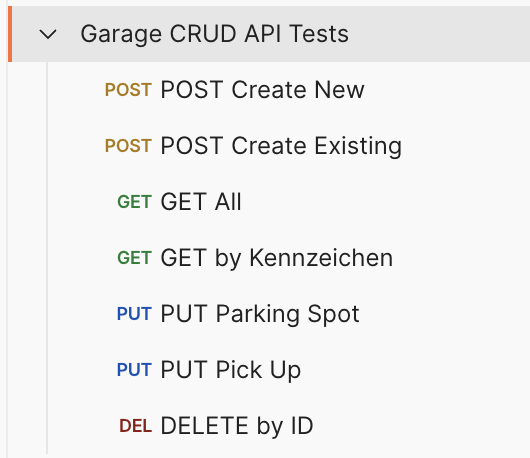

# Wie baut man eine API?
[45 min]

## Rückblick - Was ist eine API?
Im letzten Kapitel haben wir gelernt, dass API für Application Programming Interface steht. APIs ermöglichen es Entwicklern, komplexe Funktionen zu nutzen, ohne diese von Grund auf neu entwickeln zu müssen. So können beispielsweise Entwickler einer Wetter-App die API eines Wetterdienstes nutzen, um aktuelle Wetterdaten abzurufen, anstatt selbst eine umfassende Wetterdateninfrastruktur aufzubauen.

## Capstone Projekt
Ziel ist es, eine eigene RESTful FLASK API mit CRUD Funktion für das Management von Stellplätzen in einer Garage zu erstellen und diese mit einer Postman Collection zu testen.

## Entwerfen einer API
Der Aufbau einer effektiven API erfordert ein solides Verständnis der Grundprinzipien und besten Praktiken in der Softwareentwicklung.
**Deshalb beginnt der Entwurf einer API mit der Definition ihrer Funktionalität und der Daten, die sie verwalten soll.**

### Festlegung der Anforderungen und Endpoints
Endpoints sind die spezifischen Ansprechpartner innerhalb einer API, über die Interaktionen stattfinden. Sie bestimmen, wie die API aufgerufen wird und welche Ressourcen oder Dienste sie bietet.

#### Designprinzipien
Beim entwerfen einer API liegt der Fokus auf die Verständlichkeit und Nutzbarkeit der späteren Nutzer. Deshalb ist es umso wichtiger folgende Prinzipien zu kennen.

**Klarheit und Einfachheit**: Endpoints sollten intuitiv und leicht zu verstehen sein. Ein guter Endpoint beschreibt die Ressource oder Aktion, die er repräsentiert. Wie im Kapitel zu Clean Code beschrieben, kann man z.B. über die Bezeichnung der Endpunkte bereits viel Klarheit geben.

Für die Funktion, einen Nutzer per ID abzufragen, ist der Endpoint `get_user_by_id` besser als z.B. nur `get_user`. 

**Konsistenz**: Einheitliche Benennung und Strukturierung der Endpoints erleichtern die Nutzung der API. Vor allem das [Schema](#definition-des-schemas-für-requests-und-responses) der Responses muss so konsistent wie möglich gewählt sein, sodass den Nutzern die Einarbeitung erleichtert wird.

**Ressourcenorientierung**: In RESTful APIs repräsentiert jeder Endpoint idealerweise eine spezifische Ressource oder eine Sammlung von Ressourcen. Das [Single Responsibility Prinzip](https://www.linkedin.com/pulse/single-responsibility-principle-software-design-sanjoy-kumar-malik/) ist vor allem beim API-Design ein wichtiges Konzept. 

### Definition des Schemas für Requests und Responses
#### Request und Response Struktur
Jeder API-Request und -Response folgt einem spezifischen Schema, normalerweise in JSON oder XML. Dieses Schema definiert, wie Daten gesendet und empfangen werden.

#### JSON und XML
**JSON (JavaScript Object Notation)**: Leichtgewichtig und die am häufigsten verwendete Formatierung für API-Interaktionen. Es ist leicht lesbar und zu schreiben und wird heutzutage für fast alle APIs verwendet.

**XML (eXtensible Markup Language)**: Eine ältere, oft in Legacy-Projekten verwednete, Alternative zu JSON, die in manchen Systemen immer noch verwendet wird. XML ist strenger strukturiert als JSON und enthält meist konkrete Informationen zu Dateitypen. Anstelle von Objektnotation (`user.name`) wird XPath (`//user/name`) zur Abfrage einzelner Werte verwendet.

## Entwicklungswerkzeuge
Wie für die Entwicklung von anderen Spezialthemen gibt es auch für APIs ein zusätzlichen Toolset. Da vor allem großen Wert auf das Testen und die Dokumentation von APIs gelegt wird, sind **API-Design-Tools** wie [Postman](https://www.postman.com/), zum einfachen Testen, und [Swagger](https://swagger.io/), zur Dokumentation, hilfreich.

## Weiterführende Materialien
- **Rate Limiting**: API Einschränkungen mit dem offiziellen [Flask Limiter Extension](https://flask-limiter.readthedocs.io/en/stable/)