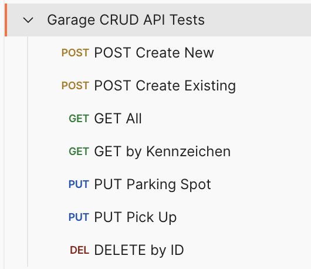

# Lösungen
```python
from flask import Flask, request, jsonify
from flask_sqlalchemy import SQLAlchemy
from datetime import datetime

app = Flask(__name__)
app.config['SQLALCHEMY_DATABASE_URI'] = 'sqlite:///garage.db'
db = SQLAlchemy(app)

class Car(db.Model):
    id = db.Column(db.Integer, primary_key=True)
    license_plate = db.Column(db.String(80), nullable=False)
    check_in = db.Column(db.DateTime, nullable=False, default=datetime.utcnow)
    pick_up = db.Column(db.DateTime, nullable=True)
    parking_spot = db.Column(db.String(80), nullable=True)

    def __repr__(self):
        return f'<Car {self.license_plate}>'

@app.before_first_request
def create_tables():
    db.create_all()

@app.route('/car', methods=['POST'])
def check_in_car():
    data = request.get_json()
    existing_car = Car.query.filter_by(license_plate=data['license_plate']).first()

    if existing_car:
        return jsonify({'success': False, 'message': f"Auto mit dem Kennzeichen '{data['license_plate']}' ist bereits geparkt."}), 400
    
    new_car = Car(license_plate=data['license_plate'], parking_spot=data.get('parking_spot'))
    db.session.add(new_car)
    db.session.commit()
    return jsonify({'success': True, 'message': f"Auto mit dem Kennzeichen '{new_car.license_plate}' eingecheckt mit ID {new_car.id}"}), 201

@app.route('/car/<license_plate>', methods=['GET'])
def get_car_by_license_plate(license_plate):
    car = Car.query.filter_by(license_plate=license_plate).first()
    if car:
        parking_spot_msg = f"Das Fahrzeug mit dem Kennzeichen {car.license_plate} steht auf Parkplatz {car.parking_spot}." if car.parking_spot else f"Das Fahrzeug mit dem Kennzeichen {car.license_plate} hat keinen zugewiesenen Parkplatz."
        return jsonify({'success': True, 'message': parking_spot_msg}), 200
    else:
        return jsonify({'success': False, 'message': 'Auto mit dem angegebenen Kennzeichen wurde nicht gefunden.'}), 404

@app.route('/cars', methods=['GET'])
def get_cars():
    cars = Car.query.all()
    car_data = [
        {'id': car.id, 
         'license_plate': car.license_plate, 
         'check_in': car.check_in.strftime("%Y-%m-%d %H:%M:%S"), 
         'pick_up': car.pick_up.strftime("%Y-%m-%d %H:%M:%S") if car.pick_up else None,
         'parking_spot': car.parking_spot
        } for car in cars
    ]
    return jsonify({'success': True, 'cars': car_data}), 200

@app.route('/car/<int:id>', methods=['PUT'])
def update_car(id):
    car = Car.query.get_or_404(id)
    data = request.get_json()
    action = data.get('action')

    if action == 'change_parking':
        car.parking_spot = data.get('parking_spot')
        db.session.commit()
        return jsonify({'success': True, 'message': f'Parkplatz des Autos mit dem Kennzeichen {car.license_plate} aktualisiert zu {car.parking_spot}.'}), 200
    elif action == 'pick_up':
        car.pick_up = datetime.utcnow()
        db.session.commit()
        return jsonify({'success': True, 'message': f'Auto mit dem Kennzeichen {car.license_plate} wurde abgeholt.'}), 200
    else:
        return jsonify({'success': False, 'error': 'Ungültige Aktion spezifiziert.'}), 400

@app.route('/car/<int:id>', methods=['DELETE'])
def delete_car(id):
    car = Car.query.get_or_404(id)
    db.session.delete(car)
    db.session.commit()
    return jsonify({'success': True, 'message': f'Auto mit dem Kennzeichen {car.license_plate} und ID {id} gelöscht.'}), 200

if __name__ == '__main__':
    app.run(debug=True)
  ```

### Tests
[Postman Collection](../../images/Garage%20CRUD%20API%20Tests.postman_collection.json)

