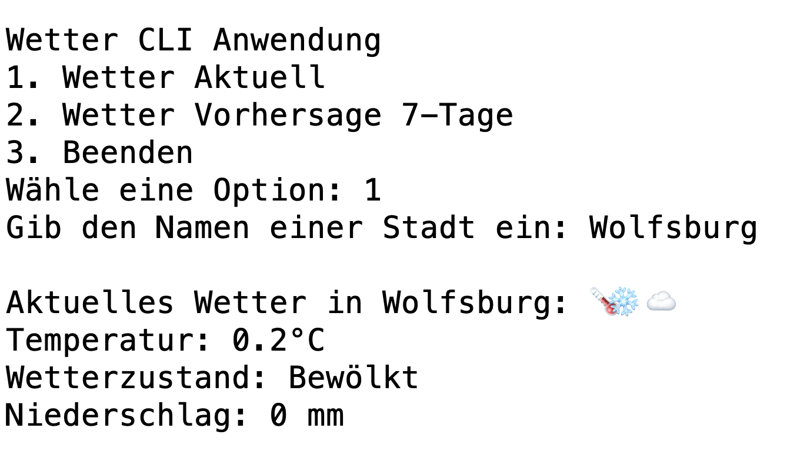

# Was ist eine API?
[20 min]

API steht für Application Programming Interface. APIs ermöglichen es Entwicklern, komplexe Funktionen zu nutzen, ohne diese von Grund auf neu entwickeln zu müssen. So können beispielsweise Entwickler einer Wetter-App die API eines Wetterdienstes nutzen, um aktuelle Wetterdaten abzurufen, anstatt selbst eine umfassende Wetterdateninfrastruktur aufzubauen

## API Capstone Projekt Ausblick
Ziel für das erste Capstone Projekt ist es, eine Wetterabfrage mit Python in einer CLI Anwendung zu integrieren und informationen zum Wetter einer Stadt zu bekommen.

## Wie funktioniert eine API?
Vergleichen kann man eine API mit Kellner*innen und der Küche in einem Restaurant. Die zwei wichtigsten Komponenten sind die Anfrage (Request) und die Antwort (Response).

Im Fall des Restaurants ist die Küche ein System mit vielen Funktionen. Der Kellner (API) ist aber die einzige Möglichkeit mit der Küche zu kommunizieren. Was genau in der Küche passiert, wissen wir nicht.

Als Nutzer stellen wir eine Anfrage (Request) mit einer Auswahl (URI) an den Kellner (API). Der Kellner gibt die Anfrage weiter an die Küche (Server) und das liefert uns das fertige Produkt (Response) zurück. 

Auf die gleiche Weise ermöglicht eine API die Kommunikation zwischen verschiedenen Softwarekomponenten oder Programmen. Es werden Anfragen für spezifische Aktionen oder Daten übermittelt und Ergebnisse zurückgeliefert.

## API Beispiele
[25 min]

**[Wetter API](https://open-meteo.com/)**: Kostenlose API die es ermöglicht, aktuelle Wetterdaten und Forecasts zu Geocoordinaten zu erhalten.

**[Google Maps API](https://developers.google.com/maps/documentation/places/web-service?hl=de)**: API die es ermöglicht, Karten und geografische Daten auf einfache Weise in Websites oder Apps zu integrieren.

**[RapidAI](https://rapidapi.com/)**: Plattform mit großer tausenden APIs für verschiedene Anwendungszwecke. 

# Weiterführende Materialien
- [Official Python Requests Library](https://docs.python-requests.org/en/latest/user/quickstart/#:~:text=,we%20need%20from%20this%20object)
- [A typical HTTP session](https://developer.mozilla.org/en-US/docs/Web/HTTP/Session)
- [An overview of HTTP](https://developer.mozilla.org/en-US/docs/Web/HTTP/Overview)
- [HTTP cookies](https://developer.mozilla.org/en-US/docs/Web/HTTP/Cookies)