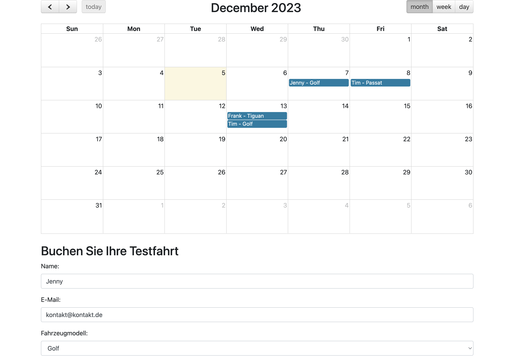

# Wie werden Websites Interaktiv?
[45 min]

Bisher waren unsere Websites entweder simple Strukturseiten oder Layoutdesigns. Durch die Kombination von HTML und CSS können bereits Click-Prototypen erstellt werden, zur richtigen Funktionalität fehlt aber noch ein weiteres Konzept - `JavaScript`. 

## Website Basics-Recap 
Bei der Erstellung einer Website kommen zahlreiche Technologien und Praktiken zum Einsatz, die zusammenspielen, um ein nahtloses, interaktives Nutzererlebnis zu erstellen. Die Basis bildet ein Verständnis der Web-Grundlagen – von der Strukturierung und dem Styling von Inhalten bis hin zur Implementierung von Interaktivität und dynamischen Funktionen. 

### Fragen
Zeit: 3 min / Frage
1. Was ist der Zweck des `
`-Elements in HTML?
2. Wie unterscheiden sich Klassen- und ID-Selektoren in CSS?
3. Was ist das Box-Modell in CSS und welche Komponenten beinhaltet es?
4. Wie unterscheidet sich das Flexbox-Layout von traditionellen Layout-Techniken in CSS?
5. Was sind die Hauptfunktionen von Bootstrap als CSS-Framework?
6. Wie funktioniert responsives Design mit Media Queries?
7. Wozu dient das `<label>`-Element in HTML und wie wird es richtig eingesetzt?
8. Was ist der Unterschied zwischen Inline-Styling und externen CSS-Stylesheets?
9.  Erkläre die Funktionsweise und Anwendung von `<select>` und `<option>` in HTML.
10. Wie kann JavaScript in ein HTML-Dokument eingebunden werden?

## Capstone Projekt
Ziel ist es, die simple Website zum Buchen von Testfahrten mit verschiedenen VW-Fahrzeugen mit Funktionalität zu erweitern und die gebuchten Fahrten, anstelle einer Flask API Integration, im Local Storage zu speichern.

## Weiterführende Materialien
- **Client-Side vs. Server-Side Rendering**: Ein umfassender [Vergleich beider Ansätze](https://www.toptal.com/front-end/client-side-vs-server-side-rendering)
- **Single Page Applications (SPA)**: [Eine detaillierte Erläuterung](https://www.smashingmagazine.com/2018/02/single-page-application-and-multi-page-application-pros-cons/).
- **Progressive Web Apps (PWA)**: Für einen [tiefen Einblick in PWAs](https://web.dev/progressive-web-apps/).