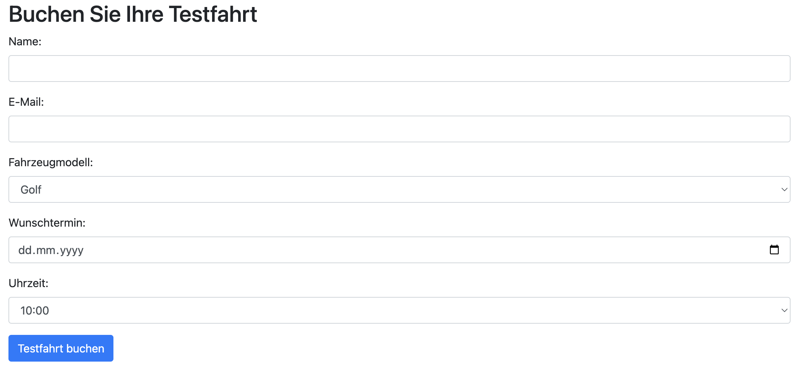

# Wie entsteht eine Website?
[45 min]

Die Erstellung einer Website ist ein dynamischer und iterativer Prozess, der Flexibilität und Anpassungsfähigkeit erfordert. Von der ersten Idee bis zur Veröffentlichung ist jede Phase entscheidend für die Entwicklung einer erfolgreichen Online-Präsenz. In den folgenden Tagen werden wir alle Schritte nach und nach durchführen und so den vollen Prozess kennenlernen. 

## API-Recap 
Hinter fast jeder modernen Website oder Webanwendung steht ein Backend, das häufig über eine API (Application Programming Interface) mit dem Frontend kommuniziert. 

### Fragen
Zeit: 3 min / Frage
1. Was ist eine API und warum ist sie wichtig?
2. Beschreibe das Prinzip einer RESTful API
3. Was sind die Hauptunterschiede zwischen Flask und Django?
4. Wie kann die Sicherheit einer API gewährleistet werden?
5. Warum ist die Dokumentation einer API wichtig?
6. Wie werden Daten in einer RESTful API übertragen und welche Formate werden typischerweise verwendet?
7. Welche Rolle spielen HTTP-Statuscodes in einer RESTful API und wie sollten sie verwendet werden?

## Capstone Projekt
Ziel ist es, eine simple Website zum Buchen von Testfahrten mit verschiedenen VW-Fahrzeugen zu erstellen. Vorerst wird nur der visuelle Teil der Website gebaut, im Anschluss dann die Logik.

## Weiterführende Materialien
- **CSS Flexbox Game**: CSS Flexbox einfach lernen mit dem [Flexbox Froggy Web Game](https://flexboxfroggy.com/#de)
- **Web Security Basics**: Kurzer Überblick über potentielle Risiken in den [Mozilla Security Docs](https://developer.mozilla.org/en-US/docs/Learn/Server-side/First_steps/Website_security)