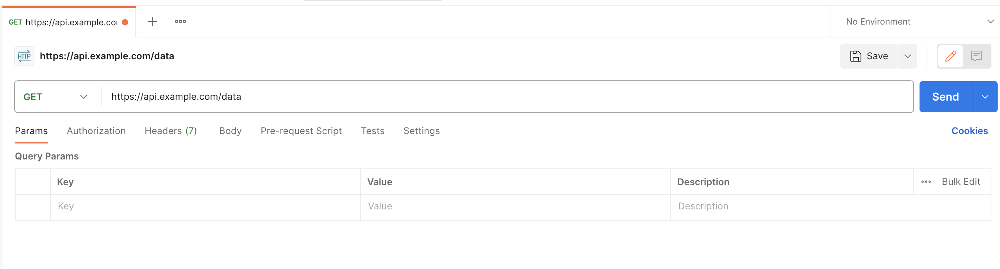
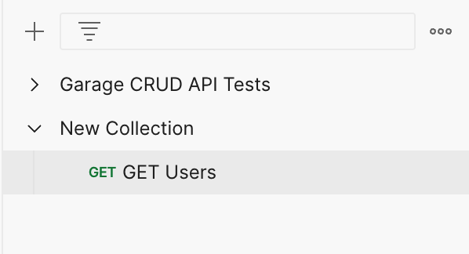
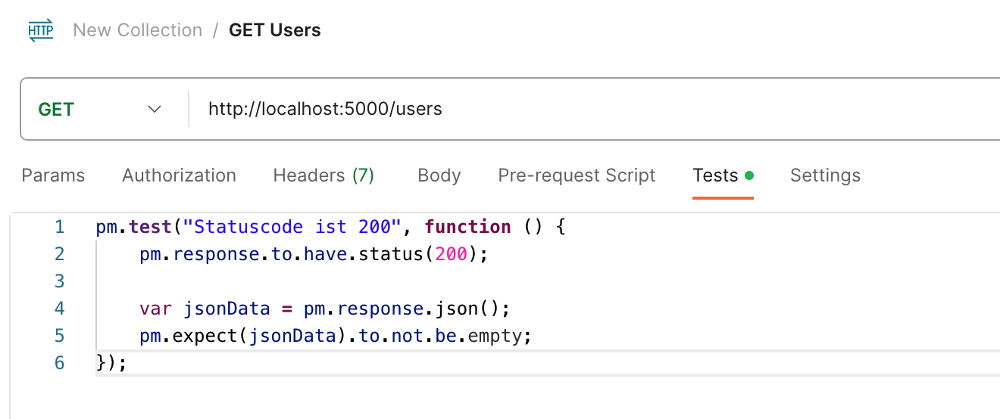
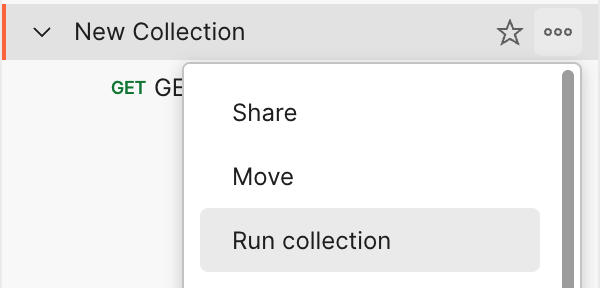
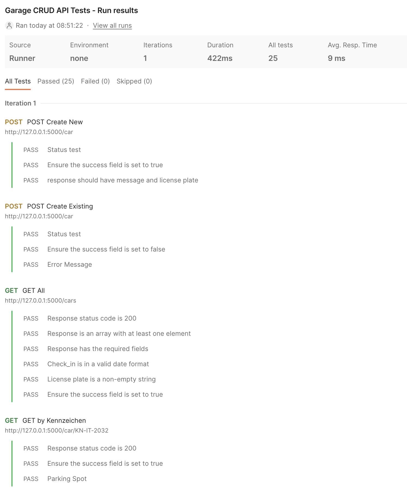

# Testing einer RESTful API in Flask
[60 min]

Abhängig von der Art der Tests ([Unit, Integration oder End-To-End](#2-umsetzung)) gibt es verschiedene Möglichkeiten diese zu implementieren. Das Testen mit Python Requests und Postman bietet eine sich ergänzende Kombination, die Funktionalität und Zuverlässigkeit einer Flask-API sicherzustellen. 

Während Python Requests ideal für das Schreiben automatisierter Testskripte (Unit Tests) ist, bietet Postman eine leistungsstarke Plattform für manuelles Testing, Automatisierung und Dokumentation (vor allem Integrationstests). Durch die Kombination beider Methoden kann ein robustes Testframework für APIs aufgebaut werden.


## Testing mit Python Requests
Die Python Requests Library haben wir bereits kennen gelernt. Sie ist eine einfache, aber leistungsstarke HTTP-Bibliothek, die für das Senden aller Arten von HTTP-Anfragen verwendet werden kann und somit perfekt geeignet um unsere API zu testen.

**Grundlegendes Testing**: In diesem Beispiel wird eine GET-Anfrage an die /users-Route gesendet. Es wird überprüft, ob der Statuscode 200 ist und ob die Antwort JSON-Daten enthält.
Erweiterte Testbeispiele

```python
import requests

def test_get_users():
    response = requests.get('http://localhost:5000/users')
    assert response.status_code == 200
    assert response.json() is not None
```

**Fehlerbehandlung testen**: Dieser Test überprüft, ob die API korrekt auf nicht gefundene Ressourcen mit einem 404-Fehler reagiert.

```python
def test_get_user_not_found():
    response = requests.get('http://localhost:5000/users/999')
    assert response.status_code == 404
```

## Testing mit Postman
Postman ist ein beliebtes Werkzeug für das Testen von APIs und das Werkzeug der Wahl für das kommende Tagesprojekt. Es bietet eine benutzerfreundliche Oberfläche und leistungsstarke Funktionen zum Erstellen, Testen und Dokumentieren von APIs.

#### Erstellen eines neuen Requests


#### Erstellen einer Postman Collections


#### Erstellen eines Tests für einen GET-Endpoint
Füge im nächsten Schritt den Status-Code Test im "Tests"-Tab hinzu.
```javascript
pm.test("Statuscode ist 200", function () {
    pm.response.to.have.status(200);

    var jsonData = pm.response.json();
    pm.expect(jsonData).to.not.be.empty;
});
```


Über einen Rechtsklick auf die Collection können dann alle Requests inklusive tests in der angegebenen Reihenfolge getestet werden.



### Automatisierung und wiederholbares Testing
Postman ermöglicht es, alle Anfragen innerhalb einer Collection automatisch auszuführen. Das ist nützlich, um Regressionstests durchzuführen.



Zusätzlich bietet Postman die Möglichkeit, Collections über die [Postman API](https://www.postman.com/postman/workspace/postman-public-workspace/documentation/12959542-c8142d51-e97c-46b6-bd77-52bb66712c9a) oder [Newman](https://www.npmjs.com/package/newman) (eine Command-Line-Version von Postman) in CI/CD-Pipelines zu integrieren. Das ermöglicht das automatische Testen von APIs bei jedem Build oder Deployment.


## Aufgaben
[45 min]

### Testen der GET-Route für Benutzerliste 🌶️
Schreibe einen Python-Test, der die GET-Route für die Benutzerliste testet.

### Testen der POST-Route für das Hinzufügen eines neuen Benutzers 🌶️🌶️
Schreibe einen Python-Test, um das Hinzufügen eines neuen Benutzers zu testen.

### Testen der DELETE-Route für das Löschen eines Benutzers 🌶️🌶️
Schreibe einen Python-Test, um das Löschen eines Benutzers zu testen.

[Lösungen](./solutions.md)