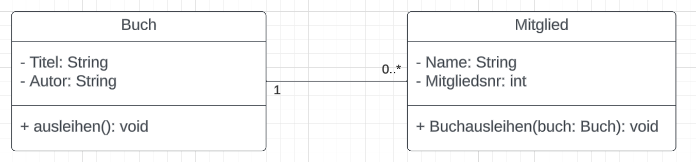
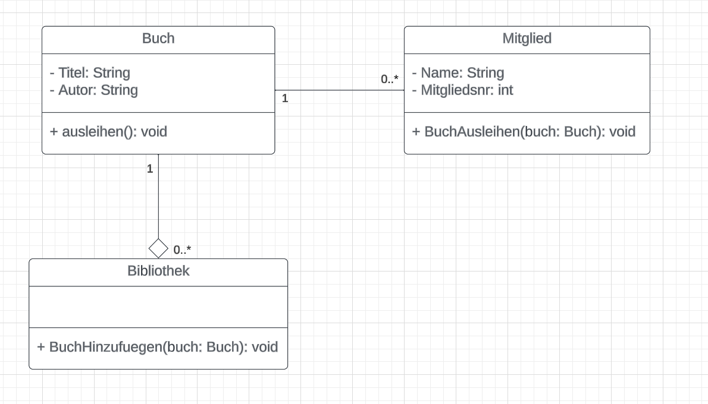
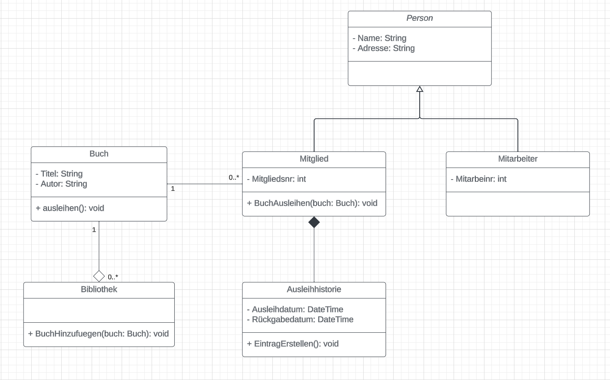

# Lösungen

## Einfaches Klassendiagramm

- Zwei Klassen: Buch und Mitglied.
- Klasse Buch hat Attribute Titel: String, Autor: String und eine Methode ausleihen().
- Klasse Mitglied hat Attribute Name: String, Mitgliedsnummer: Int und eine Methode BuchAusleihen(buch: Buch).
- Eine Assoziationslinie zwischen Buch und Mitglied zeigt die Beziehung an.

## Erweitertes Klassendiagramm mit Aggregation

- Neue Klasse Bibliothek mit einer Methode BuchHinzufügen(buch: Buch).
- Aggregationsbeziehung zwischen Bibliothek und Buch, dargestellt durch eine Linie mit einer leeren Raute am Bibliothek-Ende.
- Die Klasse Bibliothek enthält eine Liste von Büchern.

## Komplexes Klassendiagramm mit Vererbung und Komposition

- Abstrakte Klasse Person mit Name: String und Adresse: String.
- Klassen Mitglied und Mitarbeiter erben von Person.
- Klasse Ausleihhistorie mit Ausleihdatum: Date, Rückgabedatum: Date und EintragErstellen().
- Kompositionsbeziehung zwischen Mitglied und Ausleihhistorie, dargestellt durch eine Linie mit einer gefüllten Raute am Mitglied-Ende.
- Vererbungslinien von Person zu Mitglied und Mitarbeiter mit einem ausgefüllten Dreieck am Person-Ende.

## Komplexe UML-Modellierung mit Schnittstellen und Mehrfachvererbung

- Die Schnittstelle Zahlbar hat die Methode bezahlen().
Klassen Rechnung und PayPalZahlung implementieren Zahlbar und enthalten die Methode bezahlen().
- Die abstrakte Klasse OnlineArtikel hat Preis: Double, DigitaleLieferung: Boolean und die Methode Herunterladen().
- Klassen EBook und MusikAlbum erben von OnlineArtikel und enthalten spezifische Attribute und Methoden.
- EBook zeigt eine Schnittstelle zur Zahlbar-Schnittstelle zusätzlich zur Vererbung von OnlineArtikel.

