# Projektplanung mit UML
[120 min]

Unified Modeling Language (UML) ist eine visuelle Sprache zur Darstellung von Software-Designs. Sie bietet verschiedene Diagrammtypen, um verschiedene Aspekte eines Systems darzustellen. UML hilft bei der Analyse, dem Entwurf und der Dokumentation von Softwareprojekten. Es existieren eine Vielzahl von Diagrammtypen, die in zwei Hauptkategorien unterteilt sind: **Strukturdiagramme** und **Verhaltensdiagramme**.

#### Strukturdiagramme
Diese Diagramme fokussieren sich auf die statischen Aspekte eines Systems.

**[Klassendiagramme](https://www.lucidchart.com/pages/de/uml-klassendiagramme)**: Das Klassendiagramm ist das zentrale Element der UML und unverzichtbar für das Design objektorientierter Systeme. Es stellt Klassen, ihre Attribute, Methoden und die Beziehungen zwischen ihnen dar. Klassen, als grundlegende Bausteine, werden durch Rechtecke repräsentiert, die in drei Teile untergliedert sind: den Klassennamen, ihre Attribute und die Methoden. Die Beziehungen zwischen den Klassen, wie Assoziationen, Aggregationen und Kompositionen, werden durch verschiedene Arten von Verbindungslinien dargestellt.

Sämtliche Klassen verfügen zusätzlich, je nach gewollter Sichtbarkeit, über unterschiedliche Zugriffsebenen. Diese werden durch das jeweilige Zeichen an Attributen wie Methoden definiert.
 - Öffentlich (`+`)
 - Privat (`-`)
 - Geschützt (`#`)
 - Paket (`~`)
 - Abgeleitet (`/`)
 - Statisch (`unterstrichen`)

Beispielsweise könnte ein Klassendiagramm für ein Einkaufssystem Klassen wie `Kunde`, `Produkt` und `Bestellung` enthalten. Attribute könnten bei `Kunde` beispielsweise `Name`, `Adresse` sein, während Methoden `ProduktHinzufügen()`, `BestellungAufgeben()` umfassen könnten.

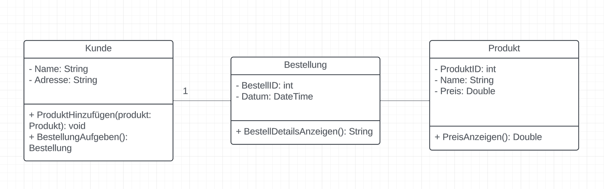

**[Komponentendiagramme](https://www.lucidchart.com/pages/de/uml-komponentendiagramm)**: Komponentendiagramme visualisieren die Organisation und Beziehungen zwischen verschiedenen Softwarekomponenten. Sie sind besonders nützlich in großen Systemen, um die Struktur der Softwarearchitektur und Abhängigkeiten zwischen Modulen und Schnittstellen darzustellen.

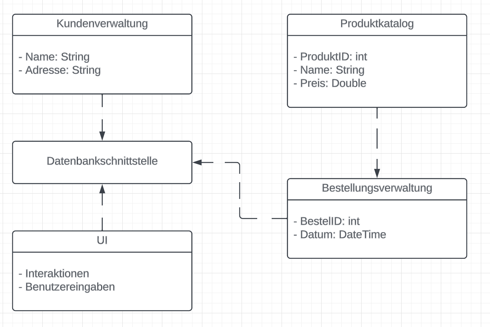

**[Paketdiagramme](https://www.lucidchart.com/pages/de/uml-paketdiagramm)**: Paketdiagramme organisieren Elemente eines Systems in "Paketen". Diese Diagramme sind hilfreich, um die Struktur großer Systeme zu verstehen und zu zeigen, wie Klassen oder Komponenten in logische Module gruppiert sind.

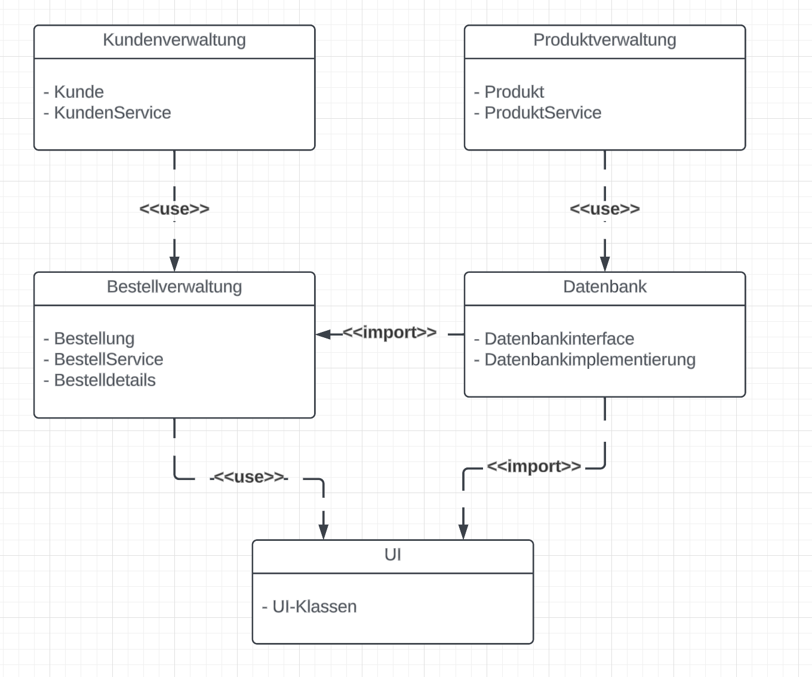

**[Verteilungsdiagramme](https://www.lucidchart.com/pages/de/tutorial-fur-verteilungsdiagramme)**: Verteilungsdiagramme zeigen die physische Verteilung von Softwarekomponenten auf Hardware. Sie sind wichtig, um zu verstehen, wie verschiedene Teile eines Systems auf Servern, Clients und anderen Geräten verteilt sind.

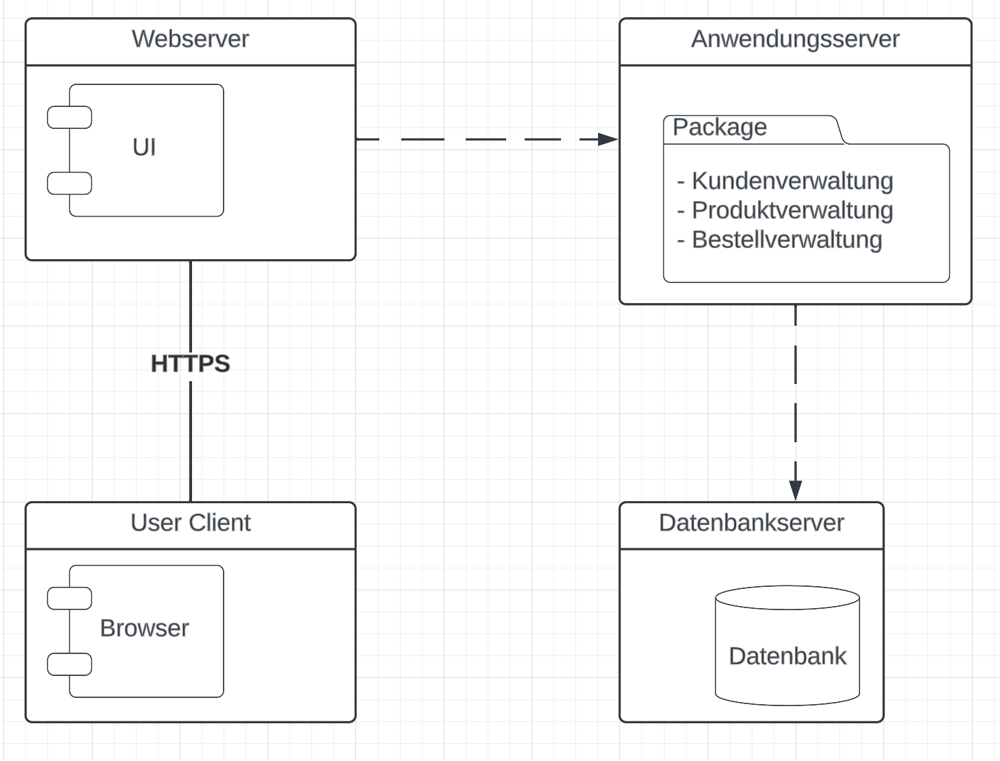

#### Verhaltensdiagramme
Diese Diagramme beschreiben die dynamischen Aspekte und das Verhalten von Systemelementen.

**[Anwendungsfalldiagramme](https://www.lucidchart.com/pages/de/uml-anwendungsfalldiagramm)**: Anwendungsfalldiagramme illustrieren die Funktionalitäten eines Systems aus der Sicht des Benutzers. Sie sind nützlich, um die Interaktion zwischen Benutzern (oder "Akteuren") und dem System zu verstehen.

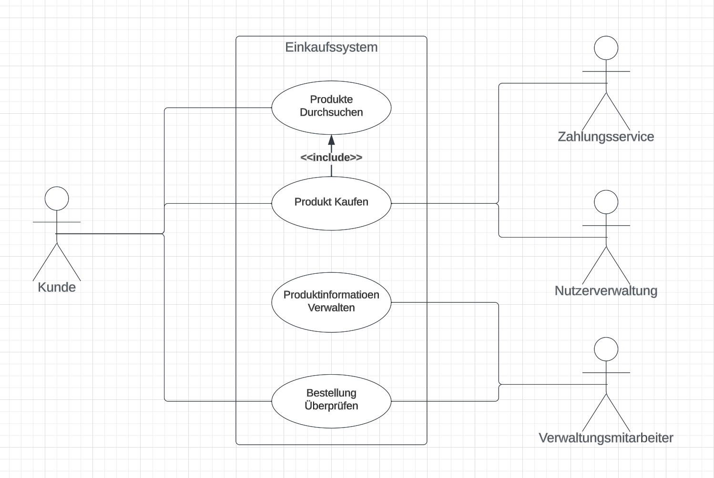

**[Aktivitätsdiagramme](https://www.lucidchart.com/pages/de/uml-aktivitatsdiagramme)**: Aktivitätsdiagramme stellen den Fluss von Aktivitäten und die Reihenfolge von Operationen dar. Sie sind nützlich, um den Workflow oder Geschäftsprozess in einem System zu verstehen.

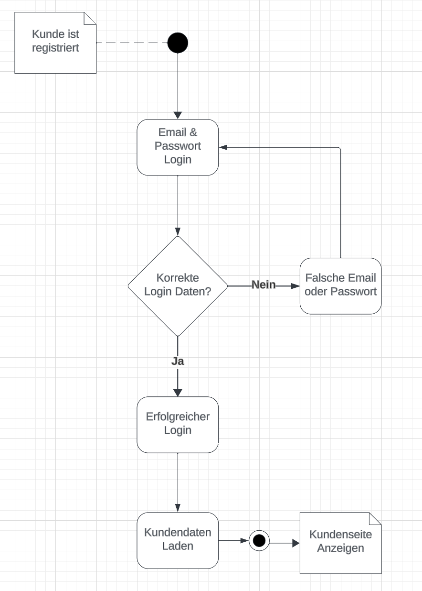

**[Zustandsdiagramme](https://www.lucidchart.com/pages/de/maschinenzustandsdiagramm)**: Zustandsdiagramme zeigen die verschiedenen Zustände, die ein Objekt während seines Lebenszyklus durchlaufen kann. Sie sind wichtig, um das Verhalten von Objekten in Reaktion auf Ereignisse darzustellen.

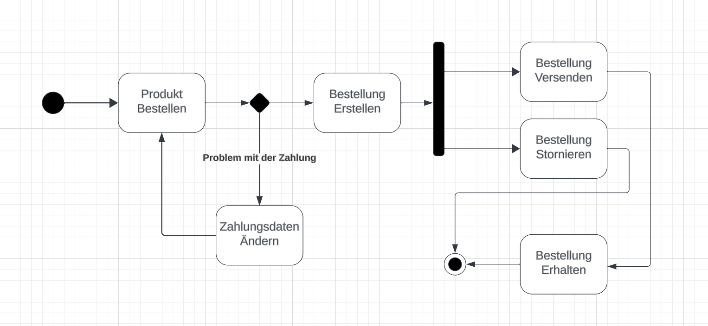

**[Sequenzdiagramme](https://www.lucidchart.com/pages/uml-sequence-diagram)**: Sequenzdiagramme illustrieren die Interaktionen zwischen Objekten in einer zeitlichen Abfolge. Sie zeigen, wie Objekte zusammenarbeiten, um eine Funktion auszuführen.

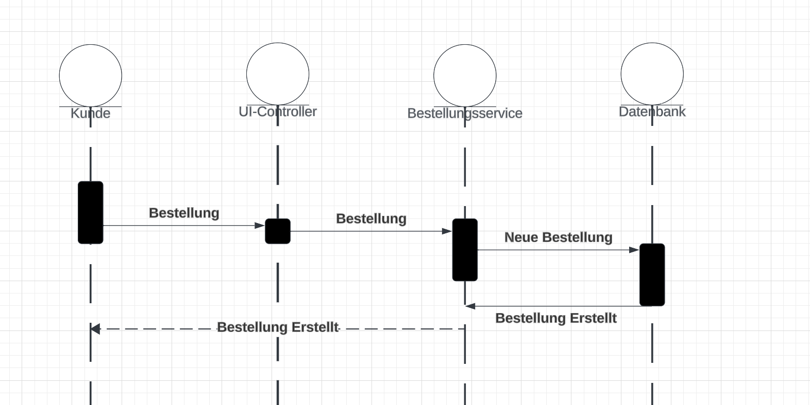

#### Vererbung und Klassentypen
Um komplexere Beziehungen in UML modellieren zu können, gibt es auch hier die Konzepte aus der Objektorientierung.

**`Vererbung`**: In UML wird Vererbung durch eine Linie dargestellt, die von der abgeleiteten Klasse (Unterklasse) zu ihrer Basisklasse (Oberklasse) führt. Diese Linie endet bei der Basisklasse mit einem leeren Dreieck.

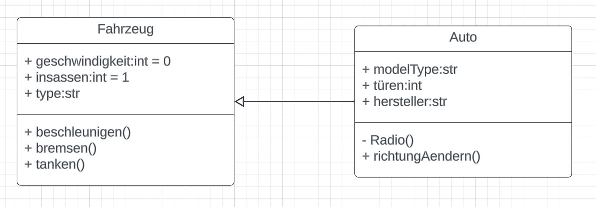

**`Implementierung`**: Die Implementierung eines Interfaces wird in UML als `gestrichelte Linie` mit einem nicht ausgefüllten Dreieck am Ende dargestellt, das auf das Interface zeigt.

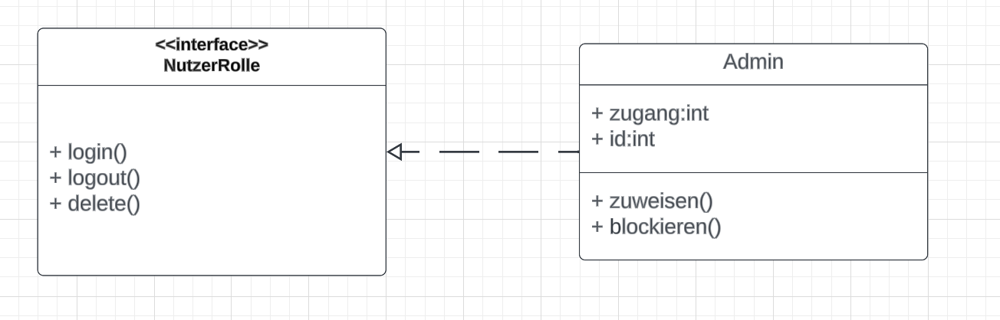

**`Abstrakte Klasse`**: Eine abstrakte Klasse wird in UML meist durch *`Kursivschrift`* ihres Namens kenntlich gemacht. Sie enthält oft abstrakte Methoden, die keine Implementierung besitzen.

**`Interfaces`**: Interfaces werden wie Klassen dargestellt, jedoch wird der Klassenname oft mit dem Schlüsselwort `«interface»` darüber notiert. Sie definieren Methoden, die von implementierenden Klassen bereitgestellt werden müssen.

**`Methoden`**: Methoden, die von einer Oberklasse geerbt werden, müssen nicht notwendigerweise in der UML-Diagramm für die Unterklasse erneut aufgelistet werden, es sei denn, `sie werden überschrieben` oder ihre Bedeutung ist für das Verständnis der Unterklasse wesentlich.

#### Assoziationen, Aggregation und Komposition
**`Assoziationen`**: In UML wird eine Assoziation durch eine `einfache Linie zwischen zwei Klassen` dargestellt. Oft wird die Assoziation mit Rollennamen und Multiplizitäten an beiden Enden gekennzeichnet, um die Art der Beziehung zu präzisieren.

Die Multiplizität gibt an, wie viele Instanzen der einen Klasse mit der anderen in Beziehung stehen können. Zum Beispiel würde `„1“ für eine Eins-zu-Eins-Beziehung` und `„1..*“ für eine Eins-zu-viele-Beziehung` stehen.

**`Aggregation`**: Aggregation wird als eine spezielle Form der Assoziation dargestellt, die eine „hat-ein“-Beziehung darstellt. In UML wird dies durch eine `Linie mit einer leeren Raute` am Ende der Linie bei der Klasse gezeigt, die das Ganze repräsentiert.

**`Komposition`**: Komposition ist eine stärkere Form der Aggregation, die eine exklusive Besitzbeziehung anzeigt. In UML wird dies durch eine `Linie mit einer gefüllten Raute` am Ende der Linie bei der Klasse dargestellt, die das Ganze repräsentiert. Die gefüllte Raute impliziert, dass die Lebensdauer der Teilobjekte eng mit der des Ganzen verbunden ist. 

#### Praktisches Beispiel
Um zu verstehen, wie Klassen strukturiert sind, wie sie miteinander interagieren und wie Schnittstellen zur Definition gemeinsamer Funktionalitäten genutzt werden können, schauen wir uns ein Beispiel genauer an.

1. **Klassendiagramm**: 
   - Eine Klasse `Kunde` mit Attributen wie `Kundennummer` und `Name` und Methoden wie `Login()` und `ÜberweisungTätigen()`.
   - Eine Klasse `Konto` mit Attributen `Kontonummer`, `Kontostand` und Methoden wie `Einzahlen(double betrag)` und `Abheben(double betrag)`.

2. **Schnittstellen**: 
   - Eine Schnittstelle `Transaktionsfähig` mit der Methode `TransaktionDurchführen()`.

3. **Vererbung und Implementierung**: 
   - Die Klasse `Girokonto` und `Sparkonto` erben von `Konto` und implementieren die Schnittstelle `Transaktionsfähig`.

Diese Struktur zeigt die Beziehungen und Abhängigkeiten zwischen den Klassen und wie sie über Vererbung und Schnittstellen interagieren.

- Die Klasse Kunde hat grundlegende Attribute wie Kundennummer und Name, sowie Methoden wie Login() und ÜberweisungTätigen().
- Die Schnittstelle Transaktionsfähig definiert eine Methode TransaktionDurchführen().
- Die Klassen Girokonto und Sparkonto erben von der abstrakten Klasse Konto und implementieren zusätzlich die Schnittstelle Transaktionsfähig.
- Die Konto-Klasse hat Attribute Kontonummer und Kontostand, sowie Methoden Einzahlen() und Abheben().
- Girokonto hat ein zusätzliches Attribut Dispo, Sparkonto hat ein Attribut Zinssatz. Beide Klassen definieren die Methode TransaktionDurchführen() gemäß der Schnittstelle.

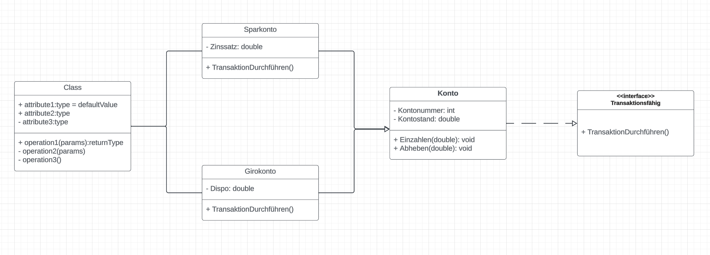

## Aufgaben
[90 min]

### Einfaches Klassendiagramm 🌶️ 
Erstelle ein einfaches UML-Klassendiagramm für ein Bibliothekssystem.
   - Modelliere die Klassen Buch und Mitglied.
   - Die Klasse Buch sollte die Attribute Titel und Autor und eine Methode ausleihen() haben.
   - Die Klasse Mitglied sollte die Attribute Name und Mitgliedsnummer und eine Methode BuchAusleihen() enthalten.
   - Stelle eine Assoziation zwischen Buch und Mitglied dar, um das Ausleihen zu visualisieren.

### Erweitertes Klassendiagramm mit Aggregation 🌶️🌶️
Erweitere das Bibliothekssystem um Aggregationsbeziehungen.
   - Füge eine Klasse Bibliothek hinzu, die mehrere Buch-Objekte aggregiert.
   - Die Klasse Bibliothek sollte eine Methode BuchHinzufügen() enthalten.
   - Zeige eine Aggregationsbeziehung zwischen Bibliothek und Buch

### Komplexes Klassendiagramm mit Vererbung und Komposition 🌶️🌶️🌶️
Entwickle ein umfassendes Modell mit Vererbung und Komposition.
   - Erstelle eine abstrakte Klasse Person mit den Attributen Name und Adresse.
   - Leite die Klassen Mitglied und Mitarbeiter von Person ab.
   - Füge eine Klasse Ausleihhistorie hinzu, die eine Kompositionsbeziehung zu Mitglied hat und die Historie der ausgeliehenen Bücher aufzeichnet.
   - Die Klasse Ausleihhistorie sollte Attribute wie Ausleihdatum und Rückgabedatum und eine Methode EintragHinzufügen() haben.
   - Visualisiere die Vererbung zwischen Person, Mitglied und Mitarbeiter und die Kompositionsbeziehung zwischen Mitglied und Ausleihhistorie.

### Komplexe UML-Modellierung mit Schnittstellen und Mehrfachvererbung 🌶️🌶️🌶️
Entwickle ein erweitertes UML-Klassendiagramm, das Schnittstellen und Mehrfachvererbung für ein Online-Shop-System umfasst.
   - Definiere eine Schnittstelle Zahlbar mit der Methode bezahlen().
   - Erstelle Klassen Rechnung und PayPalZahlung, die die Schnittstelle Zahlbar implementieren.
   - Füge eine abstrakte Klasse OnlineArtikel hinzu mit Attributen Preis und DigitaleLieferung und einer Methode Herunterladen().
   - Leite die Klassen EBook und MusikAlbum von OnlineArtikel ab.
   - Erstelle eine Mehrfachvererbungsbeziehung, in der EBook sowohl von OnlineArtikel als auch von Zahlbar erbt.

[Lösungen](./solutions.md)