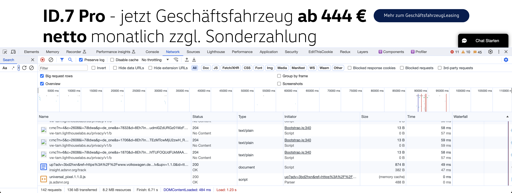

# Web Basics
[90 min]

Bei der Erstellung einer Website kommen zahlreiche Technologien und Praktiken zum Einsatz, die zusammenspielen, um ein nahtloses, interaktives Nutzererlebnis zu erstellen. Die Basis bildet ein Verständnis der Web-Grundlagen – von der Strukturierung und dem Styling von Inhalten bis hin zur Implementierung von Interaktivität und dynamischen Funktionen. 

## Websites Grundkomponenten
Eine Website setzt sich aus einigen Grundkomponenten zusammen, die nur duch Zusammenarbeit in eine interaktive und visuelle Anwendung verwandeln.  

### HTML (Hypertext Markup Language)
HTML ist das Grundgerüst jeder Webseite. Es ist die grundlegende Markupsprache für Webseiten. Hierbei definiert sie die Struktur und den Inhalt der Seite mittels `Tags`, die verschiedene Elemente wie Überschriften, Absätze, Bilder und Links markieren. 

```html
<!DOCTYPE html>
<html>
<head>
    <title>Meine Webseite</title>
</head>
<body>
    <header>
        <h1>Willkommen auf meiner Webseite</h1>
    </header>
    <section>
        <p>Hier ist ein interessanter Absatz über das Thema meiner Webseite.</p>
        
    </section>
    <footer>
        <p>Kontakt: info@meinewebsite.com</p>
    </footer>
</body>
</html>
```

### CSS (Cascading Style Sheets)
CSS ist die Sprache, die für das Styling und das Layout von Webseiten verwendet wird. Mit CSS können Designer und Entwickler das Erscheinungsbild von HTML-Elementen steuern, einschließlich Farben, Schriftarten, Abstände, Positionierung und vieles mehr. CSS ermöglicht damit ein sauberes Trennen von Inhalt (HTML) und Design.

```css
body {
    font-family: Arial, sans-serif;
    background-color: #f4f4f4;
}
header {
    background-color: #007bff;
    color: white;
    padding: 10px 0;
    text-align: center;
}
footer {
    background-color: #333;
    color: white;
    text-align: center;
    padding: 5px 0;
}
```

### JavaScript (JS)
JavaScript ist eine mächtige Skriptsprache, die verwendet wird, um Webseiten dynamisch und interaktiv zu gestalten. Mit JavaScript können Entwickler auf Browser-Events reagieren, Elemente auf der Seite dynamisch ändern, mit externen Datenquellen kommunizieren und komplexe Animationen und Benutzerinteraktionen erstellen.

```js
document.getElementById("demoButton").addEventListener("click", function() {
    alert("Danke fürs Klicken!");
});
```

### Das Dokument Objekt Model (DOM)
Das Dokumentenobjektmodell, meistens als DOM bezeichnet, ist eine wesentliche Komponente der Webentwicklung. Es bietet eine strukturierte Darstellung der Inhalte einer Webseite und ermöglicht es Skriptsprachen wie JavaScript, den Inhalt, die Struktur und das Design einer Webseite dynamisch zu ändern.

**Grundkonzept**: Das DOM modelliert eine HTML- oder XML-Seite als Baumstruktur, wobei jedes Element der Seite, wie Textblöcke, Bilder, Links und weitere, als Knoten im Baum dargestellt wird. Diese Baumstruktur besteht aus Eltern- und Kindbeziehungen; beispielsweise ist in HTML das `<body>`-Tag ein Kind des `<html>`-Tags und kann selbst wiederum Kinder wie `<p>`, `<div>`, `` usw. haben.

```css
        html
      /    \
    /        \
  head         body
    |         /  |  \
  title header section footer
            /     /  \     \
          h1     p   img    p
```

**Interaktion mit JavaScript**: Über das DOM können Webentwickler mit JavaScript auf einzelne Elemente der Seite zugreifen, sie verändern, hinzufügen oder entfernen. Beispielsweise kann JavaScript verwendet werden, um auf ein Element mit einer bestimmten ID zuzugreifen und seinen Inhalt zu ändern, ein neues Element zu erstellen und es in den Baum einzufügen oder die Stilattribute eines Elements zu ändern.

```html
<p id="text">Ursprünglicher Text</p>
```

```js
document.getElementById("text").innerHTML = "Neuer Text";
```

**Ereignissteuerung**: Das DOM ermöglicht es aber auch, auf Benutzeraktionen wie Klicks, Tastatureingaben oder Mausbewegungen zu reagieren. Entwickler können Event-Listener zu Elementen hinzufügen, um bestimmte Funktionen auszuführen, wenn diese Ereignisse auftreten.

Stell dir eine einfache Webseite mit einem Absatz (`<p>`) und einem Button (`<button>`) vor. Wenn der Benutzer auf den Button klickt, soll der Text des Absatzes geändert werden.

```html
<p id="text">Ursprünglicher Text</p>
<button id="changeButton">Text ändern</button>
```

```js
document.getElementById("changeButton").addEventListener("click", function() {
    document.getElementById("text").innerHTML = "Neuer Text";
});
```

## Anschauen einer Website mit den Webtools
[45 min]

Um die Komplexität einer modernen Website zu verstehen, schauen wir uns die dahinter liegenden, internen Prozesse einmal genauer an. 

### Elemente
Webentwickler können die Struktur und das Styling von Webseiten-Elementen untersuchen und in Echtzeit bearbeiten. Dies ist hilfreich, um das Layout und das visuelle Design zu optimieren.


### Console
Die Konsole dient als Schnittstelle, um JavaScript-Befehle auszuführen und um System- oder Fehlermeldungen anzuzeigen. Sie ist ein wesentliches Tool für Debugging und Testing.


### Applications: Cookies & Localstorage
Cookies sind Daten, die vom Webserver auf dem Endgerät des Nutzers gespeichert werden und bei späteren Besuchen wieder abgerufen werden können. LocalStorage ermöglicht die Speicherung von Daten direkt im Browser über längere Zeiträume.


### Netzwerkanalyse
Der Network Tab in den Webentwicklungstools der Browser zeigt alle Netzwerkanfragen (Requests) an, die beim Laden einer Webseite gemacht werden. Dies umfasst das Laden von HTML, CSS, JavaScript-Dateien, Medienressourcen wie Bilder und Videos sowie API-Anfragen.




## HTTPS vs HTTP
HTTPS ist die sichere Version des Hypertext Transfer Protocols (HTTP). Es verwendet Verschlüsselung, um die Datenübertragung zwischen dem Webbrowser des Benutzers und dem Webserver zu sichern. Diese Verschlüsselung schützt die Daten vor Lauschangriffen, Manipulationen und Diebstahl.

HTTPS nutzt [TLS](https://www.cloudflare.com/de-de/learning/ssl/transport-layer-security-tls/) (Transport Layer Security) oder dessen Vorgänger [SSL](https://www.cloudflare.com/de-de/learning/ssl/what-is-ssl/) (Secure Sockets Layer) zur Verschlüsselung der Daten. Diese Protokolle verwenden eine Kombination aus asymmetrischer und symmetrischer Verschlüsselung, um sowohl die Identität des Servers zu bestätigen als auch die übertragenen Daten zu schützen.

Der `Handshake-Prozess` ist das Kernelement der sicheren Kommunikation. Beim ersten Verbindungsaufbau führen der Client und der Server einen `Handshake` durch. Dabei werden die Verschlüsselungsparameter festgelegt und der Server authentifiziert sich beim Client, in der Regel durch ein digitales Zertifikat.

Um HTTPS auf einer Webseite zu implementieren, muss der Webseitenbetreiber ein SSL/TLS-Zertifikat von einer Zertifizierungsstelle erwerben und auf seinem Server installieren. Viele Hosting-Anbieter bieten heutzutage aber einfache Möglichkeiten, HTTPS auf Webseiten zu aktivieren.

 
## Web-Accessibility
Web-Accessibility bedeutet, dass Webseiten und Online-Tools so gestaltet und entwickelt werden, dass sie für alle Menschen, einschließlich jener mit Behinderungen, zugänglich sind. Zwei konkrete Beispiele für mehr Accessibility sind die Verwendung von Alt-Texten und Verbesserung von Kontrasten und Farben. 

**Alternative Texte für Bilder (Alt-Texte)**: Bilder sollten mit einem alternativen Text versehen werden, der den Inhalt und Zweck des Bildes beschreibt. Das ist besonders wichtig für Screenreader-Nutzer.

```html

```