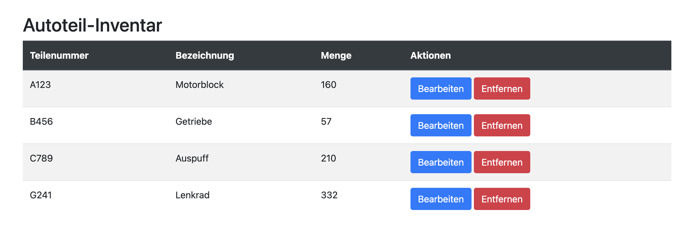

# Projekte mit Struktur
[45 min]

In der Softwareentwicklung, insbesondere bei Web- und Cloud-Applikationen, ist ein effektives Projektmanagement unerlässlich, um komplexe Anforderungen zu managen, die Qualität zu sichern und Projekte termingerecht und im Rahmen des Budgets zu liefern.

## JavaScript Recap 
Bei der Erstellung einer Website kommen zahlreiche Technologien und Praktiken zum Einsatz, die zusammenspielen, um ein nahtloses, interaktives Nutzererlebnis zu erstellen. 

### Fragen
[20 min]

1. Was ist der Hauptunterschied zwischen `let`, `const` und `var` in JavaScript?
2. Wie funktionieren Template Literals in JavaScript und gib ein Beispiel?
3. Wie werden Arrays in JavaScript manipuliert? Nenne ein Beispiel für das Hinzufügen eines Elements.
4. Was ist ein JavaScript Promise und wie wird es typischerweise verwendet?
5. Beschreibe die Grundstruktur eines Event Listeners in JavaScript.
6. Was sind die Hauptvorteile der Verwendung der Fetch API in JavaScript?
7. Wie unterscheidet sich asynchroner von synchronem Code in JavaScript? Gib ein Beispiel mit `async` und `await`.
8. Erkläre, wie die DOM-Manipulation in JavaScript funktioniert. Gib ein Beispiel für das Ändern des Inhalts eines Elements.
9. Erkläre den Unterschied und die Anwendungsfälle von addEventListener im Vergleich zu On-Event-Attributen wie onclick in JavaScript.
10. Wie kann der lokale Speicher im Browser mittels JavaScript genutzt werden? Gib ein Beispiel für das Speichern und Abrufen von Daten.

## Capstone Projekt
Ziel ist es, in 2er Teams an einem vollständigen Projektentwicklungszyklus zu arbeiten. Hierbei geht es vor allem darum, sowohl die Planung über UML und Architekturdiagram, als auch die Aufteilung der Aufgaben und Implementierung zu vertiefen.

## Weiterführende Materialien
- **IBM UML Basics**: [Einführung in die Unified Modeling Language](https://developer.ibm.com/articles/the-class-diagram/)
- **Test Driven Development (TDD)**: [Die Testgetriebene Entwicklung](https://www.ionos.de/digitalguide/websites/web-entwicklung/test-driven-development/)